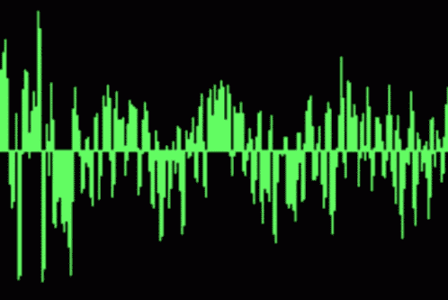
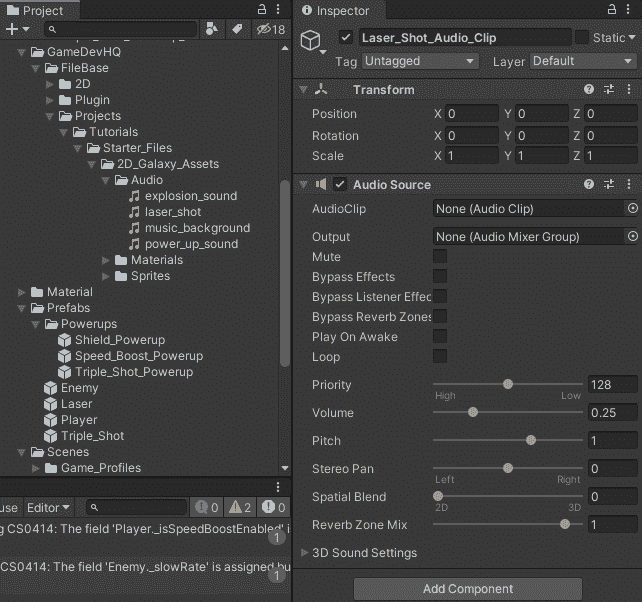
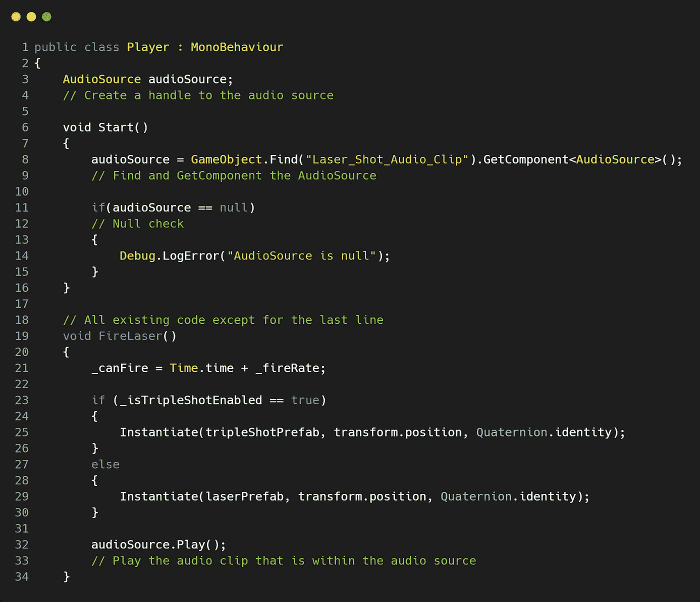
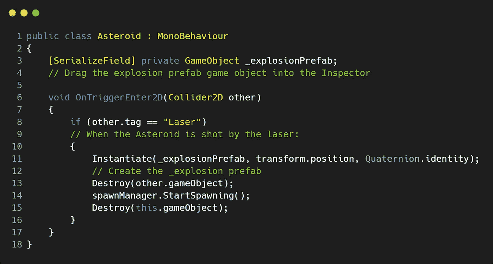
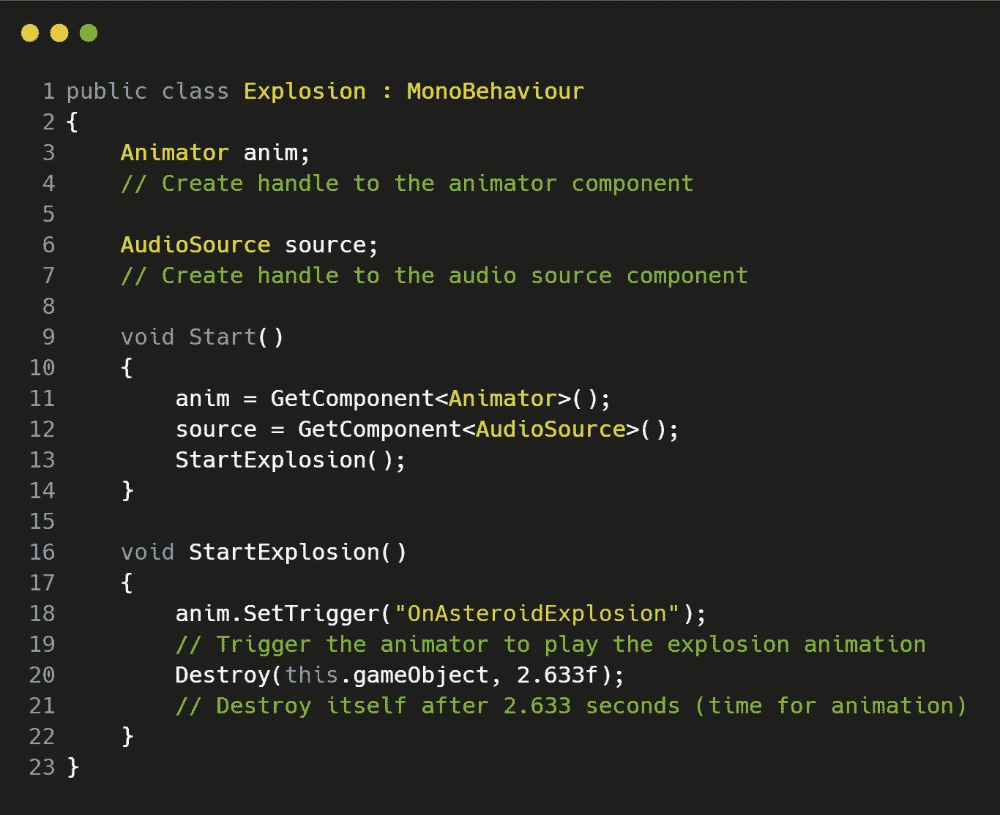

# 如何在 Unity 中播放音效

> 原文：<https://medium.com/geekculture/how-to-play-sound-effects-in-unity-b8b59a8d6fc3?source=collection_archive---------29----------------------->

**目标**:在 **Unity** 中给我们的玩家激光和一颗爆炸的小行星添加一些音效！

Tenor.com

现在我们已经通过在场景中添加一些背景音乐，了解到我们需要一个**音频监听器**来播放游戏中的音乐，我们已经过了声音的基础，是时候给我们的玩家添加一些很酷的声音效果了，比如激光和一颗爆炸的小行星。

## 给我们的激光添加音效

首先，让我们为我们的**音频管理器**创建一个空的游戏对象，并将其命名为“ **Laser_Shot_Audio_Clip** ”。接下来，将一个**音频源**组件添加到这个游戏对象中，并将您想要播放的**音频剪辑**拖动到如下所示的适当框中(或点击按钮符号):

现在还要确保关闭“唤醒时播放”**，因为我们想在玩家发射激光时通过代码控制声音的播放，我们也不想让这个**循环**！**

## **向我们的播放器脚本添加一些代码**

**我们希望能够在玩家发射激光时调用并播放这个**音频源**，所以让我们给我们现有的 **FireLaser()** 方法添加一些代码:**

****

**让我们首先创建一个**音频源**组件的句柄，然后在 **Start()** 方法中，我们需要定位游戏对象" **Laser_Shot_Audio_Clip** 上的**音频源**。当然，确保 **null** 检查我们确实成功地使用脚本通信来访问这个**音频源**。**

**然后在我们的 **FireLaser()** 现有方法中，让我们添加一行代码，用于 **Play()** 位于**音频源**组件中的音频剪辑。 **Play()** 是**音频源**组件中内置的 **Unity** 方法，它只是告诉组件播放剪辑。**

**我们还在 **if/else** 语句之外添加了这一行，因为这与正在发射的激光无关(单次或三次发射)，我们仍然希望播放激光音频剪辑，而不管它发射了多少次。**

**你应该可以点击**播放**，在你发射激光的时候听听你的声音！**

## **给我们的小行星添加音效**

**我们将从不同的角度来看待这个问题。由于我们已经有了一个“**爆炸**脚本和**爆炸预设**游戏对象，我们将把**音源**组件附加到这个预设上，并在这个游戏对象实例化时播放声音。这个**小行星**游戏对象是在游戏开始时创建的，因此当玩家发射激光时，小行星将爆炸，敌人将开始产卵。**

**在**爆炸** n 预设游戏对象上，让我们添加我们的**音源**组件，并拖入 ***爆炸 _ 声音*** 剪辑。我们将让“**唤醒时播放**”勾选，当第二个**爆炸**预设被实例化时，我们也希望声音被播放。**

## **向我们的小行星和爆炸脚本添加代码**

****

**因此，在我们的“ ***小行星*** ”脚本中，让我们创建一个序列化的游戏对象(这样我们就可以在**检查器中看到**并将预设拖入)。然后，一旦玩家将激光射入小行星，实例化**爆炸**预设。这个**爆炸**预设有一个附属的爆炸**动画**，还有一个爆炸**音频剪辑**，一旦**动画**播放完毕，它就会自我毁灭。**

**然后在我们的“ ***爆炸*** ”脚本中，附加了**爆炸**预设:**

****

**让我们为**动画师**和**音源**创建几个句柄，然后**获取组件**。一旦我们完成了这些，运行 **StartExplosion** ()方法，该方法将触发**爆炸动画**播放，然后**在**动画**完成播放(2.633 秒)后销毁**。对于我们的**音频源**，我们已经这样设置了，这样当脚本被调用时，它会自动播放声音，并且不会循环播放。**

**希望这有助于你在游戏中播放一些音频剪辑！**