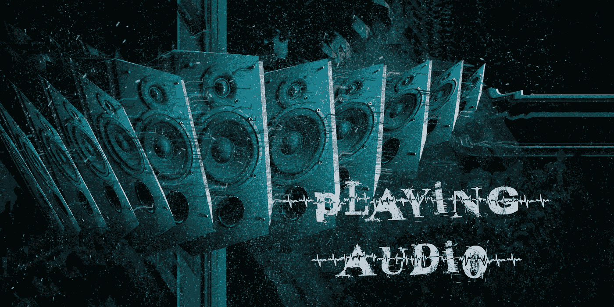

# 如何在 Unity 中播放音效

> 原文：<https://medium.com/geekculture/how-to-play-sound-effects-in-unity-f4172e1acd7c?source=collection_archive---------26----------------------->

在 Unity 中播放音效有多种方式。有些方法有好有坏，这取决于你如何播放音效，所以我将在本文中探讨一些不同的选择。

我想做的第一件事是，每当我的玩家发射炮弹时，播放一段声音。首先，我需要一个**声音剪辑**给我的武器。
我妻子最近买了这个微型立体声聚光镜…