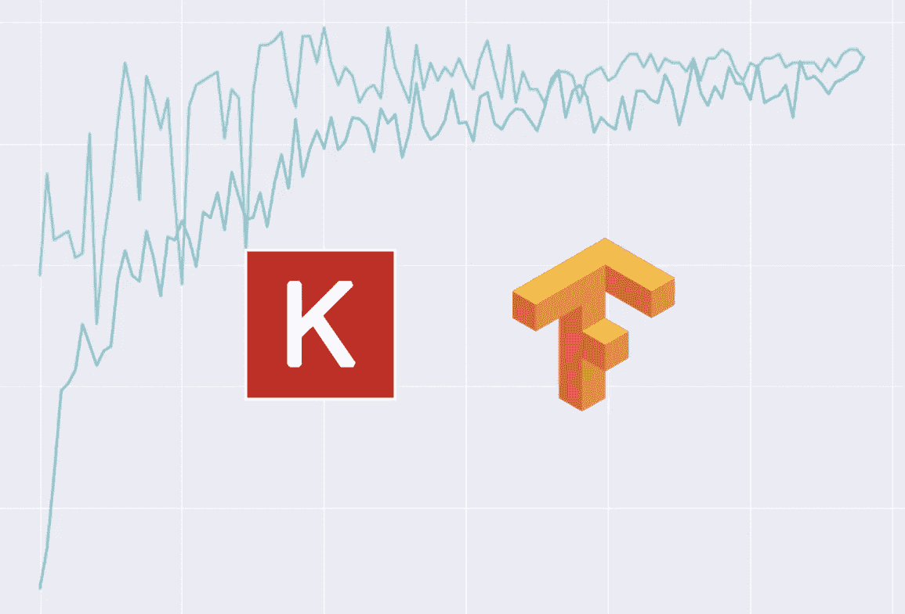
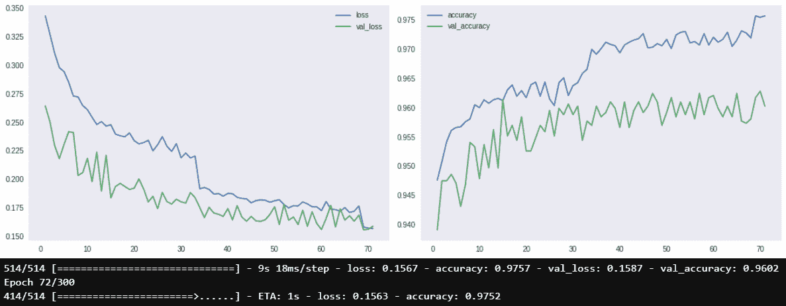

# 如何在 TensorFlow 中绘制训练期间的模型损失

> 原文：<https://medium.com/geekculture/how-to-plot-model-loss-while-training-in-tensorflow-9fa1a1875a5?source=collection_archive---------0----------------------->

## 如何通过策划模型学习来加强模型训练。



Image By Author (Logos by Keras and Tensorflow)

如果你正在训练 20 个纪元，Keras 进度条看起来不错，但是**没有人想在他们的日志**中无限滚动 300 个纪元进度条(我觉得这很恶心)。这使得很难了解训练的进展，这只是**不好的练习**(至少如果你是在 Jupyter 笔记本上训练的话)。

另一种方法是绘制一个简单的图，在训练和测试损失的情况下，每一个时期或每 n 步更新一次。这是一个极其简单的实现，而且更加有用和有洞察力。

所以让我们开始吧。

# Keras 回调是如何工作的

Keras 回调是一个具有不同函数的类，这些函数在训练期间的不同时间执行[1]:

*   当`**fit**` / `**evaluate**` / `**predict**`开始&结束时
*   当每个时期开始和结束时
*   当每个训练批次开始和结束时
*   当每个评估(测试)批次开始和结束时
*   当每个推理(预测)批次开始和结束时

我们将重点关注历元函数，因为我们将在每个历元结束时更新绘图。在这些功能中，你可以做任何你想做的事情，所以你可以让你的想象力自由驰骋。但是现在让我们专注于这个应用程序。

# 我们的定制回拨

每个函数接收参数 *logs，*，它是一个字典，包含每个度量名称(精度、损失等)的对应历元值:

```
logs == {
  'accuracy' : 0.98,
  'loss': 0.1
}
```

为了绘制训练进度，我们需要存储这些数据，并在每个新的时期更新这些数据。我们将创建一个字典来存储指标。每个键对应一个指标，并有一个列表作为其值。

# 火车上开始

当训练开始时，我们将初始化所有的值。对于每个时期，我们将更新度量字典并更新绘图。

# 在纪元结束时

首先，我们将新的日志值存储到我们的数据结构中:

然后，我们为每个指标创建一个图表，其中将包括培训和验证指标。在这里，我们清除前一个时期的输出，生成一个带有子图的图形，并为每个指标绘制图形，然后检查是否有等效的验证指标:

# 运行我们的回拨

您可以使用任何其他回调的任何详细级别运行此回调。当我们实现它时，它将清除输出，并更新绘图，所以没有必要删除日志。你甚至可以保留进度条来获得更多的交互性。

为此，您只需在回调列表中包含我们实现的函数:

然后，当您调用 fit()时，您将获得这些实时更新的漂亮图形:



Image by Author

# 总结

现在，您可以以更清晰、更直观的方式现场展示您的训练。像这样对你的工作流程做一些小小的改变，为我节省了很多时间，也提高了我对工作方式的整体满意度。

这只是我的实现，你还可以用回调做很多其他有用的事情，所以试试吧，创造一些美丽的东西！

这是完整的实现:

参考资料:

[1] [张量流文档](https://www.tensorflow.org/guide/keras/custom_callback)

[](https://betterprogramming.pub/4-keras-callbacks-that-will-change-the-way-you-train-ml-models-a0df2592d36b) [## 4 个 Keras 回调将改变你训练 ML 模型的方式

### 添加模型检查点、CSV 记录器等等

better 编程. pub](https://betterprogramming.pub/4-keras-callbacks-that-will-change-the-way-you-train-ml-models-a0df2592d36b)