# 如何用分类算法预测客户流失率

> 原文：<https://medium.com/geekculture/how-to-predict-customer-churn-rate-with-classification-algorithm-e0dd1b8d0d1c?source=collection_archive---------14----------------------->

[Unsplash](https://unsplash.com/photos/mTehrY1mH-s)

为什么我的客户在不断变化？您的客户服务团队正在积累支持票，IT 部门正在修复漏洞并连夜发货，营销部门推出每周促销活动，希望让您的客户购买。相反，你的网站得到了一些访问，然而，客户不断下降。

你不是唯一一个。研究表明，超过 95%的客户默默地退出了产品，没有留下任何线索或反馈，说明他们为什么退出。

流失率，有时也称为损耗率，是在给定时间内停止使用某项服务的客户的百分比。它通常用于衡量拥有合同客户群的企业，尤其是基于订户的服务模式。 [Statista](https://www.statista.com/statistics/816735/customer-churn-rate-by-industry-us/)

# 在这篇文章中，你将了解到预测客户流失所需的一切，通过 SPARK 分类算法建立机器学习模型，根据流失规则预测客户流失。

# 如何衡量客户流失？

流失率向您显示在特定时间段内，现有客户停止使用您的服务或产品的百分比。

要确定已产生收入的百分比，请在月初将你所有的月经常性收入(MRR)除以你当月损失的月经常性收入，减去任何升级或来自现有客户的额外收入。

例如，如果一家连锁餐馆在月初有 500 名顾客，而在月末只有 450 名顾客，那么它的顾客流失率将是 10%。

但这只是衡量客户流失的第一步，它依赖于你的致命判断来识别流失的客户。

如果你想根据 RFM 模型的结果来预测未来谁会流失呢？传统的过程是痛苦的，它是这样的:

您需要选择一个想要从中提取信息的数据源，比如一个 Microsoft SQL Server——您必须确定要从该数据源中提取哪些表。然后，您必须确定客户流失规则。作为一个被搅动的顾客，你会考虑什么？现在您已经有了数据源和客户数据，您必须合并这两个数据，这样您就可以在一个全新的表中生成一个客户流失列。然后，你必须根据这些数据进行训练、测试和预测。然后添加一个运行所有前面元素的模型。最后，您需要将模型的输出发送到 CSV 表或业务应用程序中。

这个过程可能需要几个月的时间，如果它真的投入生产的话。

Gartner 进行的一项研究发现，由于流程和/或应用过程中的困难，47%的公司难以将项目投入生产。

工作流程看起来像这样。

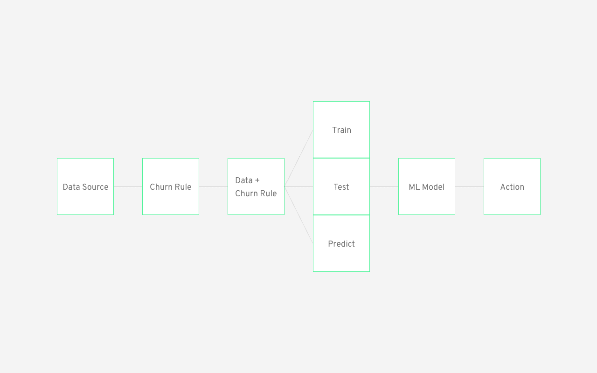

最简单的方法之一是使用 Datagran，通过构建数据工作流，或者我们通常所说的管道。借助 Datagran，您可以将整个公司的数据集中在一个工作空间中，处理其中的信息，以便您可以挑选您想要使用的数据，基于这些数据进行培训、测试和预测，添加 Spark 算法(例如，预测流失)，并通过 Slack、RestAPI、Workbook 等业务应用程序将结果发送到生产部门，以便您可以与利益相关方共享。此外，管道是按频率运行的，所以你不必每次都要建立模型来寻找活跃的客户。

# 基于 RFM 分析的数据挖掘如何预测客户流失

Datagran 将您的数据库和数据仓库连接起来，处理所有类型的数据比手动处理更好。它可以识别你最忠诚、最谦虚和最挑剔的客户，找到他们的联系信息，将结果发送到 Slack 频道或任何其他可用的应用程序，如 RestAPI、Salesforce、Webhook、[和更多](https://www.datagran.io/your-ml-in-production-in-seconds)，并将他们转化为你的最佳客户。在我们开始之前，有几件事需要强调:

*   你必须有充足的客户信息。
*   明确客户流失规则——你必须问你的企业如何计算客户流失？如果这是不确定的，那么你可以从 RFM 模型中提取它，通过使用它的结果，将提供正在冬眠、冬眠+即将入睡的客户群。
*   然后，您将连接客户数据并添加一个客户流失列来应用客户流失规则。
*   然后你就把训练/测试/预测分开。为了预测客户流失，我们更倾向于预测新客户或最后四分之一的客户。
*   最后，您将构建一个分类模型。

1.  **第一步是** [**把你的数据源连接到 Datagran**](https://www.youtube.com/watch?v=p4G6UfukDwM) **。**

如果您还没有，请注册一个 Datagran 帐户。然后选择您的工作区(或者创建一个新的工作区)，添加一个项目，转到 Integrations，并单击 Add Integrations 从可用列表中连接您需要的任何数据源。

Datagran 新手？[观看视频](https://www.datagran.io/your-ml-in-production-in-seconds)了解更多关于集成以及如何设置集成的信息。

如果您还没有连接数据源，请单击加号添加一个集成，并选择您希望集成的那个。Datagran 将要求您选择想要从数据中提取的信息流。

信息流是从商店收集的数据类型，因此在这种情况下，您需要确保选择与客户相关的信息流。例如，你想从顾客、发票、购买频率等方面获取信息。然后会询问您希望它多久从您的数据源提取一次数据—选择“每天”作为您的频率。

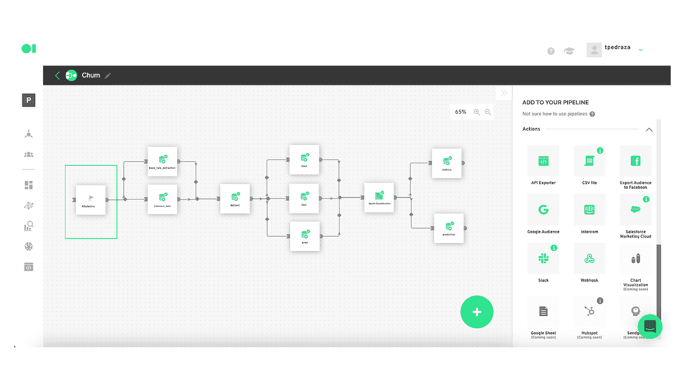

**2。创建一个机器学习数据工作流程(管道),并确定如何根据 RFM 模型的结果来衡量客户流失**

现在 Datagran 已经有了您的数据，是时候将它转换成一个 ML 工作流了，在这个工作流中，您将使用 Spark 分类算法来测量客户流失。要做到这一点，您需要建立一个新的管道——或者自动化的工作流——并添加您想要从中提取信息的数据源。在本例中，我们使用的是 Microsoft SQL server。

在这个用例中，您将从 RFM 模型中提取客户流失规则。要了解如何建立一个 RFM 模型[点击这里](https://blog.datagran.io/posts/rfm-analysis-build-an-ml-model-and-learn-more-about-your-customers-with-rfm-analysis-and-segmentation)。

从右侧边栏拖动 Microsoft SQL server 数据，然后拖放一个自定义 SQL 操作符，通过选择将从数据集中提取的特定变量来确定如何测量客户流失。单击编辑按钮，选择源，复制并粘贴下面的示例查询。在本教程中，您将确定具有以下特征的客户:

1.  花费不到 320 美元
2.  购买次数不到 2 次。
3.  已经超过 185 天没有购物。

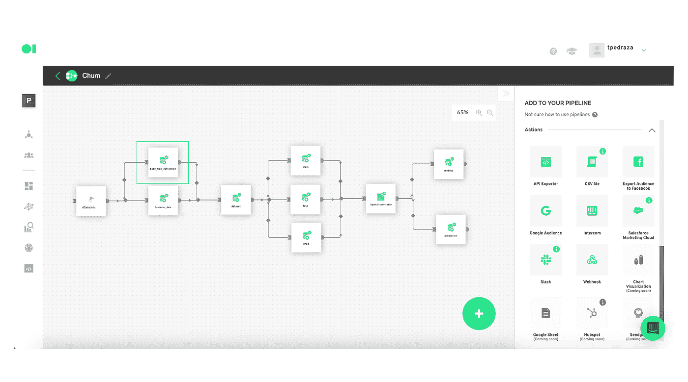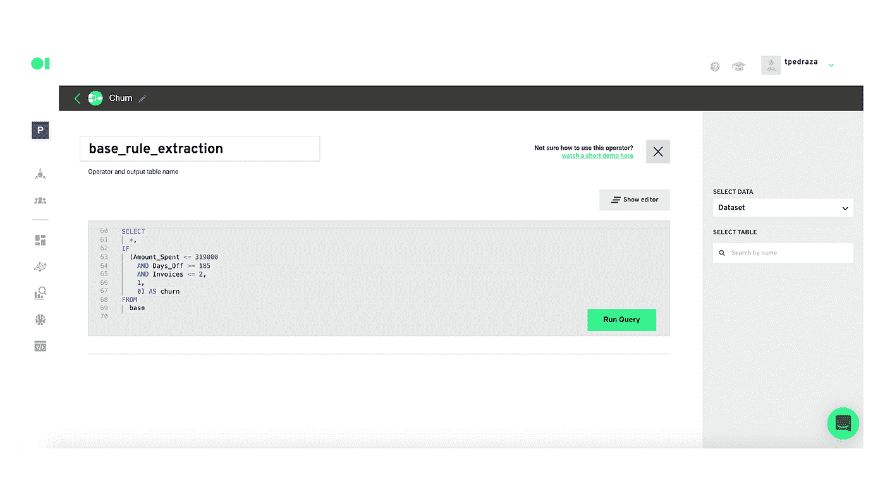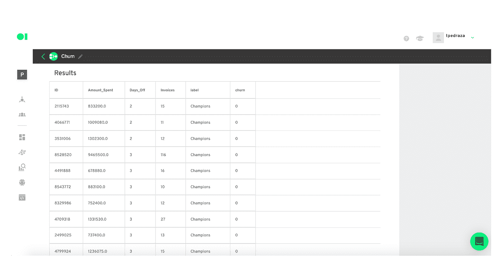

从
基数中选择
*、
IF
(金额 _ 花费< = 319000
和天数 _ 休假> = 185
和发票< = 2、
1、
0)作为流失

**3。运行查询并保存该表。**

现在回到管道，按下 play 按钮，通过将鼠标悬停在它上面来运行 SQL 操作符。然后，添加第二个 SQL 操作符，它将提取您的客户信息。重复相同的过程，但这次复制并粘贴下面的查询。通过运行查询并按 play 运行元素来完成，如步骤 2 所示。

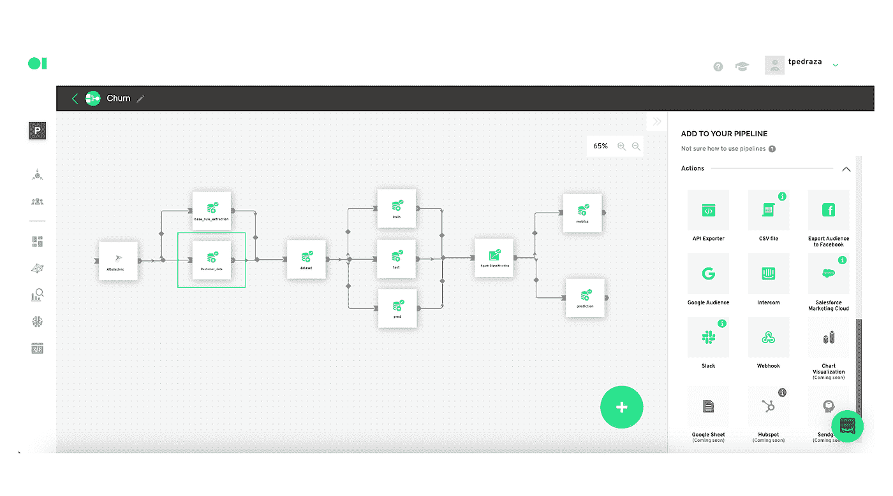

选择
不同的制作。CheckID，
制作方法。
剧组(Clientes。InvoiceNumber AS INT64)作为 InvoiceNumber，
Clientes。从
客户处提取
年
的业务日期。BusinessDate)作为年度发票，
从
客户中提取(月份
)。BusinessDate)作为 MonthInvoice，
从
客户中提取(第
天)。BusinessDate)作为 DayInvoice，
客户。PrimaryPhoneNumber，
客户。电子邮件地址，
客户。地址行 1，
客户。MainPaymentDescription，
IF
(客户。MainPaymentDescription = ' post mates '
或客户。MainPaymentDescription = ' UbearEats '，
0，
IF
(Clientes。MainPaymentDescription = ' Cash '
1，
IF
(Clientes。MainPaymentDescription = ' master card '
或客户。MainPaymentDescription = ' Visa '
或客户。MainPaymentDescription = 'Amer。' Exp '
或委托人。主顾。MainPaymentDescription = 'Credit '，
2，
3)))作为 PaymentDescription_ID，
IF
(Clientes。MainPaymentDescription = ' post mates '
或客户。MainPaymentDescription = ' UbearEats '
1)作为 CompraMedioDigital，
if null(DATETIME _ DIFF(DATETIME(Clients。ClosedTime)，
DATETIME(客户端。SentToKitchenTime)，
分钟)，
263)作为交货时间，
客户。
IFNULL 城市(CAST(Items。FKStoreId 为 INT64)，
0)为 FKStoreId，
项。Item，
IFNULL(强制转换(Items。FKItemId 为 INT64)，
0)为 FKItemId，
Clientes。小计，
制作方法。Promo，
IF
(演员表(制作。Promo AS FLOAT64) > 0，
1，
0) AS TieneDescuento，
Facturas。TotalSale，
物品。价格，
物品。
储存，施放(物品。Value AS float 64)AS Value
FROM
` adataunickpf _ _ adataunick _ dbo _ view _ PFC _ Clients ` AS Clients
JOIN(
SELECT
DISTINCT DOB，
checknum，
CheckID，
IdStore，
Promo，
sale total
FROM
` adataunickpf _ _ adataunick _ dbo _ view _ PFCIdStore =客户端。IdStore
和 Facturas。CheckID = Clientes。订单号
和制作方法。DOB =客户。business date
JOIN(
SELECT
DISTINCT FKStoreId，
DateOfBusiness，
CheckNumber，
Value，
Store，
Price，
Item，
FKItemId
FROM
` adataunickpf _ _ adataunick _ dbo _ view _ fac _ Items `)作为
项目上的项目
。FKStoreId =发票。IdTienda
和物品。营业日期=发票。DOB
和物品。支票号码=发票。铸造时的检验号
(Valor AS float 64)>= 2000

**4。现在，您将合并步骤 2 和步骤 3 的 SQL 操作符，以便开始训练您的 ML 模型。**

为此，拖放第三个 SQL 操作符，将其连接到包含销售信息的第一个操作符和包含客户信息的第二个操作符。为此，请将下面的查询复制并粘贴到 SQL 画布中。运行查询，保存结果，并在元素上按 play 来运行操作符。

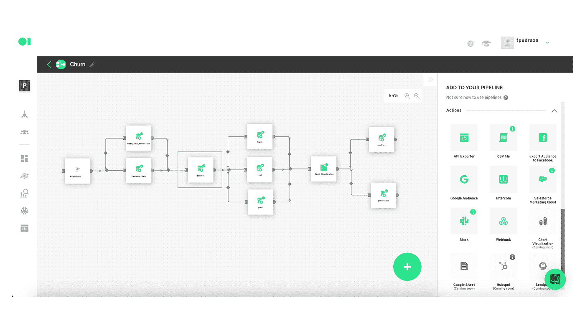

以
为基数(
SELECT
primary phone number、
YearInvoice、
MonthInvoice、
DayInvoice、
FKStoreId、
FKItemId、
PaymentDescription_ID、
DigitalChannel、
DeliveryTime、
WithPromo、
Valor
FROM
` operator _ 5f 9c 298 e 7d 5325 F3 733 e 320 _ _)PrimaryPhoneNumber =规则。身份证明

**5。训练你的 ML 模型**

这将让机器确切地知道它需要处理的信息。要了解更多关于运营商的信息，[请观看此视频](https://www.youtube.com/watch?v=-5Kj6RX67YU)。

提示:我们建议将 80%的数据集用于训练，20%的数据集用于测试。

要训练模型，您需要一组数据来训练算法(训练数据集)。如果您想要评估模型，您需要一组测试数据(测试数据集)，尽管这不是强制性的。最后，目标是模型的输出(100%的数据集)，即您希望 Datagran 预测的值。为此，需要有一个用于预测的数据集(预测数据集)。

将鼠标悬停在将被命名为 Train 的第一个操作符元素上，然后按下 edit 按钮。将弹出 SQL 查询编辑器页面，您可以在其中选择要从数据中提取的列。复制并粘贴下面的查询示例，替换每个变量以应用于您的表的变量，或者按右上角的显示编辑器按钮来选择列，而不必添加代码。然后，运行运算符。

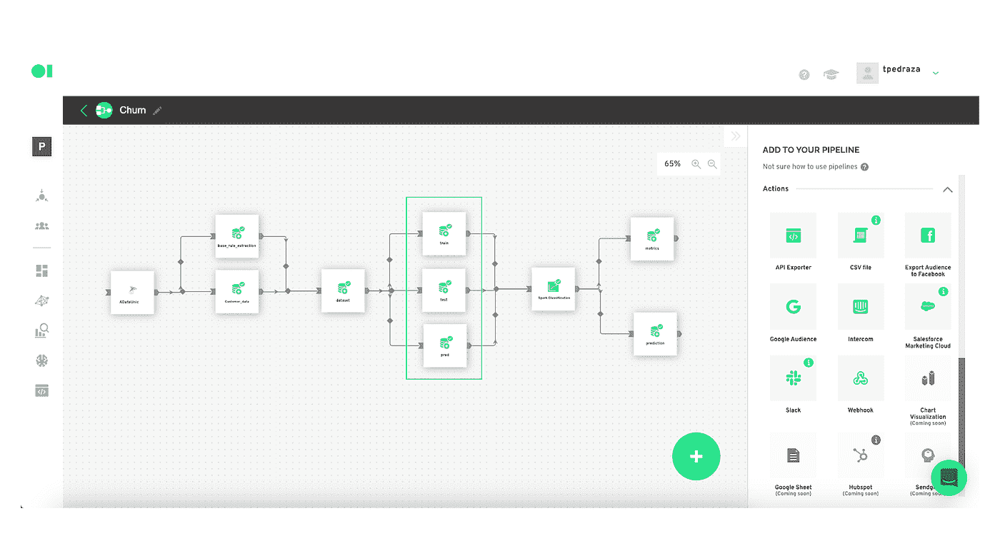

SELECT
YearInvoice，
MonthInvoice，
DayInvoice，
FKStoreId，
FKItemId，
PaymentDescription_ID，
DigitalChannel，
DeliveryTime，
WithPromo，
Value，
churn
FROM
` operator _ 5 F9 C2 a 097d 5325 F3 f 733 e323 _ _ SQL _ output`【T57

其次，测试数据集:

将第二个 SQL 操作符拖放到画布中。单击 Edit 按钮，并将第二个 SQL 元素命名为 Test。将虚拟查询复制并粘贴到 SQL 画布中。同样，这只是一个示例，您必须用自己的列变量替换查询的列变量。

选择
YearInvoice，
MonthInvoice，
DayInvoice，
FKStoreId，
FKItemId，
PaymentDescription_ID，
DigitalChannel，
DeliveryTime，
WithPromo，
Value，
churn
FROM
` operator _ 5 F9 C2 a 097d 5325 F3 f 73333

第三步是运行你的预测:

在这种情况下，您不希望从未来提取的信息中进行预测，而是从您当前拥有的客户记录信息中预测数据告诉您什么。该 SQL 将使用 100%的数据运行。通过这个查询，您将发现，根据历史数据，您的客户将来最有可能做什么。

将第三个 SQL 操作符拖放到画布中。按下编辑按钮，并将其命名为预测。复制并粘贴下面的虚拟查询，并用您自己的列变量替换。

选择
2020 年发票，
11 月语音，
01 日发票，
1 FKStoreId，
200447 FKItemId，
0 PaymentDescription_ID，
0 DigitalChannel，
120 发货时间，
0 WithPromo，
41900 Value
UNION ALL
选择
2020 年发票，
11

运行 SQL 运算符:

要激活所有三个 SQL 元素，必须按下播放按钮。只需将鼠标悬停在每个元素上即可找到它。

6。连接火花分类算法求流失率

将 Spark 分类操作符拖放到画布中。将所有操作员连接到它，通过将鼠标悬停在 Spark 元素上并按下编辑按钮来打开它的设置。从每个下拉菜单中选择选项，完成后保存它们。回到画布 a，通过将鼠标悬停在 Spark 分类元素上并按下 play 按钮来运行该元素。

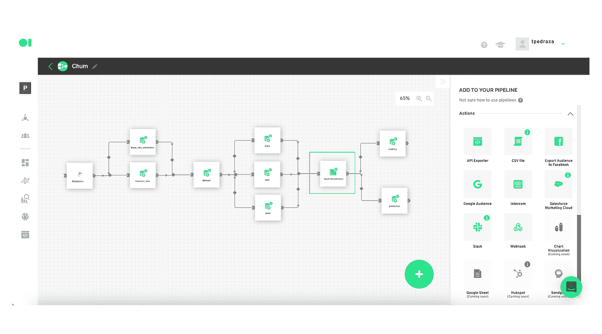

7。将 ML 模型结果发送给生产

拖放和行动，如松弛发送流失结果到松弛渠道。将 Spark 分类元素连接到新操作，然后按下 edit 按钮。登录到您的 Slack 帐户，选择您想要将结果发送给的渠道和用户。然后，选择要发送的表和列以及消息的描述。您可以保存并测试它，或者简单地保存它。完成后，返回到管道画布并按+号，然后选择 Play 运行管道。这将开始每天运行您的工作流，从您的数据源提取信息，训练，测试和预测，以及应用 Spark 分类算法，并确定每天的流失。您的 Slack 频道将每天自动接收模型结果，以供进一步分析。

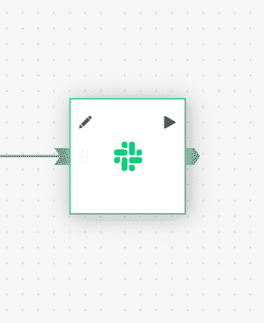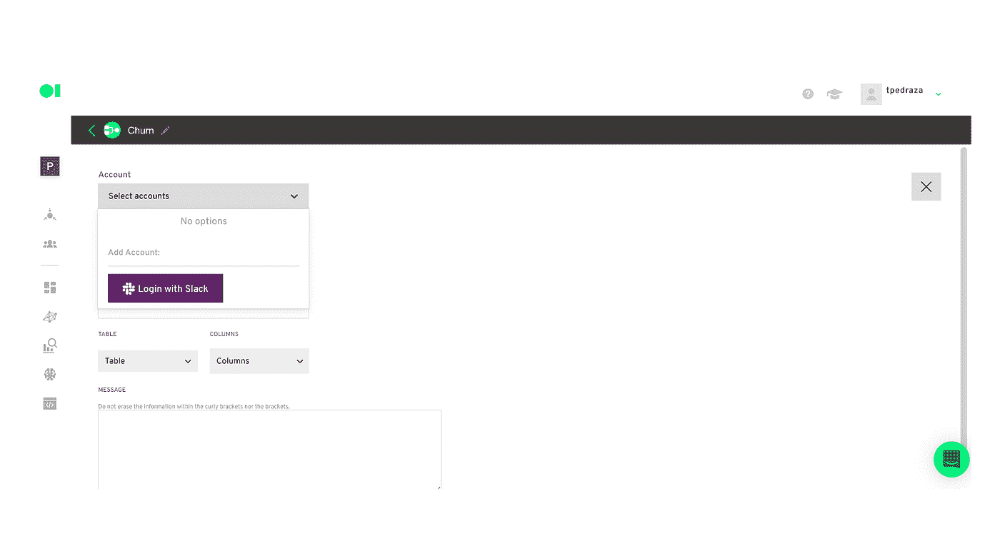

由于其易于使用的管道工具，Datagran 可以让您轻松地使用机器学习模型测量客户流失。将模型的结果即时发送到我们任何可用的业务应用程序，以前所未有的方式根据结果采取行动。构建 ML 模型来预测客户流失提供了正确的工具来留住客户，甚至在他们离开之前，让您的企业在竞争中领先。[了解更多关于我们管道的信息](https://www.notion.so/Datagran-Documentation-bd0f3437b00a49ca816f43cffb9d22c8)，构建更先进的模型来解决从运营到消费者问题的各种业务问题。