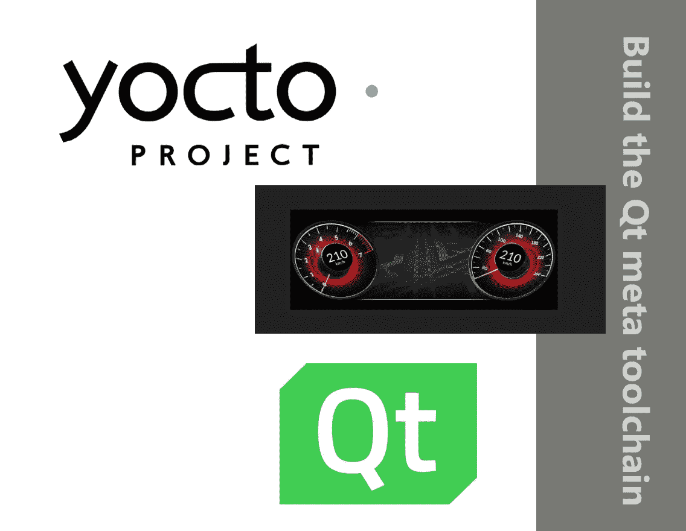

# 如何用 Yocto 项目为 Qt 准备元工具链

> 原文：<https://medium.com/geekculture/how-to-prepare-a-meta-toolchain-for-qt-with-yocto-project-400b72e93e86?source=collection_archive---------2----------------------->

准备一个元工具链的一步一步的实用指南，它将允许您将 Qt 制作的应用程序部署到来自 BeagleBone Black 家族的嵌入式设备上

# 介绍

如果您需要更多关于 Yocto 项目和 Qt 的信息，请随意访问我介绍这些的文章。