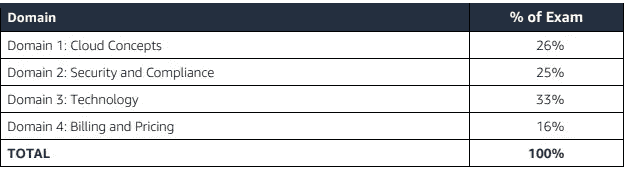

# 如何快速准备 AWS 云从业者认证

> 原文：<https://medium.com/geekculture/how-to-prepare-for-the-aws-cloud-practitioner-certification-in-no-time-e0fd62af87cc?source=collection_archive---------6----------------------->

## 资源和详细的学习计划

Photo by [Austin Distel](https://unsplash.com/@austindistel?utm_source=medium&utm_medium=referral) on [Unsplash](https://unsplash.com?utm_source=medium&utm_medium=referral)

在本文中，我将与您分享一些资源和一个详细的学习计划，以尽快通过 AWS 云从业者证书，即使这是您第一次进入云领域。目标是帮助你在几天和几个小时的专门学习中从头开始准备和参加考试。

AWS 认证云从业者认证由 Amazon Web Services 提供，作为入门层，随后是他们的助理和专业认证。它是入门考试，介绍 AWS 的基本概念、服务和使用案例。

# 考试详情(来自 AWS)

## 学习目标

*   解释 AWS 云的价值
*   理解并解释 AWS 共同责任模式
*   了解安全最佳实践
*   了解 AWS 云成本、经济和计费实践
*   描述和定位核心 AWS 服务，包括计算、网络、数据库和存储
*   确定常见用例的 AWS 服务

## 推荐的 AWS 知识

*   AWS 云概念
*   AWS 云中的安全性和合规性
*   了解核心 AWS 服务
*   了解 AWS 云的经济性

## 超出范围

*   设计云架构
*   编码、故障排除、实施和迁移
*   负载和性能测试
*   商业应用

## 内容大纲

## 考试流程

*   65 个 MCQ 问题
*   70%正确通过(46 个问题)
*   100 分钟
*   100 美元
*   可以采取物理或远程(我个人推荐远程与皮尔森 Vue)

# 学习计划+资源

在这一部分，我将列出一些你可以利用的免费和付费资源。就我个人而言，免费资源对我来说已经足够了，直到我想做更多准备的专业认证水平。然而，付费资源肯定更好，如果你愿意花点钱的话，可能会更好地帮助你。

## 课程和内容

首先了解 AWS 云非常重要，尤其是在你没有任何先验知识的情况下。有许多免费和付费的资源可以教你一般云计算和 AWS 云的重要概念。你可以在很多地方找到这些资料，比如 Linux Academy、云专家、Udemy 等等。这里只是一些帮助你，你不必使用所有的，但我建议看一看，挑选几个，这样你就可以涵盖所有的基础。

*   AWS 白皮书(推荐给助理及以上人员，但如果您有时间也很好，详情见下文)
*   AWS 认证[页面](https://aws.amazon.com/certification/certified-cloud-practitioner/)上的资源(强烈推荐下载考试指南、样题和练习题，这样你就知道会遇到什么。AWS 专家还在 Twitch 上提供免费培训，很好理解。你能免费找到的一些最好的资源，可能就是你所需要的)
*   Qwiklabs(不确定是免费的还是免费的，个人没有使用过，但是如果你需要的话，对动手体验有好处)
*   [夏羽·马瑞克的终极 AWS 认证云从业者 2022 Udemy 课程](https://www.udemy.com/share/103a093@cDJEJVdotvM9ebgNxiEQqI3YnLTD6Yk0c7pKlhZPGHIJ64aAmBINSLNBuMdEvglMmg==/)(付费但我个人最喜欢的课程之一，非常全面，省去了你记笔记或整合多个来源信息的麻烦)

## 模拟考试和练习题

一旦您对 AWS 云及其服务有了更好的了解，您应该参加模拟考试并尝试练习问题，以便您更熟悉您可能会发现的潜在挑战。这也有助于你发现知识上的差距，以便你能弥补它们。

*   AWS 练习题和样题(免费，适合尝试，但问题不多)
*   [夏羽·马瑞克 6 级实践考试| AWS 认证云从业者](https://www.udemy.com/share/103aFZ3@88FJJxx7ib8l8WMqCjMY6e73jU3WZ7kjJslRBzo1vw0BFkU-MMTmwrsu11CnU3hw4w==/)(付费，但真的是你需要的全部。真正为考试做准备的挑战性问题)
*   [Jon Bonso AWS 认证云从业者实践考试](https://www.udemy.com/share/102a6G3@XwIaUk6Cn8DERR6U16fG5OMcF0lcZnG7wmXJ59dS2gd0i9IvRVAC5CAaNlKQWblS_g==/)(付费，但更实惠，真正挑战你。个人感觉他的问题可能比实际考试难)
*   来自 [DigitalCloud](https://digitalcloud.training/aws-cloud-practitioner-free-practice-questions/) 或 [ExamTopics](https://www.examtopics.com/exams/amazon/aws-certified-cloud-practitioner/) 的练习题(免费，有一些有问题的答案和措辞。有用的话可以参考论坛，看看那些尝试过的人的回复。免费资源带来的好处)

## AWS 白皮书

就像我上面说的，我个人根本没用过它们，即使是对于专业级来说。然而，它确实很有帮助，并且让您对每个服务是如何组合在一起的有了一个非常广泛的了解。对于云从业者考试，您应该关注下面的这些白皮书。

*注意:确保这些论文是最新的(仅 pdf 版本)，并且在第一页(pdf)上没有“[存档]”。我尽量保持这些更新，但以防万一。*

*   [亚马逊网络服务概述](https://d0.awsstatic.com/whitepapers/aws-overview.pdf)
*   [AWS 架构良好的框架](https://docs.aws.amazon.com/wellarchitected/latest/framework/welcome.html)
*   [AWS 定价的工作原理](https://docs.aws.amazon.com/whitepapers/latest/how-aws-pricing-works/welcome.html)
*   [AWS 支持计划](https://aws.amazon.com/premiumsupport/plans/)

# 其他信息

1.  如果可以的话，我建议你在家里参加 Pearson Vue 的考试，但是你需要一个非常严格和安静的环境。如果你的家庭是不利的，那么最好是去身体
2.  做好准备，提前到考试报到处，无论是身体上的还是虚拟的，如果你有考试焦虑，开始让自己平静下来做好准备
3.  考完试你不会知道自己的分数，但你会知道自己是及格还是不及格。结果可能需要长达 5 天，但通常在几个小时到一天内出现。然而，最近我了解到，有时通过/失败不会立即显示出来，所以如果没有出现也不要惊慌。

## 祝你好运！