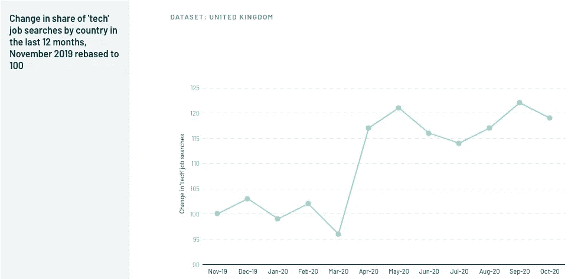

# 如何防止欧洲科技创业公司人才短缺？

> 原文：<https://medium.com/geekculture/how-to-prevent-talent-shortage-in-european-tech-startups-961be025d618?source=collection_archive---------12----------------------->

Photo by [Ivars Krutainis](https://unsplash.com/@krutainis?utm_source=medium&utm_medium=referral) on [Unsplash](https://unsplash.com?utm_source=medium&utm_medium=referral)

# 简单地说

*   为什么当欧洲劳动力是历史上受教育程度最高的时候，雇主却面临着重大的招聘挑战？
*   与英国、瑞典或德国一样，欧洲国家在吸引和雇佣技术工人方面面临更大的困难。欧洲科技行业正经历快速增长，因此正面临技能短缺。
*   人才市场是全球性的。许多欧洲科技初创公司将争夺最优秀的人才。
*   创业公司可以通过提高内部人才团队的技能和技能以及跨国招聘来防止人才短缺。

# 人才短缺

随着欧洲继续从旷日持久、代价高昂的经济危机中复苏，十分之四的欧盟(EU)初创公司报告称难以找到合格的员工。

技能短缺通常表现为初创公司无法在科技行业当前的工资和工作条件下，在合理的时间内填补空缺职位，因为无法找到像 AI 这样拥有[所需数字技能的员工。我们早就知道科技人才短缺。但是这种短缺可能比你想象的还要严重。](https://www.bruegel.org/2020/08/europe-has-an-artificial-intelligence-skills-shortage/)

技术支撑着全球经济的所有其他领域，但由于严重的技能短缺，技术进步可能会很慢。根据一份新的 [Korn Ferry 对全球 1500 名领导人的报告](https://www.kornferry.com/insights/pdfs/future-of-work--the-global-talent-crunch-report):

> 到 **2030** ，由于技能短缺，**英国将无法实现近 9** 的技术、媒体和电信(TMT)部门潜在收入。技术、媒体和电信劳动力短缺。…到 2030 年**， **TMT 行业**预计将占**美国经济的近** 10%，预计全球所有市场都将大幅增长。**

**例如，到 2022 年，北欧国家将面临大约 70，000 名工程技术人员的短缺。**

**瑞典的技术技能短缺在 2016 年变得如此严重，以至于瑞典音乐流媒体巨头 Spotify 的联合创始人请求瑞典政府实施重大变革。**

**挪威政府预计，到 2030 年，该领域将至少缺少 4，000 名专家。**

**芬兰雇主也在努力寻找技术专业人员，尤其是工程师。尽管该国失业工程师人数相对较多(4000 人)，但由于能力不匹配，短缺仍然存在。据芬兰职业工程师联盟称，15 年前毕业的人可能并不真正拥有满足当今工作环境需求的技能。**

**德国每年需要 26 万移民来满足劳动力需求。根据贝塔斯曼基金会的报告，每年将有 14.6 万人需要从非欧盟成员国移民。**

**许多人和我一样，一直在讨论欧洲科技行业是如何扩张的。根据欧洲科技状况[报告](https://2020.stateofeuropeantech.com/chapter/investments/article/investments-geo-industry/)，欧洲科技生态系统的总投资预计将达到 338.1 亿€的新高。**

****

**[State of European Tech](https://2020.stateofeuropeantech.com/) website — Atomico**

**欧洲的技术正在快速发展，因此正面临技能短缺。**

**很容易想象，随着对技术需求的增长，这一差距会进一步扩大。人才的缺乏会减缓数字革命吗？到 2030 年，430 万工人的劳动技能赤字和 4497 亿美元的未实现产出。**

## **全球市场**

**我们可以在欧洲科技生态系统中看到的另一个现象主要是由跨境招聘的增长推动的，这就是科技工作的薪酬增加。就目前情况而言，欧盟工资远低于美国工资，导致最优秀的人才流向美国公司。**

**现在，欧洲科技员工可以为硅谷的初创公司远程工作，欧洲科技公司将被迫提高薪酬待遇，否则将面临人才流失的风险。**

**这种空缺反映了技能短缺，对欧洲企业的生产力和竞争力产生了不利影响，欧盟职业教育和培训政策需要解决这一问题的根源。**

**然而，欧洲的政策将有助于促进教育和培训提供者与市场行为者之间的社会对话机制。它们必须提供必要的激励和结构性架构，以确保我们的欧洲教育和培训工具行之有效。但那是后话了。**

**人才市场是全球性的。很多创业公司会和你争夺你最优秀的人才。**

# **发掘最优秀的人才**

**当真正与高技能短缺联系在一起时，人才瓶颈是一个公司对创新密集型创业战略采取竞争方式的标志，这将限制组织的绩效和成功。**

**如果欧洲的科技创业公司想要继续他们的指数增长速度，人才短缺的问题必须得到解决。有三种方法可以解决初创企业中的技能差距:**

**聪明的招聘。为了减少招聘熟练工人的问题，人才管理战略的基础是扩大潜在申请人的范围，改善内部人才渠道，我称之为“聪明招聘”。我们帮助初创公司开发有效的智能招聘流程。对企业家和初创公司创始人来说，尽早投资一个优秀的内部招聘人员是个好主意，但许多人不知道从哪里开始。我们帮助他们实施最佳实践，从他们如何发现人才到管理职业发展。这是一个巨大的挑战。**

****技能提升和技能再提升。**训练，训练，训练。欧洲科技创业公司必须致力于提供高质量的学徒机会和高质量的培训，投资于优秀的内部人才团队。当人们学会在方便的时间，以对他们方便的速度获得他们需要的技能时，这对发展技能的能力有重大影响。发展数字能力带来屡获殊荣的表现。**

****跨国招聘。**雇佣居住在其他地方的远程员工或雇佣外籍员工并重新安置他们。当[远程工作](https://daniel-leivas.medium.com/10-key-practices-of-successful-remote-work-teams-d4dd23205748)永久确立后，就有可能通过扩大公司所在地之外的边界和克服地理障碍来真正雇佣合适的员工，从而扩大获得最佳人才的机会。优秀的人才可以在世界范围内找到，多元化可以改变游戏规则。**

**感谢阅读。我希望这篇文章对你有用。**

** [## 欧洲缺乏人工智能技能

### 欧洲缺乏人工智能人才的情况有多严重，与美国、中国和英国相比如何…

www.bruegel.org](https://www.bruegel.org/2020/08/europe-has-an-artificial-intelligence-skills-shortage/)  [## 北欧正在努力应对新兴欧洲的科技人才短缺

### 尽管这四个北欧国家的经济经常出现在科技公司的最佳投资地名单中…

emerging-europe.com](https://emerging-europe.com/news/the-nordics-are-struggling-with-a-tech-talent-shortage/?ck_subscriber_id=897681563)  [## Atomico 的《欧洲科技现状》

### 对欧洲技术最全面的数据驱动分析

2020.stateofeuropeantech.com](https://2020.stateofeuropeantech.com/european-ecosystem-weathers-storm/)  [## 研究:德国每年需要 26 万移民来满足劳动力需求| DW | 12.02.2019

### 到 2060 年，德国每年至少需要 260，000 名新移民工人，以满足由以下原因造成的劳动力短缺……

www.dw.com。](https://www.dw.com/en/study-germany-needs-260000-immigrants-a-year-to-meet-labor-demand/a-47470731?ck_subscriber_id=897681563)  [## 成功远程工作团队的 10 个关键实践

### 远程工作和远程工作(或在家工作)是不一样的。嗯什么？等等……什么？事实上，这是一种劳动方式…

daniel-leivas.medium.com](https://daniel-leivas.medium.com/10-key-practices-of-successful-remote-work-teams-d4dd23205748)**