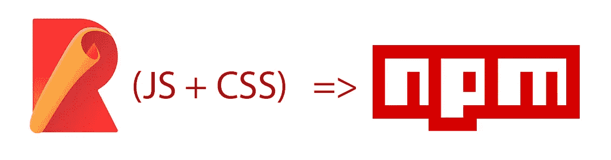

# 如何使用 Rollup 将 JS 和 CSS 库发布到 NPM

> 原文：<https://medium.com/geekculture/how-to-publish-a-js-and-css-library-to-npm-using-rollup-5406dbee51fa?source=collection_archive---------1----------------------->



在本指南中，我们将讨论如何创建 javascript 库并将其发布到 npm。在前一篇[文章](https://suryasankar.medium.com/a-simple-nested-tree-menu-with-vanilla-js-and-css-d30159f14096)中，我们已经构建了一个小脚本来创建一个嵌套的树形菜单。我们将在这里将其转换为 npm 包。

# 步骤 1:初始化目录和 repo。

让我们为库创建一个文件夹，并在那里添加一个 README.md 文件。这是执行 git init 并创建一个远程 github repo 来跟踪它的好时机。(如果你是这方面的新手，你可以查看 github howto [这里](https://docs.github.com/en/github/importing-your-projects-to-github/adding-an-existing-project-to-github-using-the-command-line)

# 步骤 2:在 src 文件夹中添加脚本和样式表

在本指南中，我们打算构建这个包，然后在一个示例项目中使用它。我们将创建两个独立的文件夹。一个用于包，一个用于示例。

在包目录中，我们将为源文件和构建文件创建单独的文件夹。在现代 javascript 工作流中，很少直接分发手工编码的源文件。源文件通过捆绑器传递，捆绑器执行各种转换和优化，并提供可以在浏览器或其他环境中使用的输出文件。因此，我们将继续创建两个名为`src`的文件夹，一个用于源文件，另一个用于输出文件。这个`dist`文件夹不需要我们去碰。它将由 bundler 填充。

在 src 文件夹中，我们创建两个子文件夹— `js`和`styles`，分别存放 javascript 文件和样式表。

文件夹结构现在应该是这样的

```
├── README.md
├── examples
│   ├── dist
│   ├── src
└── package
    ├── dist
    └── src
        ├── js
        └── styles
```

我们将把我们的[嵌套树形菜单示例](https://techonometrics.com/posts/a-simple-nested-tree-menu-with-vanilla-js-and-css)中的样式标签的内容复制到 package/src/styles/main.scss。我们正在使用 scss 扩展，以便我们将来可以使用 sass 特定的特性。但是现在，我们的样式表实际上只是纯 css 而已。

类似地，我们也将样式标记的内容复制到 package/src/js/index.js 中。

我们对从脚本标签复制的内容做了两处修改。

1.  我们在顶部导入 main.scss。这将告诉我们的 bundler 如何定位样式表，以便它们可以被缩小。
2.  我们在底部添加了一个`export default listree`语句，让我们将函数导出为 ES 模块。

# 步骤 3:初始化 npm 包

现在让我们从包文件夹中调用 npm init。这将创建一个 package.json，我们将对其进行编辑以修改`main`键并添加另外两个键- `module`和`browser`。我们还将设置 files 属性，把要添加到包中的 dist 文件夹列入白名单。

`main`键代表包的入口点。如果我们使用 NodeJS 构建一个在服务器端使用的库，我们会将其指向 CommonJS 输出格式。但是我们在这里构建的是一个纯粹的前端库，它在浏览器上下文之外没有任何用处。所以我们将它设置为指向 [ES 模块](https://developer.mozilla.org/en-US/docs/Web/JavaScript/Guide/Modules)格式输出——这将使它可以通过 import 语句访问。因此该值被设置为`dist/listree.esm.min.js`。该文件尚不存在，我们将在后续步骤中使用 bundler 生成它。

`module`入口点专门用于指向 ES 模块输出。这在 main 被设置为指向 CommonJS 输出的情况下很有用。在我们的例子中，我们已经将 main 指向了 an。esm 文件。但是无论如何我们将设置模块属性也指向`dist/listree.esm.min.js`。

`browser`条目应该指向可以在浏览器脚本标签中直接加载的脚本文件。我们将把它设置为`dist/listree.umd.min.js`，其中 umd 代表通用模块定义。

入口点文件——ESM 和 umd 将使用如下捆绑器生成

# 步骤 4:安装汇总

我们将使用 rollup 作为 bundler 来生成我们的包分发文件。有各种各样的捆绑系统可供选择——web pack 是目前最流行的。但是 rollup 更适合生成可再发行的库。

```
npm install --save-dev rollup rollup-plugin-scss rollup-plugin-terser
```

除了 rollup，我们还在这里安装了另外两个插件——一个用于将 scss 转换为 css，另一个是 terser 插件，用于最小化生成的文件

# 步骤 5:创建汇总配置 js 文件

我们使用 rollup.config.js 文件来指示 rollup bundler

在上面的配置中，我们将输入指定为我们在 src/js 中创建的 index.js。我们不必为 css 指定单独的输入，因为我们已经在 index.js 本身中导入了样式。

我们还配置了两个不同的输出，每个输出对应于 package.json 中指定的一个入口点。

我们还需要缩小生成的输出文件以便分发，这是由`terser`插件完成的。最后，我们使用 scss 插件生成一个缩小的输出 css。

# 步骤 6:构建输出文件

现在所有的配置都完成了，我们可以使用各种选项调用 rollup 命令行脚本。调用`rollup -c`将构建这个包。但是我们不是直接调用它，而是通过指定一个脚本数组来设置与 package.json 本身中的各种脚本相对应的命令，如下所示

现在我们只需调用`npm run build`，它将在`dist/`文件夹中生成所有的输出文件。我们现在需要验证它是否有效

# **步骤 7:通过使用 npm 链接使用一个示例 html 测试包的 umd 版本**

为了检查这个包在被另一个应用程序导入时是如何工作的，我们可以创建一个样例应用程序并导入这个包。

我们将在`examples`文件夹中创建一个文件`umd.html`。让我们复制文件中的以下 html 内容

注意，上面的文件引用了来自`node_modules`的 js 和 css 文件。但是我们还没有向 npm 发布我们的包。那么我们如何确保`examples`中的 node_modules 文件夹包含 listree 包呢？

NPM 为此提供了命令`npm link`。如果您熟悉 python 的包环境，这与从包文件夹中运行`python setup.py develop`有相同的效果。它实际上是将包安装在您想测试它的任何地方——在开发模式中。因此，如果对包代码进行了任何更改，调用应用程序也可以立即进行测试。这确保了我们不必在每次想要测试我们所做的小改变时都发布。因此，我们要做的是在本地链接软件包。

所以首先我们将在我们的`package`文件夹中运行`npm link`。一旦这个命令成功，这个包就链接到开发机器中的全局节点模块文件夹。

现在，为了在我们正在开发的另一个包中使用我们的包，我们将进入 examples 文件夹并在那里运行`npm link listree`。这将在 examples 文件夹中创建一个包含`listree`包的`node_modules`文件夹。在浏览器中打开`examples/umd.html`文件时，我们可以看到功能按预期运行。

# 步骤 8:使用 webpack 测试包作为 ES6 模块的导入

为了检查包作为 ES6 模块的行为，我们将在 examples 文件夹中创建一个 src/index.js 文件，其内容如下

为了使这个脚本可以通过脚本标签加载，我们将使用 webpack 来转换和捆绑它。我们在这里使用 webpack 而不是 rollup，因为 webpack 更适合于现成的应用程序捆绑(而 rollup 更适合于库捆绑)，并且更适合于测试我们的包在通过 webpack 捆绑时的行为，因为 webpack 是 web 开发人员最常用的包捆绑器。

我们首先必须通过运行`npm install -g webpack webpack-cli`来安装 webpack 和 webpack-cli

然后我们像这样加上一个`webpack.config.js`

如果我们运行`webpack`，它将创建一个`dist/mylistree.js`文件。我们现在将把我们的 umd.html 复制到`examples/es.html`，并用引用这个`dist/mylistree.js`文件的脚本标签替换底部引用 listree.umd.min.js 的脚本标签。也就是说，我们将替换它

```
<script src="./node_modules/listree/dist/listree.umd.min.js"></script>
<script>
   listree();
</script>
```

有了这个-

```
<script src="dist/mylistree.js"></script>
```

在第二种情况下，我们不需要调用`listree()`函数，因为我们已经在 index.js 中调用了它，index . js 被打包为`mylistree.js`。现在，如果我们在浏览器中打开`examples/es.html`，我们可以看到功能按预期运行。

注意，我们已经通过使用`file://`协议直接加载两个 html 文件来检查它们。如果我们想在通过 web 服务器提供服务的环境中测试它们，我们可以使用 webpack 的 html 和 devserver 插件来做同样的事情。但是为了简洁起见，让我们把这个任务留到以后的文章中。

# 第九步:推送至 github repo

现在我们已经完成了包的创建，让我们也做一个到 github 的推送。我们还需要编辑。gitignore 排除 dist 和 node_modules 文件夹。

```
node_modules/
dist/
```

不过，对 package-lock.json 文件进行版本提交是可以的。

# 步骤 10:将包发布到 npm

为此，我们将首先在[https://www.npmjs.com/](https://www.npmjs.com/)上创建一个账户(如果我们还没有的话)。然后在本地开发机器上，我们执行命令`npm login`。这将要求我们输入用户名、密码和电子邮件。一旦进入，我们就可以发布这个包了。

只需在包文件夹中调用`npm publish`，我们就可以看到包被发布到 npm 存储库中。

# 步骤 11:在 html 中使用发布的包

关于发布到 npm 的一个很棒的事情是我们的包获得了现成的 CDN 支持。将一个包发布到 npm 使得它可以通过各种内容交付网络自动获得，比如 [Unpkg](https://unpkg.com/) 、 [CDNJS](https://cdnjs.com/) 和 [JSDelivr](https://www.jsdelivr.com/) 。我们可以选择这些中的任何一个。例如，如果我们决定使用 unpkg，我们可以像这样访问我们包的 umd js 版本[https://unpkg.com/listree/dist/listree.umd.min.js](https://unpkg.com/listree/dist/listree.umd.min.js)。我们可以通过修改示例 html 文件中的 css 和 js 标签 URL 来测试这一点，使其指向这个 CDN 链接，而不是本地文件，我们将看到功能仍然按预期工作。

因此，我们创建并发布了一个包到 NPM 仓库，并成功地在一个应用程序中使用了它。本教程到此结束。为这个教程创建的包的代码可以在 https://github.com/SuryaSankar/listree[获得。如果你觉得这个包或这个教程有用，请考虑主演回购。这个包本身可以在 npm 中使用，名称是`listree`](https://github.com/SuryaSankar/listree) [这里是](https://www.npmjs.com/package/listree)。你可以在你的项目中调用`npm install listree`来安装和使用它。

*原载于*[*https://techonometrics.com*](https://techonometrics.com/posts/how-to-publish-a-js-and-css-library-to-npm-using-rollup/)*。*