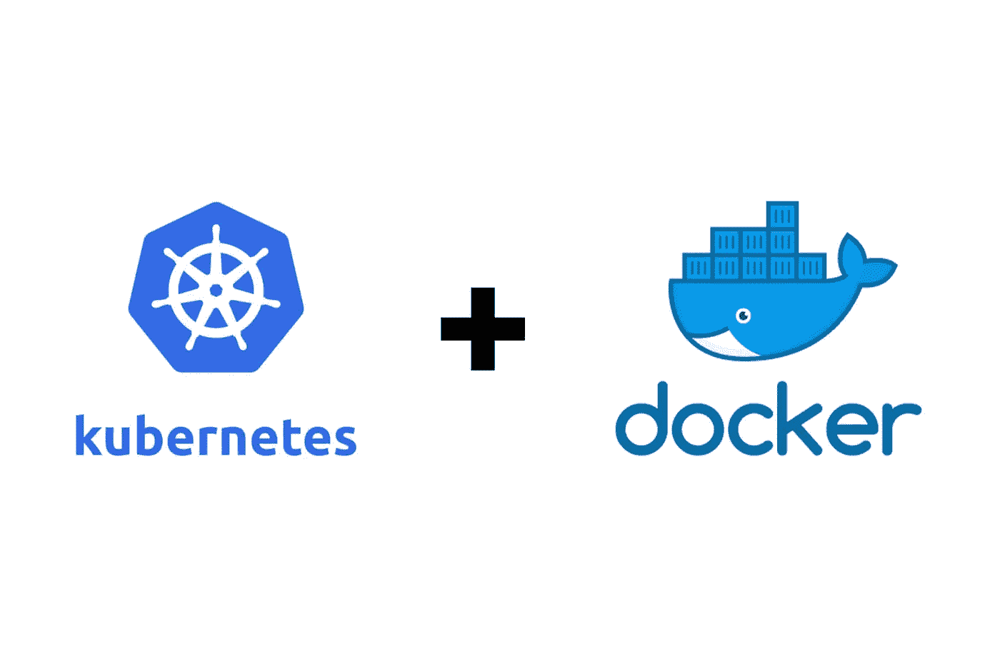

# 如何从 Kubernetes 的 AWS ECR 中提取 Docker 图像

> 原文：<https://medium.com/geekculture/how-to-pull-docker-images-from-aws-ecr-in-kubernetes-9d2f7eef46c8?source=collection_archive---------5----------------------->

Source ([link](https://blog.hcltechsw.com/digital-experience/what-are-kubernetes-and-docker-and-why-should-they-be-part-of-your-digital-solution/))

在这个简短的教程中，我们将学习如何从 Kubernetes 的 AWS ECR 中提取 docker 图像。

# 先决条件

确保您已经设置了所有必需的先决条件。您可以通过验证是否能够从 AWS ECR 本地(在机器上而不是在集群上)提取映像来检查这一点。按照本教程，详细了解如何做…