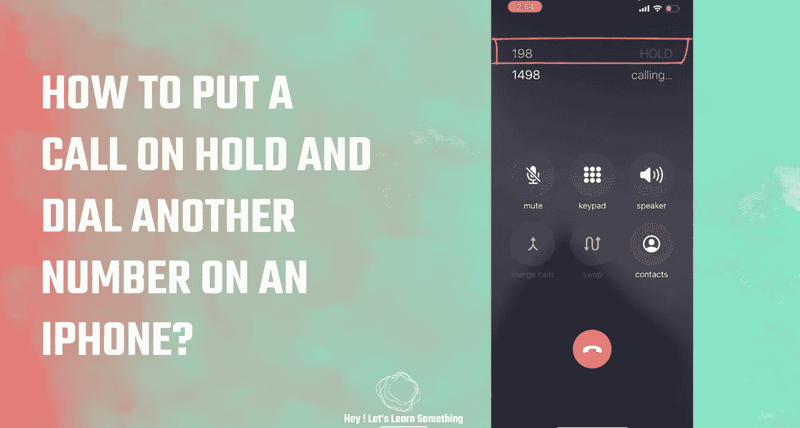

# 如何在 iPhone 上保留通话？

> 原文：<https://medium.com/geekculture/how-to-put-a-call-on-hold-on-an-iphone-366ff3b3489c?source=collection_archive---------14----------------------->

拨打另一个电话(在等待时)或只是让骗子等待

你知道吗，你可以把任何人放在 iPhone 上？是的，这非常简单，有时非常方便。这篇文章将指导你如何让任何人(或任何号码)等待，并拨打另一个电话。这非常简单，在很多情况下也非常有用。我们有时也用它来放一个骗局…