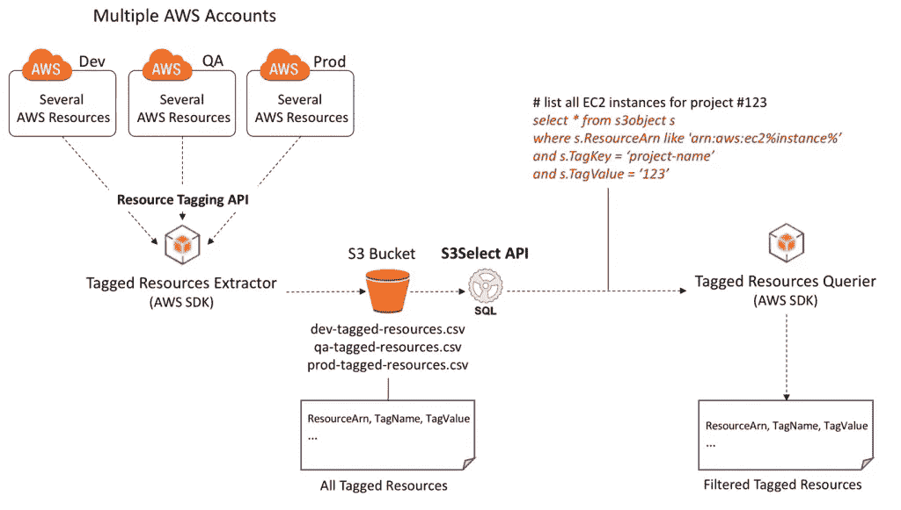

# 如何从控制台使用 S3 选择查询 S3 对象

> 原文：<https://medium.com/geekculture/how-to-query-s3-objects-with-s3-select-from-the-console-72fdad76160c?source=collection_archive---------6----------------------->

## 从 AWS 控制台运行 S3 选择的演练示例

