# 如何用 CandyPay 在 Solana 上快速打造无气 NFT 系列

> 原文：<https://medium.com/geekculture/how-to-quickly-create-a-gasless-nft-collection-on-solana-with-candypay-926b9ba7c529?source=collection_archive---------12----------------------->

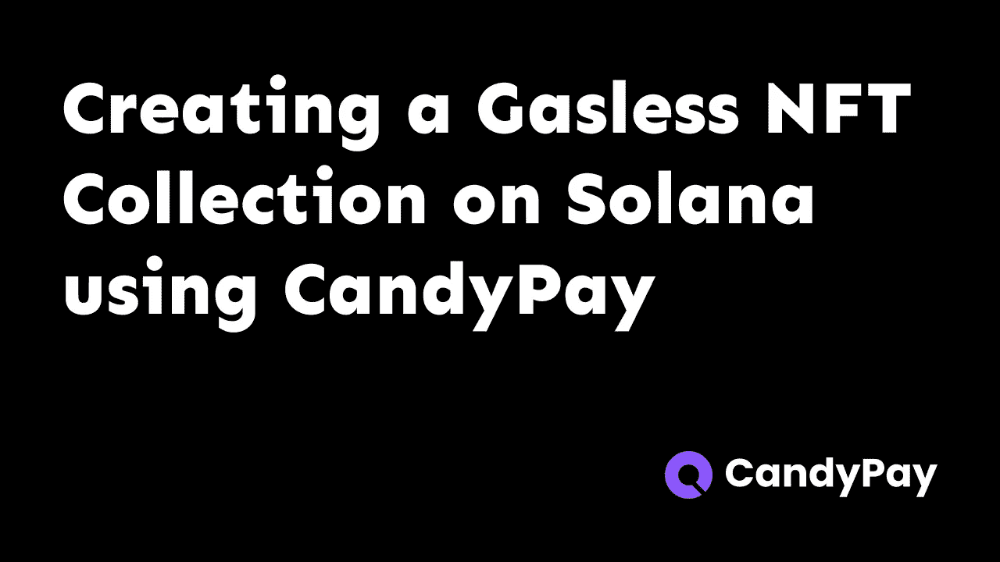

假设你是一个 NFT 创作者，想尽快将你的 NFT 发布到索拉纳区块链上。这可能很耗时，因为它涉及到创建收藏、建立铸造网站等。它还要求你熟悉所有的技术，作为一个创作者，你可能不熟悉所有的开发工作。

这就是 CandyPay 的用武之地。CandyPay 可以让你用一个无代码构建器创建 NFT，也可以让用户通过手机上的 [Solana Pay](https://solanapay.com/) 轻松获得它们，而不用担心安装任何浏览器扩展或连接他们的钱包。

此外，我们将关注无气 NFT，它不需要接收者支付任何 SOL。相反，我们，NFT 的创造者预付了汽油费。请注意，如果任何预付的 SOL 仍未使用，我们可以取回我们的 SOL。

# 先决条件

所有这些都不需要你付出任何真金白银。

*   索拉纳钱包与索拉纳支付支持。你可以使用 [Phantom](https://phantom.app/) 或 [Solflare](https://solflare.com/) ，这两款软件都适用于 Android、iOS，也可以作为浏览器扩展，尽管你需要 Solana pay 的移动应用程序。
*   作为 NFT 上传的图像(你可以使用任何东西，因为我们将在 devnet 上做)。我将使用这个，在本教程中可以随意使用它

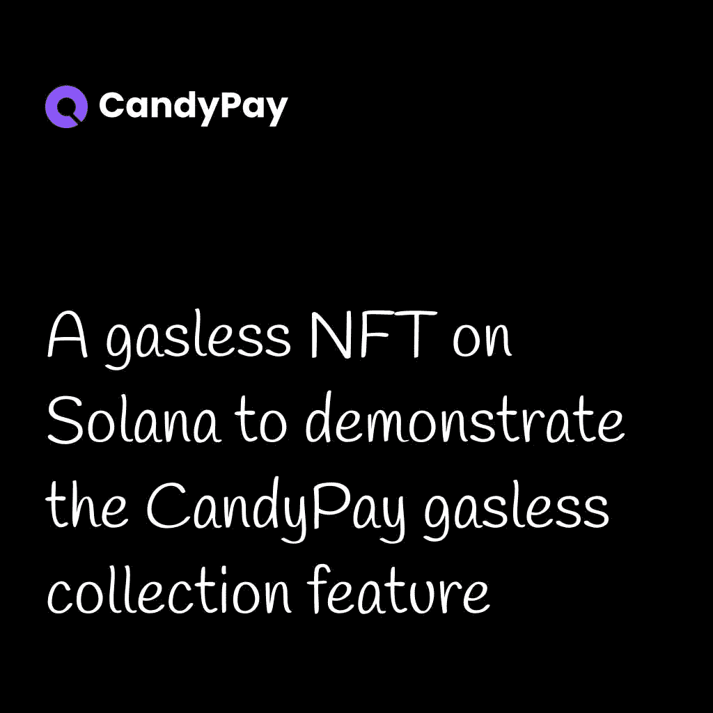

*   一些 devnet SOL。你可以从[一个 Solana 水龙头](https://solfaucet.com/)得到它(它是免费的，不需要注册)

# 用 CandyPay 打造无气 NFT 系列

首先，我们需要创建一个 CandyPay 帐户。前往[candy pay 网络应用](https://candypay.fun/)并注册一个账户。

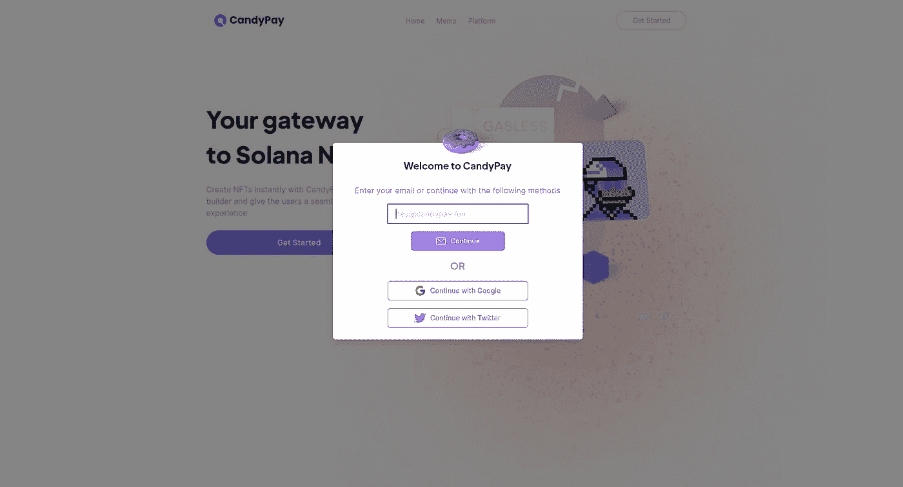

接下来，在“新建”下拉菜单中选择“无气系列”

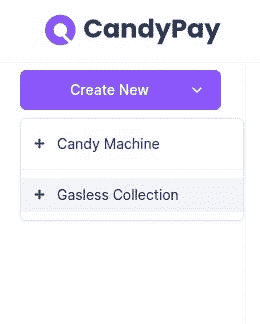

这里，我们必须提供一些关于 NFT 的细节，当然，还有图像本身。以下是对各个字段的解释-

*   NFT 名称(必填)-NFT 的名称
*   NFT 描述-您可能想要添加描述 NFT 的内容、重要性等的描述。
*   钱包地址—您的 Solana 钱包地址
*   符号-您可以为您的 NFT 提供一个符号。这通常显示在市场和钱包应用程序中
*   版税——在第一笔销售之后的任何后续销售中，这部分金额将作为版税付给您
*   集合大小(必需)—集合将具有的 NFT 数量
*   外部 URL-要与您的 NFT 相关联的任何 URL
*   网络-您要将收藏发布到的 Solana 网络。当构建一个生产应用程序时，你应该选择“Mainnet”(以真实 SOL 的形式发布集合和预付汽油将花费一些真实的钱)，但对于本教程的目的，我们选择“Devnet”(我们将使用我们从水龙头得到的 devnet SOL，它没有花费我们任何真实的钱)
*   NFT 影像(必选)-将用于 NFT 的影像

我已经为这些字段输入了如下值-

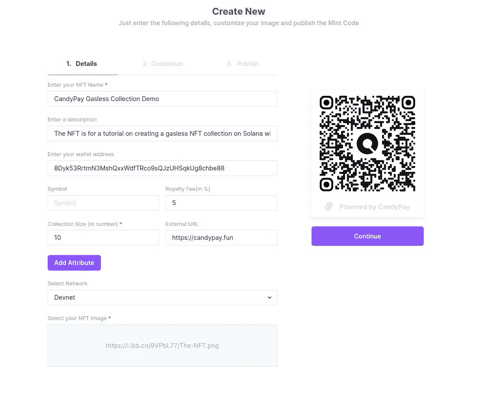

现在点击“继续”。在下一页，我们可以自定义我们的 CandyPay 二维码。这将是 NFT 的接收器为了获得 NFT 将扫描的二维码，所以让我们努力使它变得美丽:)

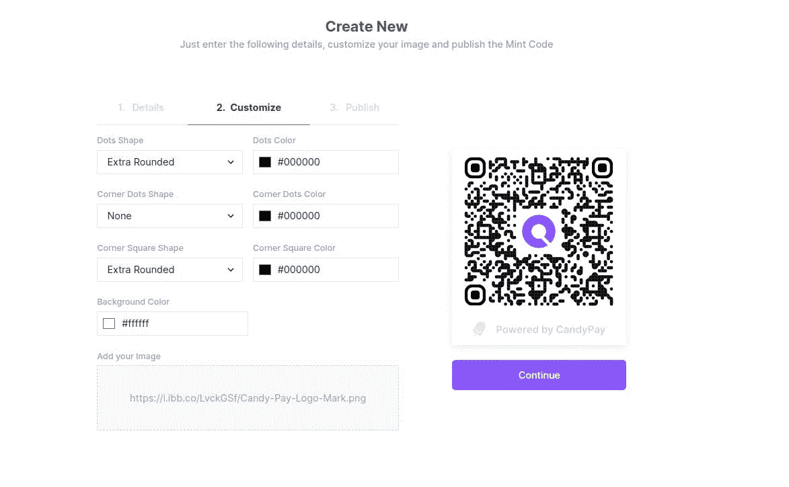

我改变了一些形状，还把黑色的 CandyPay 标志换成了带有 CandyPay 强调色的:)

现在再次点击“继续”。下一步，我们必须支付一些 SOL 来创建集合以及 10 NFTs 的气体。请注意，我们可以在以后赎回任何未使用的资金。

用你的移动钱包应用程序扫描这个二维码，你应该会看到一个 Solana 支付弹出窗口。如果您在 Phantom 中看到如下所示的错误，请尝试使用 Solflare(在 Solflare 中，这是一个两步过程，UI 略有不同，但结果是相同的)

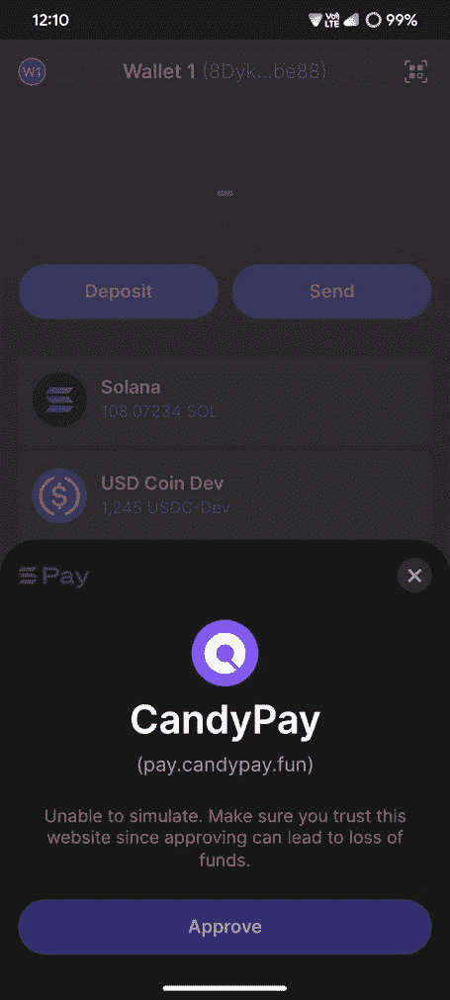

扫描二维码后，你应该会在手机钱包应用程序上看到类似这样的内容-

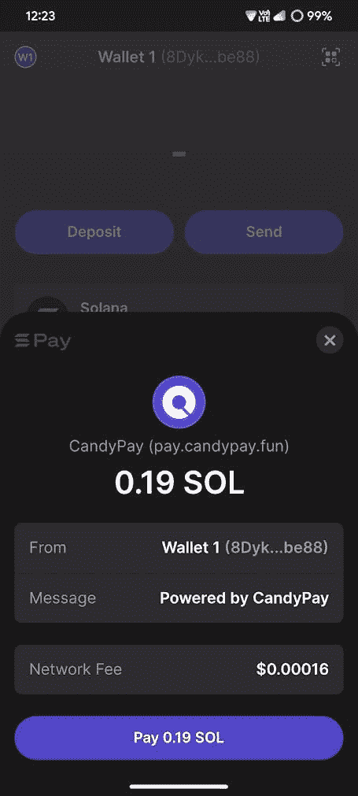

支付 devnet SOL 并让交易成功(不应该超过 10 秒)。之后，您应该会在 CandyPay 中看到一条成功消息-

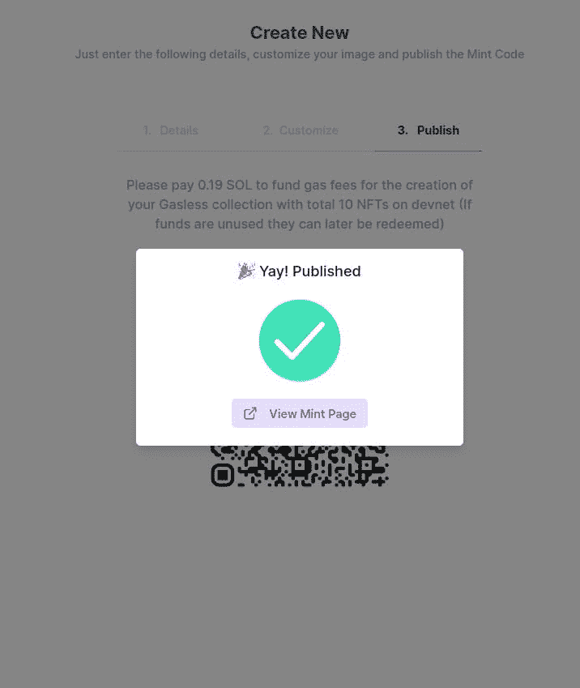

在收藏面板上，你可以看到二维码，扫描后就可以兑换 NFT。还有一个链接，人们可以在手机上打开它来兑换 NFT。

哦，顺便说一下，截图中的二维码实际上是有效的，所以你可以尝试扫描二维码来获得 NFT，直到供应结束。

# 使用 CandyPay 二维码申领 NFT

如果我现在扫描二维码，我会被提示确认交易，但注意到没有溶胶从我这边扣除，所以它是无气的！(这次我不得不使用 Solflare，因为 Phantom 出错了)

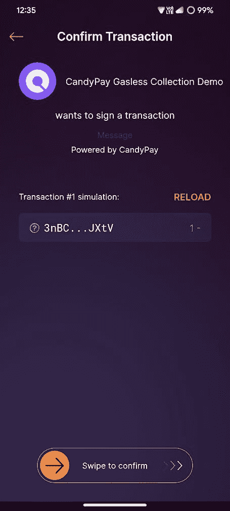

现在，如果我回到仪表板，我可以看到 1 NFT 已被赎回(忽略取消的，因为它只是幻影是错误的)。汽油也被扣除了！

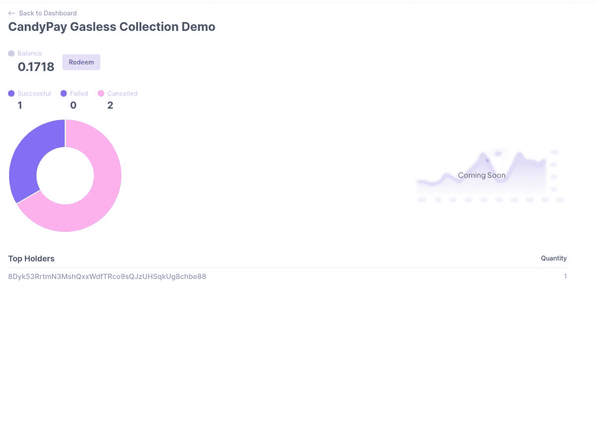

为了更清楚地了解我是否必须支付汽油费，如果我在 Solscan 的“SOL Balance Change”选项卡下检查[交易，我可以看到我的 SOL 余额没有变化。](https://solscan.io/tx/3z5U4gmVJUtPVe4YuFKj29A1JJZiqY4MtLy4pokzJ2DKZ8vi7ibCTcuU78jtqqcdfw49qKH7Wxg9WbB8tJ9rEJHh?cluster=devnet)

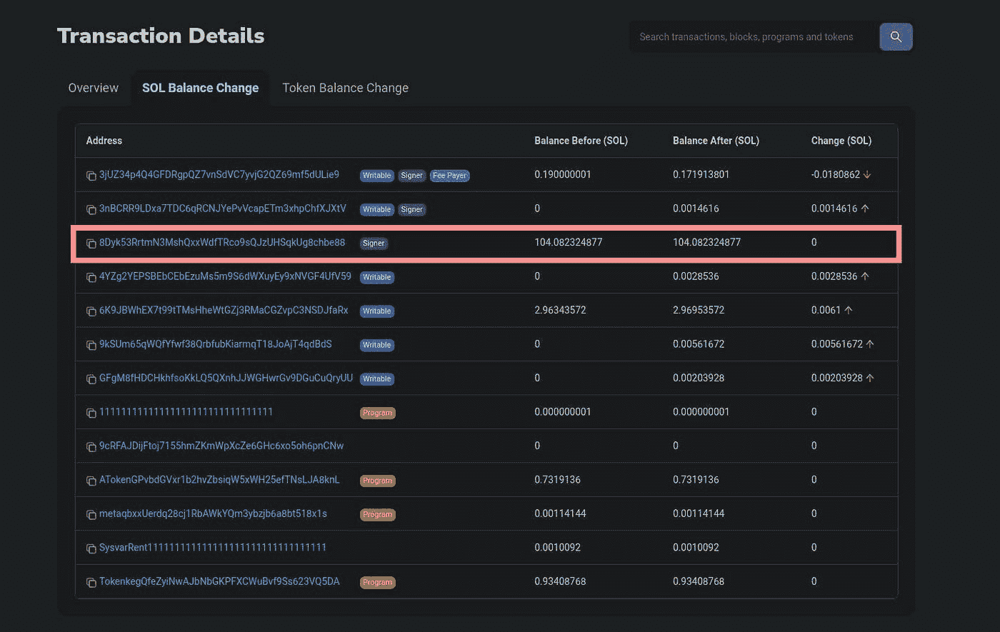

# 结论

现在是你运送你的无气 NFT 收藏的时候了！请随意在下面分享它们，看到你们的成果真的很兴奋:)

# 重要链接

*   [CandyPay](https://candypay.fun/)
*   [CandyPay Discord 服务器](https://discord.com/invite/VGjPXWUHGT)(你可以在这里获得支持)
*   [索拉纳支付](https://solanapay.com/)

*原发布于*[*https://blog . anishde . dev*](https://blog.anishde.dev/how-to-quickly-create-a-gasless-nft-collection-on-solana-with-candypay)*。*