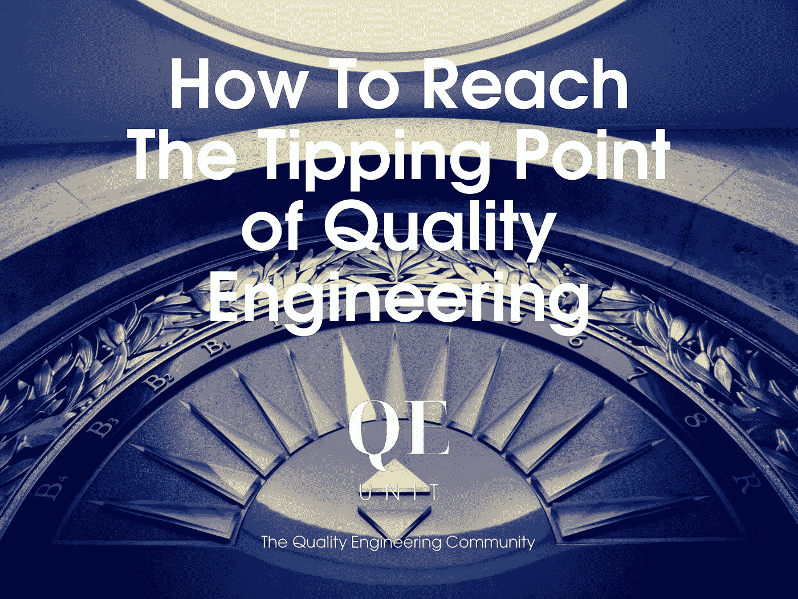

# 如何达到质量工程的临界点

> 原文：<https://medium.com/geekculture/how-to-reach-the-tipping-point-of-quality-engineering-f388a84365dd?source=collection_archive---------18----------------------->

我们可以有美好的愿景和想法，但除非它们转化为具体的结果，否则它们不会产生价值。实现转型不是偶然的结果。它是朝着一个有价值的目标执行一系列“正确的步骤”。

质量工程是一门学科，通过将系统约束在质量上来不断地向用户传递价值