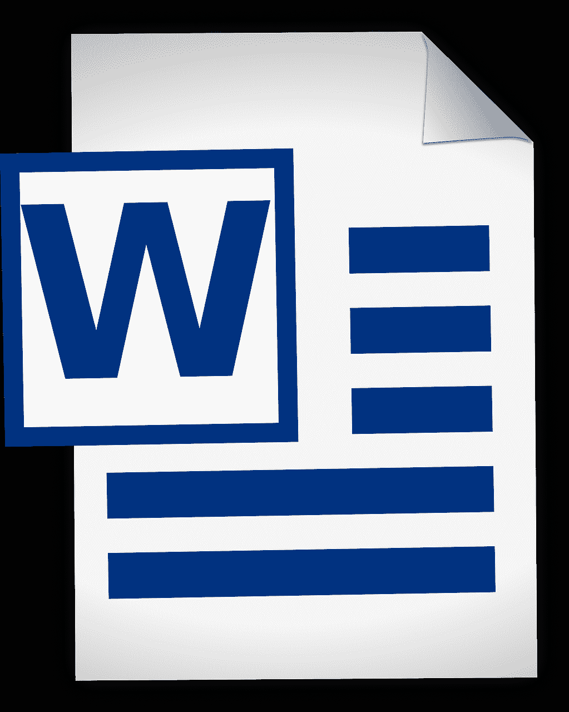

# 如何将 MS Word 文档读入 Python

> 原文：<https://medium.com/geekculture/how-to-read-a-ms-word-document-into-python-2c4e6e1b967e?source=collection_archive---------12----------------------->

因为我一直在努力增加我的数据科学知识，所以只要时间允许，我就尽可能多地选修免费课程。

我目前正在学习 Udacity 的数据分析入门课程，这是对我所学的机器学习课程的补充。

碰巧的是，早在第一课，我就遇到了一个难题。有人问我…