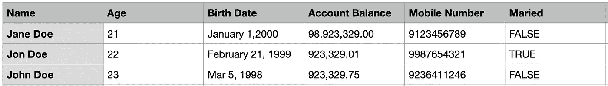
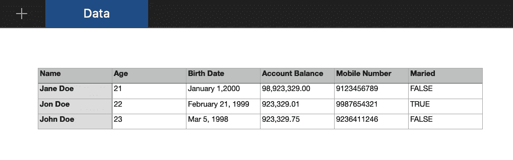
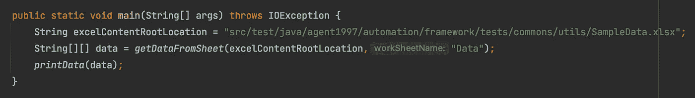

# 如何使用 Apache POI 从 Excel 文件中读取数据

> 原文：<https://medium.com/geekculture/how-to-read-data-from-excel-file-using-apache-poi-95b8a4aa3909?source=collection_archive---------1----------------------->



在测试自动化中，根据您的需要，有几种框架可供选择来在您的项目中实现。其中之一是数据驱动的框架。在这个框架中，测试数据存储在单个数据源或数据源组合中，如。csv，。xls。xlsx、数据库、直接来自 google sheets 等等。这样，您应该有一个实用程序来从这些数据源中提取或读取数据。在本文中，我们将讨论如何从 excel 文件中读取数据，特别是使用。xlsx 扩展名。

从…读取数据。xlsx 文件，我们将使用由 [Apache Poi](https://poi.apache.org/) 提供的 poi-ooxml。要将它添加到您的 maven 项目中，请检查他们的 [maven 资源库](https://mvnrepository.com/artifact/org.apache.poi/poi-ooxml)。下面是我们将使用的类，链接到它们的文档。

1.  [xssf workbook](https://poi.apache.org/apidocs/dev/org/apache/poi/xssf/usermodel/XSSFWorkbook.html)
2.  [**XSSFSheet**](https://poi.apache.org/apidocs/dev/org/apache/poi/xssf/usermodel/XSSFSheet.html)
3.  [**行**](https://poi.apache.org/apidocs/dev/org/apache/poi/ss/usermodel/Row.html)
4.  [**单元格**](https://poi.apache.org/apidocs/dev/org/apache/poi/ss/usermodel/Cell.html)
5.  [**CellType**](https://poi.apache.org/apidocs/dev/org/apache/poi/ss/usermodel/CellType.html) (这是一个枚举)
6.  [**数据格式器**](https://poi.apache.org/apidocs/dev/org/apache/poi/ss/usermodel/DataFormatter.html)

这里有一个简单的方法来读取 excel 表中的所有数据。全部读取，意味着空单元格也包括在内。

```
public static String[][] getDataFromSheet(String workbookLocation, String workSheetName) throws IOException { XSSFWorkbook workbook = new XSSFWorkbook(System.*getProperty*("user.dir") + "/" + workbookLocation);
    XSSFSheet workSheet = workbook.getSheet(workSheetName);

    int noOfRows = workSheet.getLastRowNum() + 1;
    int noOfColumns = workSheet.getRow(0).getLastCellNum();
    String[][] dataTable = new String[noOfRows][noOfColumns];

    for (int i = workSheet.getFirstRowNum(); i < workSheet.getLastRowNum() + 1; i++) {
        Row row = workSheet.getRow(i);
        for (int j = row.getFirstCellNum(); j < row.getLastCellNum(); j++) {
            Cell cell = row.getCell(j);
            dataTable[i][j] = cell.getStringCellValue();
        }
    }

    workbook.close();
    return dataTable;
}
```

首先，我们创建了一个 XSSFWorkbook 对象，并将其命名为 ***workbook*** 。向其构造函数传递。xlsx 文件。请注意，XSSFWorkbook 构造函数抛出了 IOException。 ***工作簿*** 对象是我们的表示。xlsx 文件，包含我们将从中读取数据的 excel 表。

```
XSSFWorkbook workbook = new XSSFWorkbook(System.*getProperty*("user.dir") + "/" + workbookLocation);
```

其次，使用可通过 ***工作簿*** 对象访问的 **getSheet()** 方法，我们传递 excel 工作表的名称以从我们的 ***工作簿*** 中获取 XSSFSheet，并将其命名为 ***工作表。******工作表*** 代表我们的 excel 表。

```
XSSFSheet workSheet = workbook.getSheet(workSheetName);
```

第三，我们创建了一个二维字符串数组，并将其命名为 ***dataTable。*** 注意我们如何设置 ***数据表*** 的大小来匹配 excel 表格的大小。

```
int noOfRows = workSheet.getLastRowNum() + 1;
int noOfColumns = workSheet.getRow(0).getLastCellNum();
String[][] dataTable = new String[noOfRows][noOfColumns];
```

对于***nooforus，*** 我们使用了 **getLastRowNum()。**该方法返回工作表中最后一行的从零开始的索引，包括空行。假设我们有 10 行，这将返回 9，这就是为什么我们增加了 1。

对于 ***noOfCoumns*** ，我们通过将 0 传递给 ***getRow()*** 方法来获取 ***工作表*** 中的第一行。 ***getRow()*** 返回一个**行**对象。然后我们得到该行最后一个单元格的编号。 ***getLastCellNum()，*** 根据文档，它已经给最后一个单元格的索引加了 1，这就是为什么我们没有像在 ***noOfRows 中那样加 1。***

第四，我们从我们的 ***工作表*** 中读取数据，并将其保存到到 ***数据表中。***

```
for (int i = workSheet.getFirstRowNum(); i < workSheet.getLastRowNum() + 1; i++) {
    Row row = workSheet.getRow(i);
    for (int j = row.getFirstCellNum(); j < row.getLastCellNum(); j++) {
        Cell cell = row.getCell(j);
        dataTable[i][j] = *getCellValueAsString*(cell);
    }
}
```

我们在这里做的只是迭代我们的 ***工作表*** 的每一行。然后在每一行上，我们再次迭代以获得每个单元格的值，并将其保存到我们的 ***数据表*** 。注意方法调用***getCellValueAsString*(单元格)。这是我们需要创造的另一种方法。这将只检查单元格中值的类型，并将值作为字符串返回。我们可以像下面这样做。**

```
dataTable[i][j] = cell.getStringCellValue();
```

如果工作表只包含字符串值，这是可以的。但是例如单元格包含一个数字，它会抛出一个异常。

下面是我们的***getCellValueAsString*()**方法的代码。

```
private static String getCellValueAsString(Cell cell) {
    CellType cellType = cell.getCellType();
    String val = "";

    switch (cellType) {
        case *STRING*:
            val = cell.getStringCellValue();
            break;

        case *NUMERIC*:
            DataFormatter dataFormatter = new DataFormatter();
            val = dataFormatter.formatCellValue(cell);
            break;

        case *BOOLEAN*:
            val = String.*valueOf*(cell.getBooleanCellValue());
            break;

        case *BLANK*:
            break;
    }
    return val;
}
```

最后，当我们从工作簿中读取完数据后。我们关闭工作簿并返回数据表。

```
workbook.close();
return dataTable;
```

现在让我们尝试使用我们的 **getDataFromSheet()** 方法从 Excel 文件中读取数据。



Sample Data in our excel sheet.



Sample code using the getDataFromSheet() method

上图显示了我们如何使用 **getDataFromSheet()** 方法。我们传递了 excel 文件的路径和数据将来自的工作表的名称。下图显示了我们从 excel 文件中读取的打印数据。


这是我们用来显示数据的打印方法的代码。

```
public static void printData(String[][] table) {
    for (String[] strings : table) {
        for (String string : strings) {
            if (string.equals("")) {
                System.*out*.print("<empty cell>");
            } else {
                System.*out*.print(string);
            }
            System.*out*.print(" | ");
        }
        System.*out*.println(" ");
    }
}
```

我们创建的 **getDataFromSheet()** 方法是一个简单直接的解决方案，可以满足我们从 excel 文件中读取数据的需求。既然您已经熟悉了这些类、一些方法，并且已经知道要检查哪些文档。根据你的需要创建你的更复杂的方法起初会是一个挑战，但是一旦你开始动手，它就会变得轻松。

🍻 🍻 🍻