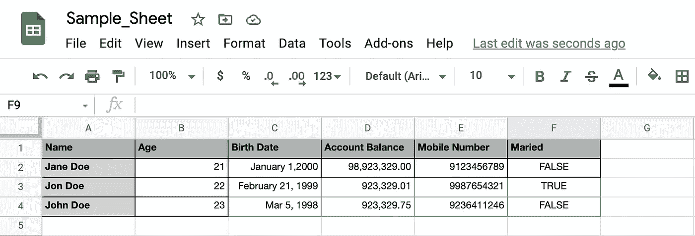
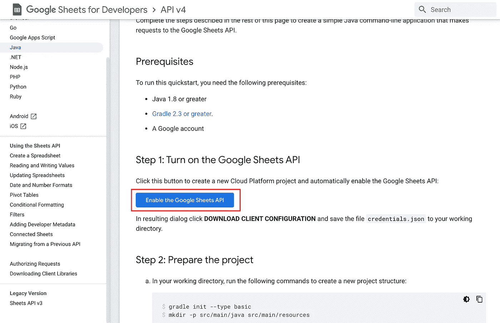
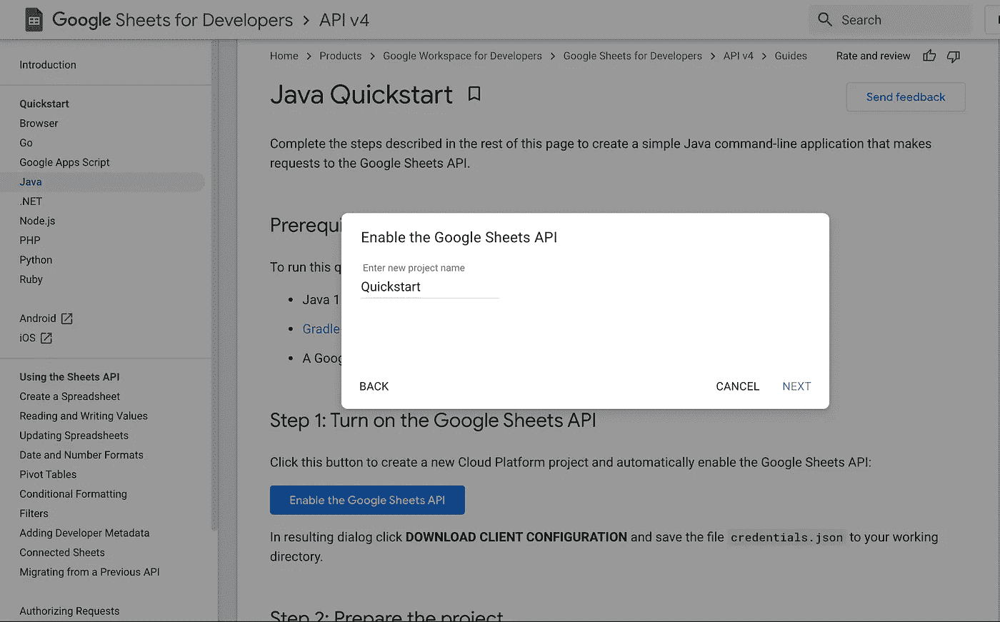
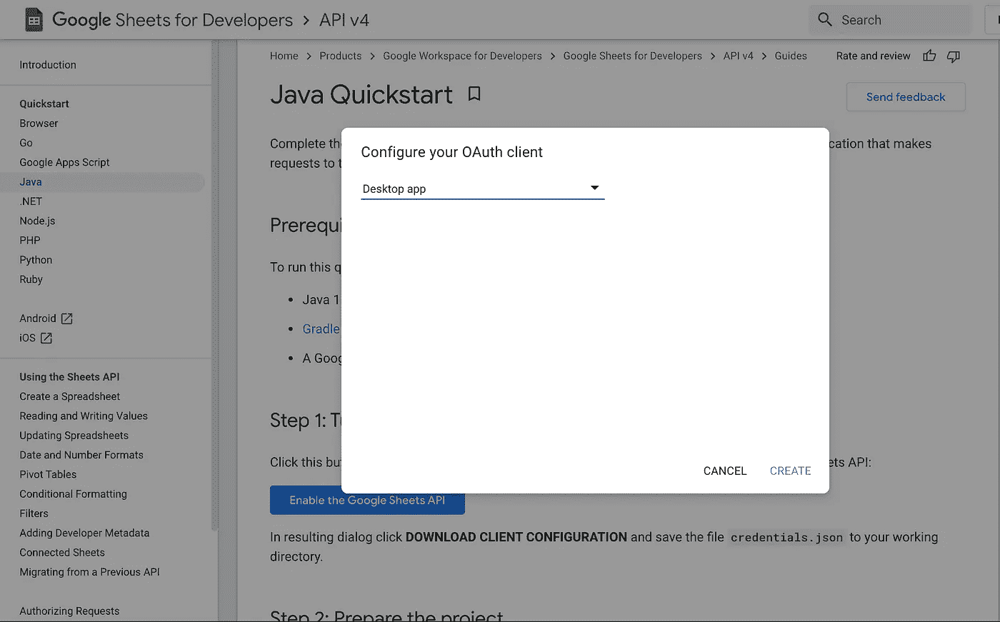
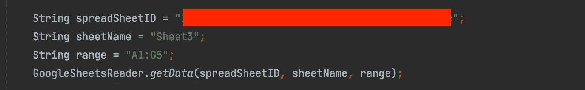
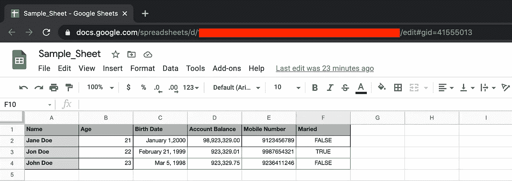

# 如何从 Google Sheets 中读取数据

> 原文：<https://medium.com/geekculture/how-to-read-data-from-google-sheets-ee335f787de6?source=collection_archive---------2----------------------->



在测试自动化中，根据您的需要，有几种框架可供选择来在您的项目中实现。其中之一是数据驱动的框架。在这个框架中，测试数据存储在单个数据源或数据源组合中，如。csv，。xls。xlsx、数据库、直接来自 google sheets 等等。这样，您应该有一个实用程序来从这些数据源中提取或读取数据。如果你还没有尝试过从 excel 文件中读取数据，你可以查看这个 [**如何使用 Apache POI**](/geekculture/how-to-read-data-from-excel-file-using-apache-poi-95b8a4aa3909) **从 Excel 文件中读取数据。**在本文中，我们将直接从 google sheets 中读取数据。

为了从 google sheets 中读取数据，我们将使用 google 提供的[**Google Sheets API**](https://developers.google.com/resources/api-libraries/documentation/sheets/v4/java/latest/)**。事实上，谷歌已经为我们提供了非常好的 [**文档和示例**](https://developers.google.com/sheets/api/quickstart/java) 关于如何使用他们的 API。因此，我们要做的是为您的 Google 帐户浏览**“启用 Google Sheets API”**，并简短地浏览一个从 Google Sheets 读取数据的简单实用程序类。**

## ****启用 Google Sheets API****

1.  **打开这个[T21 链接](https://developers.google.com/sheets/api/quickstart/java)。您将被重定向到 Google Sheets API 快速入门指南**

****

**2.查看并点击**启用 Google Sheets API** 。将显示一个提示，要求输入项目名称。出于我们的目的，任何名称都可以，缺省值甚至足够了。**

****

**3.点击**下一步。它将尝试启用 API，然后会弹出另一个配置 OAuth 客户端的提示。同样，对于我们的目的，“桌面应用程序”就可以了。****

****

**4.点击**创建**。另一个提示将显示您的客户端 ID 和客户端密码，以及一个**下载客户端配置**的选项。**

****

**5.点击**下载客户端配置，**配置文件将作为 json 下载。如果需要，您可以重命名该文件，或者保持不变。我们会将该文件添加到我们的自动化项目或您正在处理的任何项目中。当我们在 google sheets 上阅读我们的数据时，我们将使用该文件的内容来获得授权。**

**下面是我的简单实用程序类读取 google sheets 中数据的方法。这些方法只是抛出异常，为了简化，没有进行其他异常处理。但是为了让这些方法工作，您应该添加这些库，或者只是作为依赖项添加到您的 maven 项目中。**

1.  **[Google Sheets API V4 版本 614 1.18.0 RC](https://mvnrepository.com/artifact/com.google.apis/google-api-services-sheets/v4-rev614-1.18.0-rc)**
2.  **[用于 Java 的 Google OAuth 客户端库的 OAuth 2.0 验证码接收器](https://mvnrepository.com/artifact/com.google.oauth-client/google-oauth-client-jetty/1.31.5)**
3.  **[Google API Java 客户端库](https://mvnrepository.com/artifact/com.google.api-client/google-api-client/1.22.0)**

**对于 api 客户端库，我们将使用 1.22.0，这不是最新版本。如果您计划使用最新版本，请确保为 Jackson 添加一个单独的依赖项。**

****首先是 authorize()方法。****

```
private static Credential authorize() throws Exception { String credentialLocation = System.*getProperty*("user.dir") + "/GoogleAPIKey/credentials.json";

    GoogleClientSecrets clientSecrets = GoogleClientSecrets.*load*(JacksonFactory.*getDefaultInstance*(), new FileReader(credentialLocation));

    List<String> scopes = Arrays.*asList*(SheetsScopes.*SPREADSHEETS*);

    GoogleAuthorizationCodeFlow googleAuthorizationCodeFlow = new GoogleAuthorizationCodeFlow
            .Builder(GoogleNetHttpTransport.*newTrustedTransport*(), JacksonFactory.*getDefaultInstance*(), clientSecrets, scopes)
            .setDataStoreFactory(new FileDataStoreFactory(new File(System.*getProperty*("user.dir") + "/GoogleAPIKey")))
            .setAccessType("offline")
            .build();

    return new AuthorizationCodeInstalledApp(googleAuthorizationCodeFlow, new LocalServerReceiver()).authorize("user");
}
```

**基本上，这样做是为了授权我们，并给我们凭证来访问我们的表。看看我们如何使用之前下载的配置。在我的例子中，我在我的项目根目录中创建了一个名为**“GoogleAPIKey”**的文件夹，并将名为 **credentials.json** 的配置文件放在其中。请务必将此添加到您的。gitignore 文件，如果你不想把它上传到你的远程仓库。为了更好地理解这个函数，下面是这个方法中使用的主要类的文档链接。**

*   **[GoogleClientSecrets](https://googleapis.dev/java/google-api-client/latest/com/google/api/client/googleapis/auth/oauth2/GoogleClientSecrets.html)**
*   **[Google authorizationcodeflow](https://googleapis.dev/java/google-api-client/latest/com/google/api/client/googleapis/auth/oauth2/GoogleAuthorizationCodeFlow.html)**
*   **[AuthorizationCodeInstalledApp](https://googleapis.dev/java/google-oauth-client/1.30.1/com/google/api/client/extensions/java6/auth/oauth2/AuthorizationCodeInstalledApp.html)**

**下面是我们从 google 工作表中获取数据的方法**

```
public static String[][] getData(String spreadSheetId, String sheetName, String rangeDataToRead) throws Exception { Sheets sheet = new Sheets(GoogleNetHttpTransport.*newTrustedTransport*(), JacksonFactory.*getDefaultInstance*(), *authorize*());

    List<List<Object>> data = sheet.spreadsheets().values()
            .get(spreadSheetId, sheetName + "!" + rangeDataToRead)
            .execute().getValues();

    return *convertToArray*(data);
}
```

**我们首先创建了一个工作表对象。看看我们的 Sheets 构造函数的最后一个参数。我们通过调用我们的 **authorize()** 方法来传递凭证。下一行是从工作表中读取数据。注意我们的 **get()** 方法。我们传递了数据来源的电子表格的 ID。第二个参数是工作表的名称和将要读取数据的单元格区域。你会注意到第二个参数的一些字符串操作，因为 api 要求我们的第二个参数看起来像这个**“sheet name！A2:E"** 。因为这是为了我们的数据驱动测试自动化框架。TestNG 数据提供者，我们选择的测试框架，不接受 List<List<Object>>这就是为什么我们必须使用下面的方法将它转换成一个字符串的二维数组。**

```
private static String[][] convertToArray(List<List<Object>> data) {
    String[][] array = new String[data.size()][];

    int i = 0;
    for (List<Object> row : data) {
        array[i++] = row.toArray(new String[row.size()]);
    }
    return array;
}
```

**下面是我们的 **getData()** 方法的一个示例用法。**

****

**如果您想知道从哪里获得电子表格 id。它在你的电子表格的 url 中。**

****

**因为这只是为了从 google sheets 中读取数据。我们不会深究如何更新 google sheets 中的数据。但是我会留下一个示例代码供您研究。尝试一下，看看文档，了解它是如何工作的。**

```
public static void updateData(String spreadSheetId, String sheetName, String cellLocation, String newValue) throws Exception {

if (cellLocation.contains(":")) {
        throw new Exception(String.*format*("Restricting update to single cell only. You are trying to update cells %s", cellLocation));
}

    Sheets sheets = new Sheets(GoogleNetHttpTransport.*newTrustedTransport*(), JacksonFactory.*getDefaultInstance*(), *authorize*());

    ValueRange updateValue = new ValueRange()
            .setValues(Arrays.*asList*(Arrays.*asList*(newValue)));

    sheets.spreadsheets().values()
            .update(spreadSheetId, sheetName + "!" + cellLocation, updateValue)
            .setValueInputOption("RAW")
            .execute();
}
```

**是的，我们刚刚为您的工具包添加了另一个实用程序。下一次，如果你不想从 excel 文件中获取数据，就从 google sheets 中获取。**

**🍻 🍻 🍻**