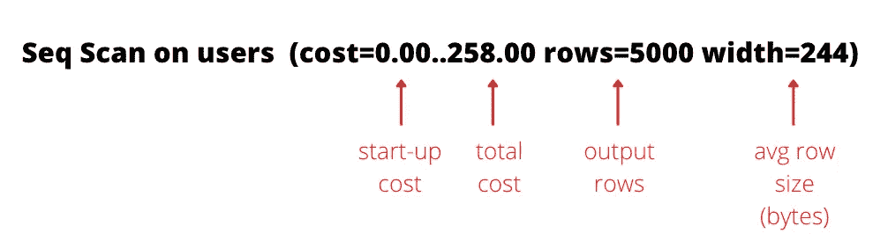
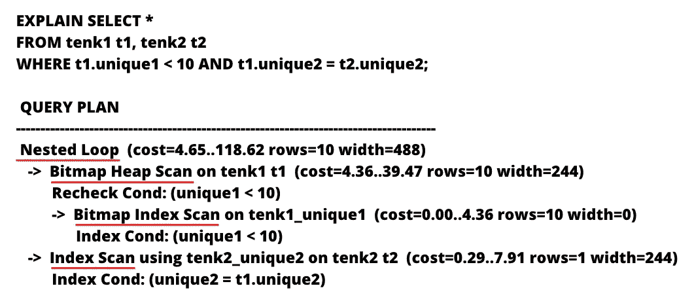

# 如何阅读 PostgreSQL 查询计划

> 原文：<https://medium.com/geekculture/how-to-read-postgresql-query-plan-df4b158781a1?source=collection_archive---------11----------------------->


如果你是一个完整的堆栈或后端软件工程师，有很大的机会，你必须与数据库工作。处理数据库性能不仅是 DBA 的工作，也是任何从事产品工作的工程师的工作。作为一名软件工程师，我的工作通常是编写高性能的 PostgreSQL 查询来满足我们的 API SLA。为了实现这一点，理解 PostgreSQL 查询计划至关重要。

在这篇博客文章中，我将向你展示如何阅读 PostgreSQL 查询计划的简单指南。如果你更喜欢教程视频而不是阅读，我有一个关于这个话题的[视频](https://youtu.be/Mll5SqR4RYk)。

# 解释命令

Postgres 允许您通过使用**解释**命令来获得查询计划。例如:

```
EXPLAIN SELECT * FROM users;

                         QUERY PLAN
-------------------------------------------------------------
 Seq Scan on users  (cost=0.00..258.00 rows=5000 width=244)
```

重要的是**解释**并不实际执行查询，而是给出一个估计值，在大多数情况下，这个估计值相当接近查询执行后的真实统计值。让我们解开上面的查询计划。



在上图中:

*   **启动成本**是启动一个节点开始处理查询的预计 Postgres 计算单元。
*   **总成本**是完成处理查询并返回结果的预计 Postgres 计算单元。
*   **输出行数**是预计返回的行数。
*   **宽度或平均行大小(以字节为单位)**是每个输出行的估计大小。

**启动成本**和**总成本**由..简单。根据上面的定义，我们可以说 SELECT 查询花费了 258 个计算单位，并返回 5000 行，每行重 244 字节。顺序扫描意味着它遍历表中的所有行。**注**:这些统计数据都是估算的。

# 解释分析命令

如果您想在查询计划中获得准确的统计数据，那么 **EXPLAIN ANALYZE** 命令非常适合您，因为它实际上执行了查询。我建议不要在生产数据库中运行这个命令。让我们在前面的查询中添加**分析**。

```
EXPLAIN ANALYZE SELECT * FROM users;

                         QUERY PLAN
-------------------------------------------------------------
 Seq Scan on users  (cost=0.00..258.00 rows=5000 width=244)(actual time=0.000..7.149 rows=5000 loops=1)Planning time: 0.004 ms
Execution time: 7.180 ms
```

如您所见，该计划显示了计划和执行时间。还为顺序扫描增加了**实际时间**，格式与**成本** : **启动时间**..**总时间**。

*   **启动时间:**启动节点并开始顺序扫描所用的时间。
*   **总时间:**完成查询并返回输出行所用的时间
*   **行**:返回的行数。
*   **循环**:执行了多少次序列扫描。

该查询执行 1 次顺序扫描，返回 5000 行，耗时约 7.2 毫秒。简单吧！！

# 缓冲区命令

如果您想知道您的查询使用了多少内存，BUFFERS 将显示统计数据。**注意**:在这个例子中，我做了缓冲统计。

```
EXPLAIN (ANALYZE, BUFFERS) SELECT * FROM users;

                         QUERY PLAN
-------------------------------------------------------------
 Seq Scan on users  (cost=0.00..258.00 rows=5000 width=244)(actual time=0.000..7.149 rows=5000 loops=1)
 Buffers: shared hit=300
 Total runtime: 7.180 ms
```

该行`Buffers: shared hit=300`表示有 300 个缓存块被命中以支持顺序扫描。Postgres 有内部缓存来加速数据检索。如果缓存中没有数据，这将是**共享读取**，这基本上意味着从磁盘读取数据块。

我认为每个块从 3kb 到 8kb(我没有确切的数字。这只是一个粗略的估计)。这个查询总共消耗了大约 900 kb。

# 查询计划结构

到目前为止，我们研究了一个非常简单的查询。我在上面的查询计划中提到了术语**节点**。但这意味着什么呢？让我们看一个来自 Postgres doc 的稍微复杂一点的查询来理解查询计划结构。

```
EXPLAIN ANALYZE SELECT *
FROM tenk1 t1, tenk2 t2
WHERE t1.unique1 < 10 AND t1.unique2 = t2.unique2;

                      QUERY PLAN
---------------------------------------------------------------------------------------------------------------------------------
 Nested Loop  (cost=4.65..118.62 rows=10 width=488) (actual time=0.128..0.377 rows=10 loops=1)
   ->  Bitmap Heap Scan on tenk1 t1  (cost=4.36..39.47 rows=10 width=244) (actual time=0.057..0.121 rows=10 loops=1)
         Recheck Cond: (unique1 < 10)
         ->  Bitmap Index Scan on tenk1_unique1  (cost=0.00..4.36 rows=10 width=0) (actual time=0.024..0.024 rows=10 loops=1)
               Index Cond: (unique1 < 10)
   ->  Index Scan using tenk2_unique2 on tenk2 t2  (cost=0.29..7.91 rows=1 width=244) (actual time=0.021..0.022 rows=1 loops=10)
         Index Cond: (unique2 = t1.unique2)
 Planning time: 0.181 ms
 Execution time: 0.501 ms
```

看起来有点吓人吧。让我们把注意力集中在下面有红线的文字上。



下面带红线的文字表示工作正在进行。每个工作由 Postgres 中的一个**节点**处理。你可以认为一个**节点**几乎就像一个树形数据结构中的一个节点。每个**节点**可以有子**节点。**在查询计划中找到**节点**的最简单的方法是箭头指向的地方。

Postgres 将首先处理最低级别的**节点**。在这种情况下，是**位图索引扫描节点**检查索引 tenk1_unique1 **上的条件unique1 < 10。**该节点返回 10 行**。**然后，结果将被返回到它的父**节点** ( **位图堆扫描**)进行进一步处理。同样，从这个**节点返回 10 行。**

与**位图堆扫描节点**处于同一级别的是**索引扫描节点**。**索引扫描**使用索引 tenk2_unique2 返回满足条件 unique2 = t1.unique2 的 1 行。

在**位图堆扫描**和**索引扫描**完成后，**嵌套循环**合并这两个节点的结果，并将结果输出到客户端。

我在这里没有提到任何关于成本、时间和内存的东西，因为我希望你们根据我在前面章节中的说明自己去读。

我希望这篇博文对读者有用。如果你喜欢技术教程的更多内容，请在 Medium 和 [Youtube](https://www.youtube.com/channel/UCX5gWhgLAUt2R0m19aLAQug) 上关注我。