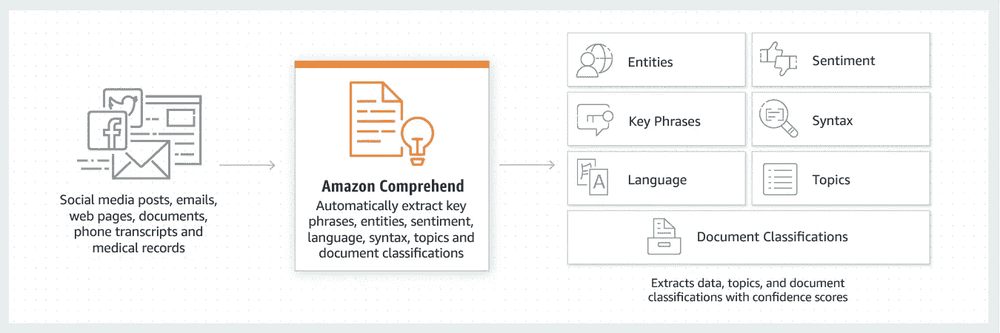

# 如何使用 AWS comprehende 编辑 PII 数据

> 原文：<https://medium.com/geekculture/how-to-redact-pii-data-using-aws-comprehend-predictive-hacks-8d84d353e32?source=collection_archive---------11----------------------->

## 一个演示示例，展示了如何使用 AWS intensive 从数据中清除 PIID

