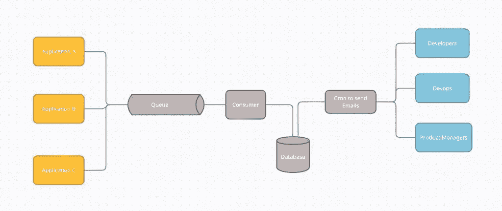
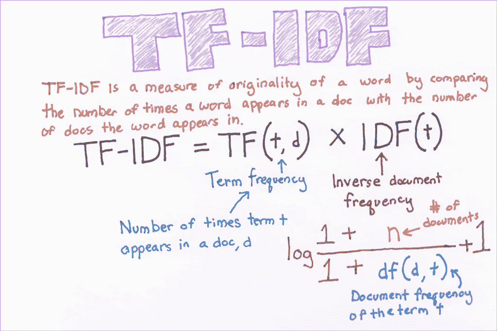
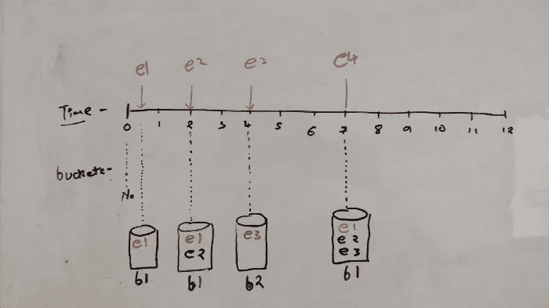
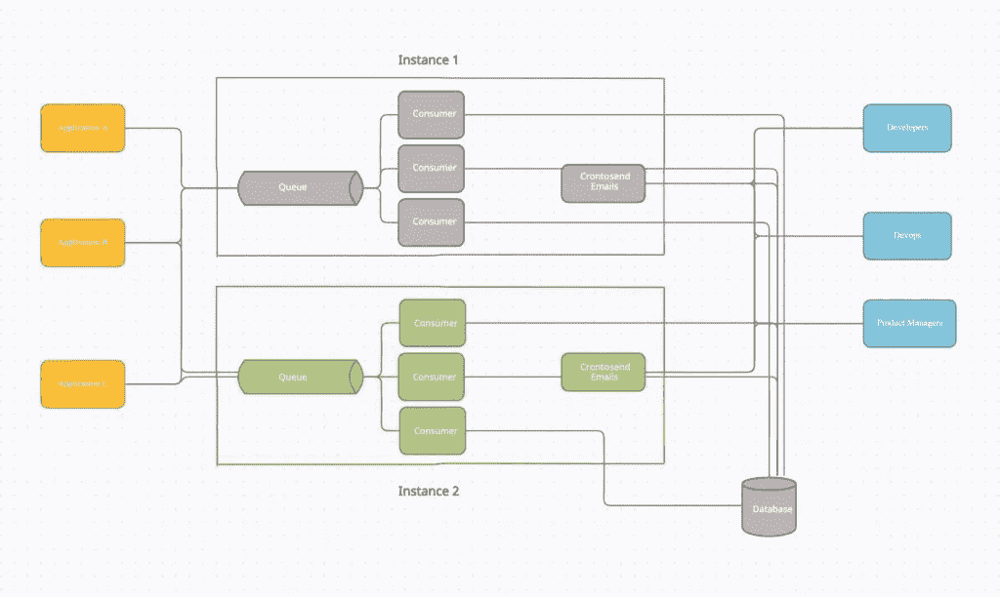

# 如何借助机器学习减少邮件超载

> 原文：<https://medium.com/geekculture/how-to-reduce-email-overload-with-the-help-of-machine-learning-e33d68bc6b81?source=collection_archive---------18----------------------->

想象一下，你每天去上班，登录你的官方邮件，你会收到数百封电子邮件，通知你你支持的一些应用程序出现了问题。你是做什么的？添加规则将它们移到废纸篓？你不能忽视这些，对吗？这些问题需要解决！我们可以通过机器学习来解决电子邮件超载的问题！让我们看看怎么做。

如果你还在读这篇文章，你可能知道我在说什么，你已经受够了。我希望你有足够的动力去做些什么。

仔细想想，我们真的不喜欢一遍又一遍地被告知相同的问题，但同时，我们确实希望被告知所有独特的问题。如果我们能把这些邮件分类，把相似的邮件放在一起，这样就能减少你收到的邮件数量。

# 解决方案——机器学习拯救世界！

最重要的任务是将相似的电子邮件分组，因为为了保持我们的理智，我们希望减少电子邮件的数量，但同时，我们也不想错过给我们一些独特信息的电子邮件。我们的目标是消除/减少重复信息。

# 为什么是机器学习？

我们正在处理电子邮件，基本上，开放的文本。这可以来自任何应用程序，我们可能对这些电子邮件的格式有一些控制，但遗留应用程序呢？当然，我们可以更新这些，但这不是太多的工作吗？

具体进入机器学习— [自然语言处理](https://en.wikipedia.org/wiki/Natural_language_processing)。它基本上为我们提供了比较不同文本的工具，让我们知道它们的相似程度。

# 解决方案摘要

具体来说，我们可以使用各种方法将这些电子邮件转换为[单词向量](https://en.wikipedia.org/wiki/Word_embedding)，如 [TF-IDF](https://en.wikipedia.org/wiki/Tf%E2%80%93idf) 、 [GloVe](https://en.wikipedia.org/wiki/GloVe_(machine_learning)) 和 [Word2vec](https://en.wikipedia.org/wiki/Word2vec) 。一旦我们有了单词向量，我们就有办法使用相似度函数来比较不同的电子邮件，比如[余弦距离/相似度](https://en.wikipedia.org/wiki/Cosine_similarity)、[欧几里德距离](https://en.wikipedia.org/wiki/Euclidean_distance#:~:text=In%20mathematics%2C%20the%20Euclidean%20distance,being%20called%20the%20Pythagorean%20distance.)和[雅克卡距离](https://en.wikipedia.org/wiki/Jaccard_index)。例如，我们可以使用余弦距离，这将基本上给出两个向量之间的角度，角度越小，电子邮件越相似。现在，我们可以使用一些阈值来考虑这两个电子邮件是否相似。

如果您正在寻找文本相似性的详细信息，[请访问此处](https://towardsdatascience.com/calculating-document-similarities-using-bert-and-other-models-b2c1a29c9630)。

# 履行

我们可以实现一个简单的 Django 应用程序来创建一个 web 服务器，它将接受来自应用程序的电子邮件请求。但是，如果服务器停机或请求过载，我们不想错过请求。我们可以在应用程序和服务器之间引入一个[消息队列](https://en.wikipedia.org/wiki/Message_queue)，如上图所示。

# 流程 1 —电子邮件处理

一旦我们的消息队列中有了电子邮件，我们的队列消费者就可以挑选并处理它们。

# 流程 2 —发送已处理的电子邮件

最后，我们可以让 CRON 触发 Django 命令，该命令会将这些电子邮件发送出去，并从我们的数据库中删除它们。

**注意——这两个流不是同步的，而是相互独立的。**

# 简单？嗯，没那么多！

像大多数项目一样，冰山理论在这里发挥作用。从表面上看，实现起来相当简单。但是在我们生产它之前，还有几个挑战需要解决。

# 挑战 1 —我们需要整个文本语料库来寻找相似性！

如果你记得我们的想法是找到电子邮件的词向量(通过技术 TF-IDF，Glove 和 Word2vec)。但是如果你仔细观察 TF-IDF 的公式:

正如你所看到的，我们需要所有我们想要相互比较的电子邮件来计算术语频率和逆文档频率，这也是用词向量计算的其他技术的情况。因此提出了两个问题。

1.  我们事先并不知道我们想要处理的所有电子邮件。
2.  即使我们事先知道所有的电子邮件，我们也可能会有许多电子邮件和正文非常大的电子邮件。这将使得计算单词向量的效率低下。

# 挑战 1 —解决方案！

为了解决上述问题，我们可以创建电子邮件 的 ***桶，每个桶有一个 ***领导者*** ，并且随着我们的进行，我们试图保持桶中的每个电子邮件都与领导者电子邮件相似，并且可能与其他电子邮件相似，也可能不相似。***

让我们看一个例子来更好地理解它。想象一个时间线和水桶。

1.  在时间 0 —假设我们收到一封电子邮件 **e1** 。此时，我们还没有，所以我们创建了一个并指定 **e1** 为领导者。
2.  在时间 2 —我们收到另一封邮件，现在有两种可能性，要么这封邮件与桶 **— b1** 的 ***领导邮件*** 相似，要么不相似。我们假设这类似于 ***领导邮件*** — **e1** 所以我们把它加到 **b1。**
3.  在时间 3，我们收到电子邮件 **e3** ，同样的可能性是电子邮件是否与桶的 ***领导电子邮件*****B1**相似。现在我们假设 **e3** 和 ***领导邮件***——**E1**不相似。由于 **e3** 不相似，我们将创建一个新的桶 **b2** 并将其分配为 ***领导邮件*。**我们现在总共有两个桶——**B1**和 **b2** 。
4.  在时间 4 —我们收到了另一封邮件 **e4** ，现在我们需要将 **e4** 与 ***桶头邮件*** **e1** 和 **e3** 。如果你注意到我们只需要做 2 次比较，而不是 3 次，这是一个非常小规模的例子，它可以随着成千上万封电子邮件的生产而显著增长，那么我们需要做相对较少的计算，从而提高性能。

# 挑战 2 —可扩展性

第二个问题出现在我们尝试横向扩展这个项目时，我们有两个实例，我们可以使用 celery 从 RabbitMQ 这样的消息代理读取数据，并让应用程序填充队列。

这里，队列是通过应用程序填充的。然后通过两个实例上的使用者进行处理。消费者通过给电子邮件贴上标签，把它们放在不同的桶里。为此，他们需要向数据库查询 bucket leader 电子邮件，然后计算相似度。

现在假设您的队列中有 10 封相似的电子邮件，而目前我们没有任何存储桶。由于我们有 6 个消费者，我们开始并行处理 6 封电子邮件。在第一步中，他们将尝试获取存储桶领导者的电子邮件，这将导致一个空列表，因为我们没有任何电子邮件存储桶。考虑到每封电子邮件都是独一无二的，我们创建了 6 个新的存储桶。

# 挑战 2 —解决方案！

为了解决这个问题，我们可以引入另一个步骤来检查相似性，然后合并桶领导电子邮件。

# 源代码

我已经创建了一个使用上述解决方案的应用程序。如果你正面临类似的问题，这可能是有用的。点击查看代码[。](https://github.com/utkarsharma2/EmailsDigest)

*原载于 2021 年 3 月 23 日*[*https://rational . tech*](https://rationalize.tech/machine-learning-project/how-to-reduce-email-overload-with-the-help-of-machine-learning/)*。*