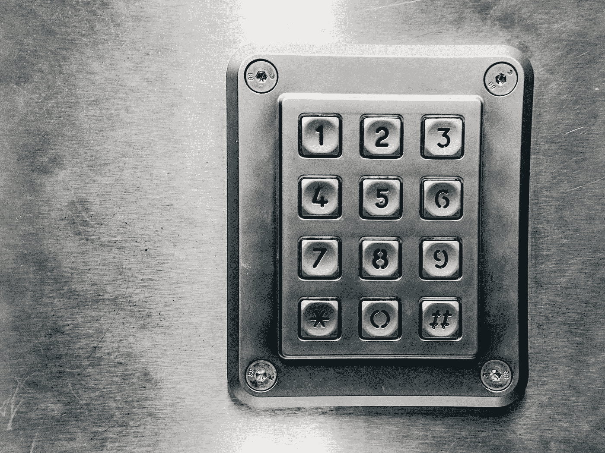

# 如何在 Mac M1 重置 MySQL 或 MariaDB Root 密码

> 原文：<https://medium.com/geekculture/how-to-reset-mysql-or-mariadb-root-password-in-mac-m1-321caf96e1cd?source=collection_archive---------2----------------------->

## Mac 图书技巧

## 在苹果 Mac M1 重置数据库根密码

你好😄，你好 folks❓.希望你过得好！！！！。我们将学习一个非常重要的概念，每个程序员在他们职业生涯的早期以及他们的大学生活中都将面临这个概念。大多数计算机/软件工程师都有忘记密码的问题。对于数据库根密码来说，它也不是新的。今天我们将看到如何在 M1 Macbook 中重置 MySQL 或 Maria DB root 密码。


Photo by [Dmitry Chernyshov](https://unsplash.com/es/@oneor0?utm_source=medium&utm_medium=referral) on [Unsplash](https://unsplash.com?utm_source=medium&utm_medium=referral)

大多数情况下，当我们安装服务器时，有可能重置 MySQL 或 MariaDB root 密码。如果你已经忘记了，如果我们不知道如何改变它，它可能会变得令人头痛。读完这篇文章后，你可以成功地更改 MySQL 或 MariaDB 的密码，这篇文章是专门为那些记不住密码这样的小事的**你们这些**人设计的，我们可以简单地称他们为软件相关人员😅。不再拖延，让我们直接进入主题。


Photo by [Etty Fidele](https://unsplash.com/@fideletty?utm_source=medium&utm_medium=referral) on [Unsplash](https://unsplash.com?utm_source=medium&utm_medium=referral)

如果您可以访问服务器和启用了`sudo`的用户帐户，您仍然可以登录并重置密码。请按照以下步骤正确▶️.

## 步骤 01 —识别数据库版本

您可以使用以下命令检查您的版本。

> **mysql —版本**

输出取决于您的数据库。MySQL 或者 MariaDB。

```
**MySQL output**mysql  Ver 14.14 Distrib 5.7.16, for Linux (x86_64) using  EditLine wrapper**MariaDB output**mysql  Ver 15.1 Distrib 5.5.52-MariaDB, for Linux (x86_64) using readline 5.1
```

你需要知道你使用的是哪个数据库，以及你以后使用的是哪个版本，所以把两者都记下来。然后必须停止数据库，以便您可以手动访问它。

## 步骤 02 —停止数据库服务器

在更改 root 密码之前，必须先关闭数据库服务器。

MySQL:

> **sudo systemctl 停止 mysql**

MariaDB:

> **sudo systemctl stop mariadb**

您需要在数据库服务器停止后手动访问它，以便重置 root 密码。

## 步骤 03 —重新启动数据库服务器，不进行权限检查

如果在不加载用户权限信息的情况下启动 MySQL 和 MariaDB，则可以使用 root 权限访问数据库命令行，而无需输入密码。你可以用这种方式访问数据库而不被发现。

为此，您需要阻止数据库加载存储用户特权信息的*授权表*。因为这有一点安全风险，所以您也应该跳过联网，以防止其他客户端连接。

启动数据库，但不加载授权表或启用网络:

> **sudo mysqld _ safe—skip-grant-tables—skip-networking&**

现在，您可以作为 root 用户连接到数据库，这不应该要求输入密码。

> **mysql -u root**

然后，你可以看到它

**MySQL 提示**

```
Type 'help;' or '\h' for help. Type '\c' to clear the current input statement.mysql>
```

**MariaDB 提示**

```
Type 'help;' or '\h' for help. Type '\c' to clear the current input statement.MariaDB [(none)]>
```

现在您可以更改 root 密码，因为您现在拥有 root 访问权限。

## 步骤 04 —更改 Root 密码

更改 MySQL 现代版本的根密码的简单方法是使用`ALTER USER`命令。但是，这个命令现在不起作用，因为还没有加载授权表。

使用`FLUSH PRIVILEGES`命令，我们可以告诉数据库服务器重新加载授权表。

> **同花顺特权；**

最后，我们可以更改 root 密码

> **更改由“new_password”标识的用户“root”@“localhost”；**

该命令适用于 **MySQL 5.7.6 和更新版本**以及 **MariaDB 10.1.20 和更新版本**

> **为' root ' @ ' localhost ' = PASSWORD(' new _ PASSWORD ')设置密码；**

该命令适用于 **MySQL 5.7.5 及更早版本**以及 **MariaDB 10.1.20** 及更早版本。

无论哪种情况，您都应该看到命令已经成功执行的确认。

```
OutputQuery OK, 0 rows affected (0.00 sec)
```

密码已被更改。因此您可以使用新密码以备将来使用。

## 步骤 05 —正常重启数据库服务器

使用`systemctl`重启服务。

MySQL:

> **sudo systemctl 启动 mysql**

MariaDB:

> **sudo system CTL start Maria db**

## 注意

> 确保您选择的新根密码是强有力的、安全的，并将其保存在安全的地方。



Photo by [regularguy.eth](https://unsplash.com/@moneyphotos?utm_source=medium&utm_medium=referral) on [Unsplash](https://unsplash.com?utm_source=medium&utm_medium=referral)

*我相信你已经了解了 MySQL root 密码问题以及如何解决它。如果您有任何问题或任何澄清，不要犹豫，通过回复部分与我联系。感谢你花宝贵的时间阅读这篇博客，我相信这将激励你继续阅读我的其他博客* [*这里*](https://sthenusan.medium.com/) *。*


Photo by [Kelly Sikkema](https://unsplash.com/@kellysikkema?utm_source=medium&utm_medium=referral) on [Unsplash](https://unsplash.com?utm_source=medium&utm_medium=referral)

*如果你想享受这样的科技故事，想支持我永远坚持写作，可以考虑* [*报名成为中等会员*](https://sthenusan.medium.com/membership) *。每月 5 美元，你可以无限制地阅读媒体上的故事。如果你用我的链接* *注册，我会赚一小笔佣金。你也可以跟着我上* [*中*](https://sthenusan.medium.com/) *和* [*推特*](https://twitter.com/thenusan97) *。*