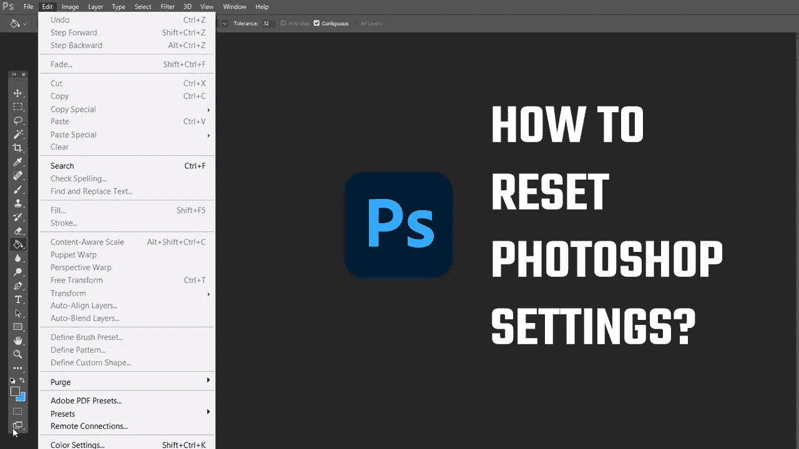

# 如何将 Photoshop 设置重置为默认值？2022

> 原文：<https://medium.com/geekculture/how-to-reset-photoshop-settings-to-default-2022-c74a3427115e?source=collection_archive---------11----------------------->

修复 Photoshop 中的任何问题

您的 photoshop 设置是否已更改，并且无法恢复？嗯，如果是的话，那么在这篇文章中，我们将学习两种重置 Photoshop 的方法，将所有设置恢复到默认设置。重置 Photoshop 会将所有自定义设置更改为以前的设置，并且在许多情况下会修复 Photoshop 中的任何问题。