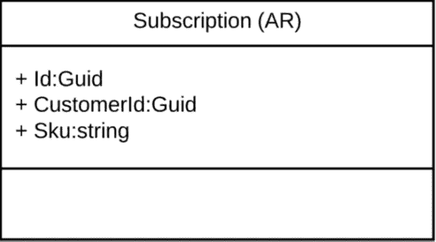
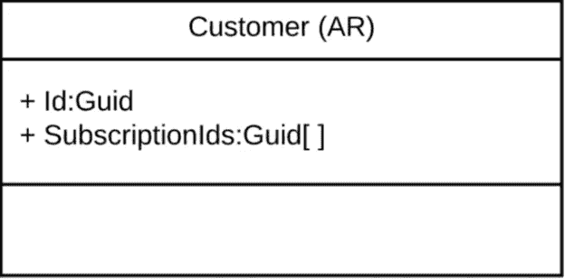
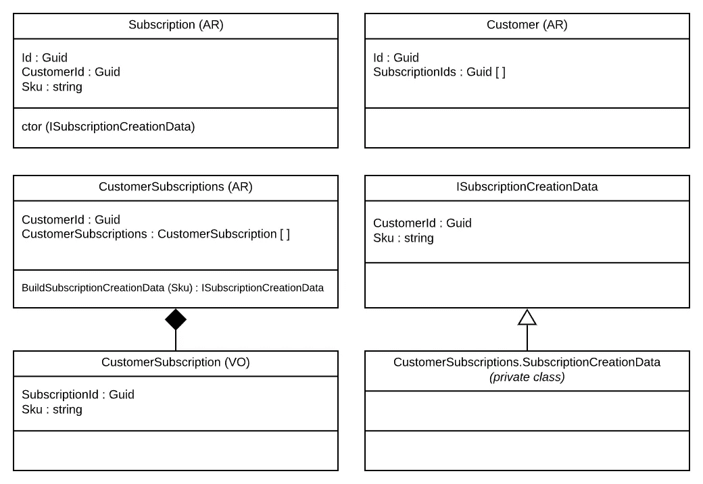

# 如何尊重包含两个聚合根的不变量

> 原文：<https://medium.com/geekculture/how-to-respect-an-invariant-implicating-two-aggregate-roots-840f98b86c6a?source=collection_archive---------17----------------------->

*(非常感谢谭震森给儿子的同行评议！)*

当试图应用严格的 DDD 规则时，你经常会面临 DDD 三难困境([https://enterprisescrafts . com/posts/domain-model-purity-completity/](https://enterprisecraftsmanship.com/posts/domain-model-purity-completeness/))。有许多方法可以解决这个问题。这些年我大概都在用。但是最近，我自己尝试了一些新的东西，通过结合其他模式来解决这个问题。这是我最喜欢的方法。

首先，简单描述一下问题。假设您有一个订阅聚合根:

还要考虑您有客户聚合根:

只是提醒一个关键的 DDD 规则，聚合根应该只通过 Id 引用其他聚合根，而不是直接引用它们。

现在，您需要实现这个不变量:一个客户不能拥有一个以上的特定 Sku 订阅。你怎么能这样做？

一种典型的、也许是幼稚的方法是在域服务中实现它，如下面的伪代码:

1-从客户仓库加载客户

2-从 SubscriptionRepository 加载所有订阅，使用已加载客户的所有 SubscriptionIds

3-检查新的 Sku 是否已经在一个已加载的订阅中

这种方法的问题是没有强制不变量的应用。任何人都可以实例化一个新的订阅，并将 SubscriptionId 添加到客户列表中。当没有强制执行时，人们会忘记应用不变量，或者他们只是没有意识到不变量，只是错误地绕过了它们。如果您想要一个始终有效的领域模型，您必须实施不变的适用性。

当一些人面临类似的问题时，他们喜欢在聚合根中注入存储库，但是这打破了领域的纯粹性(在 DDD 三难困境中解释)。这种被称为断开域模型的方法还可以在单个事务中打开更新多个聚合根的大门(更多信息请参见 Vaughn Vernon 的名著第 7 章和第 10 章)。因此，我尽可能地避免这种解决方案。

当这种问题出现的时候，是不是往往是一个概念缺失的征兆。所以这里是我喜欢的解决这类问题的方法。

那么它是如何工作的呢？

我介绍了 CustomerSubscriptions 聚合根，它代表了客户及其订阅之间的概念。在我看来，没有必要在数据库中有一个专用的数据表示。它可以在订阅和客户表中的现有数据的基础上构建为读取模型，以构建 CustomerSubscription 值对象的列表。这是有争议的，有些人不喜欢在同一个表上有多个读模型，因为理论上可以绕过一些只出现在一个聚合中而不出现在另一个聚合中的不变量。是真的。就个人而言，由于从不在 CustomerSubscriptionsRepository 上实现保存/更新方法，与在数据库中有一个专用的数据表示并同步该数据相比，这是一个很好的折衷方案，而不必违反“每个事务一个聚合”的规则。也可以这样做，但这要复杂得多，而且没有实际好处。在环境允许的情况下，尽可能降低复杂性始终是一个很好的经验法则。个人喜好在此。

下一个难题是 ISubscriptionCreationData 接口。您绝对需要有一个该接口的实例，以便能够实例化订阅，因为这在订阅构造函数中是必需的。该接口的唯一实现作为私有类驻留在 CustomerSubscriptions 内部，这意味着除了 CustomerSubscriptions 类(C#)之外，没有人可以实例化该类。因此，您必须通过 CustomerSubscriptions 聚合根来构建创建数据，该类的 BuildSubscriptionCreationData 方法负责应用具有挑战性的不变量。换句话说，CustomerSubscriptions 的目的是作为一个强制的工厂入口点，以访问实例化订阅所需的数据。你就是不能忘记它或绕过它。

当然，这种解决方案并不完美。任何人都可以决定实现自己的 ISubscriptionCreationData 接口实现。但是这样做，你知道你做错了。与需要记住使用域服务相比，这是一种更好、更不容易出错的方法。目标不是保护代码不被想黑它的人窃取(他们总是能够……)，而是保护人们不犯错误。

数据库第一人有时试图通过在数据库模式中添加约束来解决这个问题。记住，这会导致一个贫血的领域模型，这是不推荐的。数据库持久性仅仅是一个实现细节。这不是一种正确建模业务规则的方法。在领域中正确建模的不变量之上使用该解决方案没有任何问题，但是您不应该依赖它。

希望你喜欢这个解决方案。随时乐意讨论代码实现！