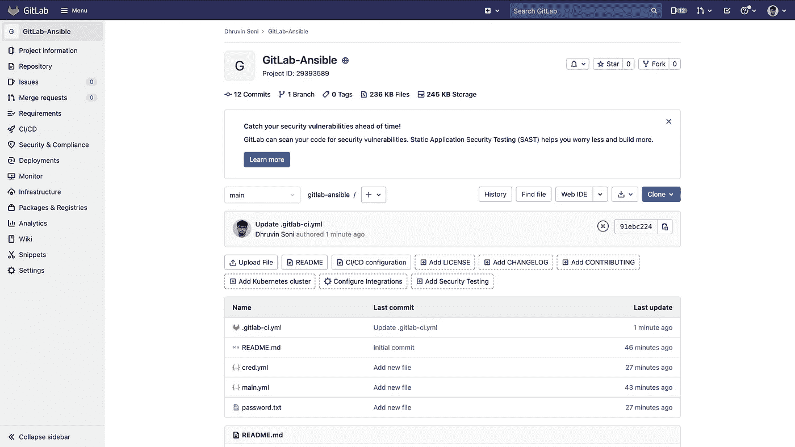

# 如何使用 GitLab CI/CD 运行 ansible 剧本？

> 原文：<https://medium.com/geekculture/how-to-run-an-ansible-playbook-using-gitlab-ci-cd-2135f76d7f1e?source=collection_archive---------0----------------------->

# 什么是 GitLab CI/CD？

**GitLab CI/CD** 是**git lab**的一部分，用于所有的**连续方法(连续集成、交付和部署)**。使用 **GitLab CI/CD** ，您可以**测试**，**构建**，以及**发布**您的代码，无需第三方应用或集成。

点击 阅读更多关于 **GitLab CI/CD** [**。**](https://docs.gitlab.com/ee/ci/)


GitLab CI/CD

# 什么是 Ansible？

**Ansible** 是一款开源的**软件配置**、**配置**、**管理**、**部署**工具。它运行在许多类 Unix 系统上，可以配置类 Unix 系统和 Microsoft Windows。Ansible 使用 SSH 协议来配置远程服务器。Ansible 遵循基于推的机制来配置远程服务器。


Ansible

# 什么是可旋转拱顶？

**Ansible Vault** 是 Ansible 的一项功能，它允许您将密码或密钥等敏感数据保存在加密文件中，而不是以明文形式保存在剧本或角色中。您可以创建新的加密文件，也可以修改现有的加密文件。

在本教程中，我将 **Ansible** 与 **GitLab CI/CD** 集成在一起，并在 **AWS** 上创建了各种资源。


GitLab CI/CD + Ansible

# 先决条件:

*   **AWS & GitLab 账户**
*   [**AWS**](https://docs.aws.amazon.com/)[**ansi ble**](https://docs.ansible.com/)**&**[**git lab CI/CD**](https://docs.gitlab.com/ee/ci/)
*   在 **AWS** 中创建的**访问密钥** & **秘密密钥**
*   **Ansible Vault** 对文件进行加密

让我们从项目的配置开始

**步骤 1:-** 创建一个**存储库**

*   在你的 GitLab 帐户中创建一个存储库，并给它起一个你自己选择的名字



GitLab Repository

**步骤 2:-** 为资源创建创建一个**可解析的**文件

*   在根目录下创建一个`.yml`文件，并在其中添加下面的代码。
*   下面的代码将在 AWS 上创建各种资源。如果你不能理解代码中的任何内容，你可以从 [**这里**](https://devopsquare.com/a-complete-overview-of-ansible-264bb0cceafe) 更好地理解

```
---
- hosts: localhost  # Place where we are running Ansible
  connection: local # Connection 
  gather_facts: no
  vars_files:
  - cred.yml

  # Variables
  vars:
    ansible_python_interpreter: /usr/bin/python3
    # Default Names
    title: "Demo"
    vpc_name: "{{ title }} VPC"
    igw_name: "{{ title }} IGW"
    subnet_name: "{{ title }} Subnet"
    acl_name: "{{ title }} ACL"
    instance_name: "{{ title }} Instance" 
    security_group_name: "{{ title }} Security Group"
    route_table_name: "{{ title }} Route Table"

    # Default values for CIDR Blocks
    vpcCidrBlock: "10.0.0.0/16"
    subNetCidrBlock: "10.0.1.0/24"
    portCidrBlock: "0.0.0.0/0"
    destinationCidrBlock: "0.0.0.0/0"

    # State
    state: "present"

    # Default value of AZ & Regio
    zone: "us-west-1a"
    region: "us-west-1"

  # List of tasks
  tasks:

  # Creating VPC
  - name: Create VPC
    ec2_vpc_net:
      aws_access_key: "{{ aws_access_key }}"
      aws_secret_key: "{{ aws_secret_key }}"
      name: "{{ vpc_name }}"
      cidr_block: "{{ vpcCidrBlock }}"
      region: "{{ region }}"
      dns_support: "yes"
      dns_hostnames: "yes"
      tenancy: "default"
      state: "{{ state }}"
      resource_tags:
        Name: "{{ vpc_name }}"
    register: vpc_result

  # Creating Internate Gateway
  - name: Create Internet Gateway
    ec2_vpc_igw:
      aws_access_key: "{{ aws_access_key }}"
      aws_secret_key: "{{ aws_secret_key }}"
      vpc_id: "{{ vpc_result.vpc.id }}" 
      region: "{{ region }}"
      state: "{{ state }}" 
      tags:
        Name: "{{ igw_name }}"
    register: igw_result

  # Creating Subnet
  - name: Create Subnet
    ec2_vpc_subnet:
      aws_access_key: "{{ aws_access_key }}"
      aws_secret_key: "{{ aws_secret_key }}"
      vpc_id: "{{ vpc_result.vpc.id }}" 
      region: "{{ region }}"
      state: "{{ state }}"
      az: "{{ zone }}"  
      cidr: "{{ subNetCidrBlock }}"
      map_public: "yes"
      resource_tags:
        Name: "{{ subnet_name }}"
    register: subnet_result

  # Creating Security Group
  - name: Create Security Group
    ec2_group:  
      name: "{{ security_group_name }}"
      description: "{{ security_group_name }}"
      aws_access_key: "{{ aws_access_key }}"
      aws_secret_key: "{{ aws_secret_key }}"
      vpc_id: "{{ vpc_result.vpc.id }}" 
      region: "{{ region }}"
      state: "{{ state }}"
      tags:
        Name: "{{ security_group_name  }}"
      rules:
        - proto: tcp
          from_port: 80
          to_port: 80
          cidr_ip: "{{ portCidrBlock }}"
        - proto: tcp
          from_port: 443
          to_port: 443
          cidr_ip: "{{ portCidrBlock }}"
        - proto: tcp
          from_port: 22
          to_port: 22
          cidr_ip: "{{ portCidrBlock }}"

      rules_egress:
        - proto: tcp
          from_port: 80
          to_port: 80
          cidr_ip: "{{ portCidrBlock }}"
        - proto: tcp
          from_port: 443
          to_port: 443
          cidr_ip: "{{ portCidrBlock }}"
        - proto: tcp
          from_port: 22
          to_port: 22
          cidr_ip: "{{ portCidrBlock }}"
    register: security_group_result

  # Creating NACLs for subnet   
  - name: Create Network ACLs
    ec2_vpc_nacl:
      name: "{[ acl_name }}"
      aws_access_key: "{{ aws_access_key }}"
      aws_secret_key: "{{ aws_secret_key }}"
      vpc_id: "{{ vpc_result.vpc.id }}" 
      region: "{{ region }}"
      state: "{{ state }}" 
      subnets: [ "{{ subnet_result.subnet.id }}" ]
      tags:
        Name: "{{ acl_name }}"
      ingress:
      # rule no, protocol, allow/deny, cidr, icmp_type, icmp_code, port from, port to
        - [100, 'tcp', 'allow', '0.0.0.0/0', null, null, 0, 65535]

      # rule no, protocol, allow/deny, cidr, icmp_type, icmp_code, port from, port to
      egress:
        - [100, 'all', 'allow', '0.0.0.0/0', null, null, 0, 65535]

  # Creating Route Table for subnet
  - name: Create Route Table
    ec2_vpc_route_table:
      aws_access_key: "{{ aws_access_key }}"
      aws_secret_key: "{{ aws_secret_key }}"
      vpc_id: "{{ vpc_result.vpc.id }}" 
      region: "{{ region }}"
      state: "{{ state }}" 
      tags:
        Name: "{{ route_table_name }}"
      subnets: [ "{{ subnet_result.subnet.id }}" ]
      routes:
        - dest: "{{ destinationCidrBlock }}" 
          gateway_id: "{{ igw_result.gateway_id }}"
    register: public_route_table

  # Creating EC2 Instance
  - name: Create EC2 Instance
    ec2:
      aws_access_key: "{{ aws_access_key }}"
      aws_secret_key: "{{ aws_secret_key }}"
      instance_type: t2.micro
      image: ami-04b6c97b14c54de18
      wait: yes
      region: "{{ region }}"
      group: "{{ security_group_name }}"
      key_name: tests
      count: 1
      vpc_subnet_id:  "{{ subnet_result.subnet.id }}" 
      assign_public_ip: yes
      instance_tags:
        Name: "{{ instance_name }}"
    register: ec2_result
```

**步骤 3:-** 为 AWS 凭证创建一个**可回复的**文件

*   在这里，我已经使用 **ansible vault** 为 AWS **访问密钥** & **秘密密钥**创建了凭证文件，这样我们可以安全地管理它。

> 要使用 ansible vault 创建新的加密文件，您需要运行以下命令。它会要求输入密码，所以请输入一个容易记住的密码

```
ansible-vault create cred.yml
```

*   在其中添加以下内容

```
aws_access_key: <your aws access key>
aws_secret_key: <your aws secret key>
```

**第四步:-** 创建一个**密码**文件

*   创建一个名为`password.txt`的新文件，并在其中添加您的 ansible vault 密码，以便我们稍后使用。

**第四步:-** 创建一个**工作流**文件

*   现在，为了自动创建资源，我们需要创建一个工作流文件
*   创建`.gitlab-ci.yml`文件，并将下面的代码添加到其中
*   以下作业将在主分支上发生的每个**推**和**拉请求**上运行。在构建部分，我已经在脚本部分指定了映像名称和命令。

```
stages:
  - run

image:
  name: registry.gitlab.com/torese/docker-ansible

variables:
    ANSIBLE_HOST_KEY_CHECKING: 'false'
    ANSIBLE_FORCE_COLOR: 'true'
    ANSIBLE_PYTHON_INTERPRRTER: /usr/bin/python3

before_script:
  - yum install httpd -y
  - yum install -y python3
  - ansible --version

run:
  stage: run
  script:
    - ansible-playbook main.yml --vault-password-file=password.txt
```

我们来理解一下上面的代码。

*   下面的代码用于声明阶段的名称

```
stages:
  - run
```

*   我们使用`ansible`图像来运行 ansible 剧本

```
image:
  name: registry.gitlab.com/torese/docker-ansible
```

*   在`variable`部分，我们定义了环境变量

```
variables:
    ANSIBLE_HOST_KEY_CHECKING: 'false'
    ANSIBLE_FORCE_COLOR: 'true'
    ANSIBLE_PYTHON_INTERPRRTER: /usr/bin/python3
```

*   在`before_script`部分，我们正在安装`httpd`和`python3`并检查`ansible`版本

```
before_script:
  - yum install httpd -y
  - yum install -y python3
  - ansible --version
```

*   在`run`部分，我们正在运行 ansible 行动手册

```
run:
  stage: run
  script:
    - ansible-playbook main.yml --vault-password-file=password.txt
```

**步骤 5:-** 检查**输出**

*   现在，只要你提交你的工作流文件，GitLab 就会触发这个动作，资源就会在 AWS 帐户上创建。
*   运行作业后，您将看到所有步骤都运行良好，没有错误。因此，当每个步骤工作成功时，您将拥有用绿色书写的`passed`。


Jobs

*   您还可以通过单击来检查每个步骤的输出

**步骤 6:-** 检查 **AWS** 上的资源

*   一旦作业运行完成，您就可以导航到 AWS 并检查所有资源
*   Ansible 将创建以下资源

1.  **VPC**


VPC

**2。子网**


Subnets

**3。互联网网关**


Internet Gateway

**4。Rouet 表**


Route Table

**5。安全组**


Security Group

**6。密钥对**


Key Pair

**7。EC2 实例**


EC2 Instance

现在就这样，你已经学会了如何将 Ansible 与 GitLab CI/CD 集成。您现在可以使用它并对其进行相应的修改。

如果您觉得本指南很有帮助，请点击👏按钮，也可以随意发表评论。

关注更多类似的故事😊