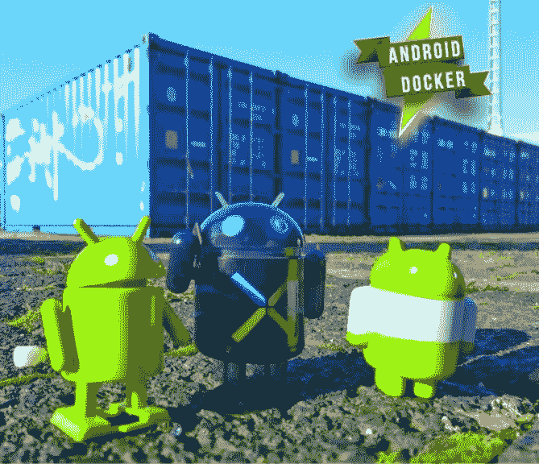
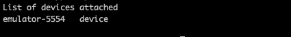

# 如何用 docker 环境运行 android 自动化脚本？

> 原文：<https://medium.com/geekculture/how-to-run-android-automation-scripts-with-docker-environment-51f6207d52ed?source=collection_archive---------1----------------------->


Photo by [Árpád Czapp](https://unsplash.com/photos/4aDuXiPcfQI)

测试过程是一个非常复杂和广泛的程序。测试过程本身有助于理解和识别开发过程中产生的缺陷、错误和失败。测试过程本身需要大量的时间和资源。但是最大的资源花费在 Android 或 iOS 的移动测试上。移动测试需要安装大量的依赖项。还需要有足够大的设备群(所谓的设备群)来执行手动和自动场景。

使用 Docker 容器化技术，我们可以为多个功能分支创建和运行自动化脚本，从而加快开发并提高生产率。



假设您要建立测试自动化。完全由您的团队来构建和维护整个测试基础设施可能是痛苦的。虽然像 Sauce Labs 这样的一些云服务确实涵盖了 DevOps，但由于公司的安全问题或预算问题，您可能会犹豫是否使用它们。Docker 是设置和维护测试自动化服务器的一个很好的工具，尤其是如果您刚刚开始使用开源解决方案构建自动化测试基础设施的话。

在本文中，我们创建一个 Android 容器来隔离测试过程。

无论您使用哪种测试框架或测试库，在实现和执行测试时，您都需要考虑库版本、环境变量设置和其他依赖项。测试脚本是一个程序，它向服务器发送请求，以便在要测试的驱动程序上执行命令。为了使您团队中的任何人能够在任何平台上执行测试，您可以使用 Docker 将所有测试脚本和库打包成一个测试运行器容器。容器是一个独立的环境，包括所有的环境设置和库，所以测试脚本可以在任何平台上运行。下面是一个 Docker 文件的例子，用来制作一个简单的测试运行程序 Docker 映像。Dockerfile 是一个文本文档，包含用户可以在命令行上调用的所有命令来组合一个图像。

开始一个码头集装箱。

我们构建的图像是— **ubuntu:最新的**

*   — `it`:交互执行 shell 命令。
*   `— name "name-of-your-android-container”`:首选容器名。

另外，要以非根用户身份运行 docker，最简单的方法是将当前用户添加到组 docker:

安装 SDK 和所有的包。

Gradle。

创建一个新的目录`/opt/gradlew`，并在那里安装`gradle-wrapper`。(目录名可以是任何名称，但是要将文件保存在容易找到的地方)

一个 ndroid SDK。

*Android 软件开发套件(SDK)包括不同的组件，包括 SDK 工具、构建工具和平台工具。SDK 工具主要包括 Android 模拟器、层级查看器、SDK 管理器和 ProGuard。构建工具主要包括 apt(一个用于创建的 Android 打包工具。APK)，dx(一个转换的 Android 工具。java 文件到。dex 文件)。平台工具包括 Android 调试外壳、sqlite3 和 Systrace。*

你需要手动下载没有 Android Studio 捆绑的 SDK，只使用 SDK 工具。

最重要的包是`platform-tools`、`tools`和`emulator`。运行以下命令快速安装它们:

*   `platform-tools`包含`adb`
*   `tools`包含`avdmanager`和`sdkamanager`
*   `emulator`:运行仿真器
*   `system-images;android-*29*;google_apis;x86`:用于创建 **avd**

接受 Android SDK 的所有许可:

现在创建一个**avd**:

检查一下是否有效！

联合国模拟器。

以下是运行模拟器之前的一些小步骤:

*   用 ADB 停止任何正在运行的模拟器。
*   用标志`-no-window`和`-gpu off`在后台启动仿真器。
*   关闭动画以避免不稳定的测试。

一些测试用例将在一个小屏幕上不可见的视图上运行——所以我们将模拟器设置为高分辨率(1180x2220)

我们经常需要在不同的操作系统上运行我们的自动化脚本。这通常是因为 PC 上的操作系统可以是 Windows、Linux 或 Mac OS。CI 系统通常运行在 Linux 上。有了这些多样性，我们需要一个简单的启动。我建议使用以下实现:

模拟器启动脚本可能如下所示:

用`sh create-emulator.sh`或`./create-emulator.sh`启动仿真器，并等待直到`Boot Status: 1`，这意味着设备已完全加载并准备好使用。

输入`**bg**`查看后台作业，再次检查。

在类 Unix 操作系统上， **bg** 是作业控制命令。它在后台恢复暂停的作业，在作业运行时将用户返回到 shell 提示符。

# 句法

```
bg [*job*]
```

***作业*** *—* 指定您想要在后台运行的作业。工号 1 称为 **%1** ，工号 2 称为 **%2** ，以此类推。； **%** 、 **%+** 或 **%%** 指当前作业； **%-** 或—指以前的工作。

另外，我建议创建 shell 脚本来从 AVD 管理器中删除模拟器:

您可以使用以下命令检查模拟器的创建是否成功:

```
$ adb devices
```



我们已经成功地在容器中运行了一个 Android 模拟器！

建立一个码头工人的形象。

打开一个新的终端标签，停止**name-of-your-Android-container**并提交您的更改以创建一个新的 Docker 映像:

再次测试:

为了进一步使用，我们需要创建一个`Dockerfile`:

为了自动化为不同版本应用许可证的过程，您需要创建一个文件 **license_accepter.sh** ，其内容如下:

构建项目并运行测试。

检查您的项目配置，并使用适当的参数构建 docker 映像:

进入项目目录的顶层并运行:

*   -it:交互模式。
*   — rm:在该过程完成后删除卷。
*   -v `$PWD:/project`:将你的目录挂载到容器:`/project`
*   “android-container”:您的容器的名称。
*   bash `-c “ . /create-emulator.sh && gradlew build -p /project”`:用项目创建模拟器和挂载文件夹。

**结论**

Docker 不仅用于软件开发，还可以用于软件测试。它允许您为 web UI 或移动测试设置和扩展远程服务器。通过拥有一个隔离且稳定的环境，每个人都可以在一个容器内执行测试，以验证任何开发阶段的系统功能。这个基础设施中的所有容器都可以按需创建，并在测试完成时销毁。它使测试基础设施灵活，并最大限度地利用机器资源。尝试使用 Docker 为 web UI 和移动测试构建一个灵活的、一次性的测试基础设施。


[https://test-engineer.site/](https://test-engineer.site/)

# 作者[安东·斯米尔诺夫](https://www.linkedin.com/in/vaskocuturilo/)