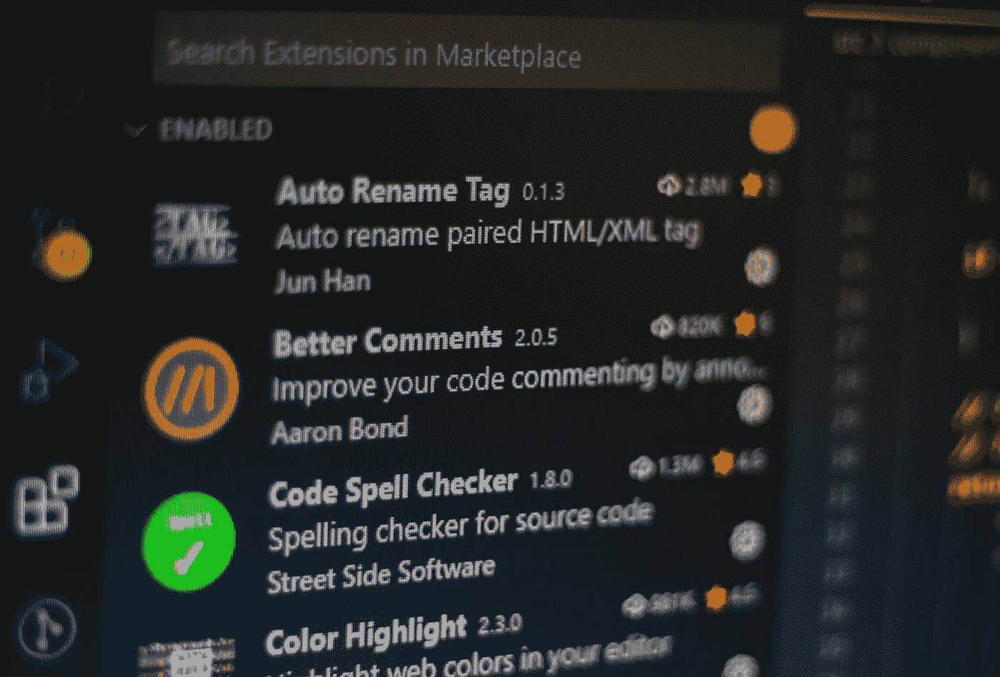
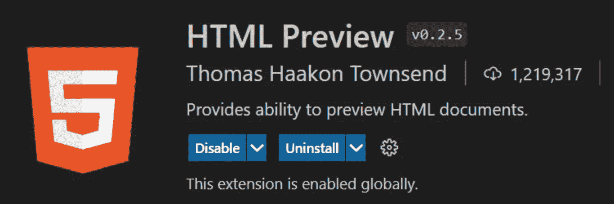
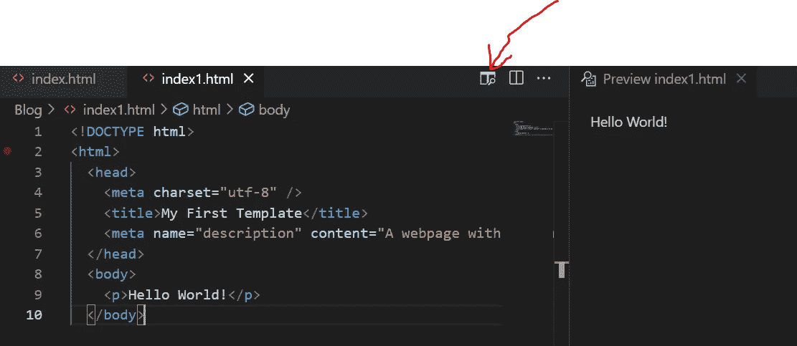
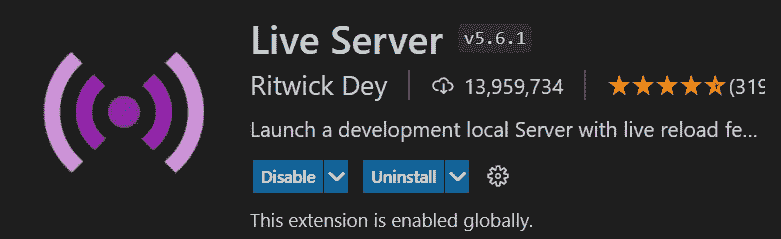
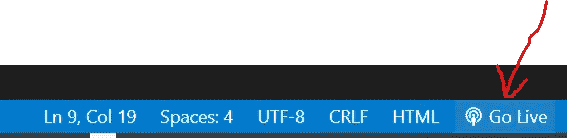
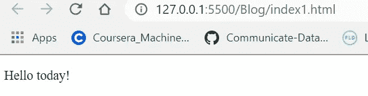
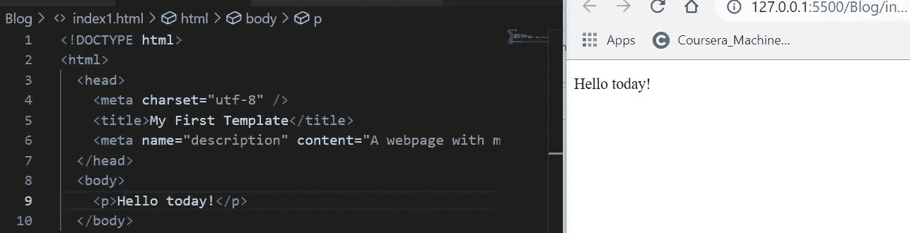
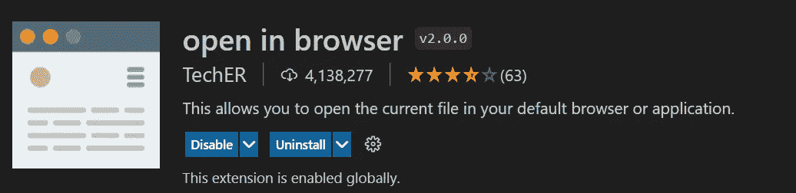
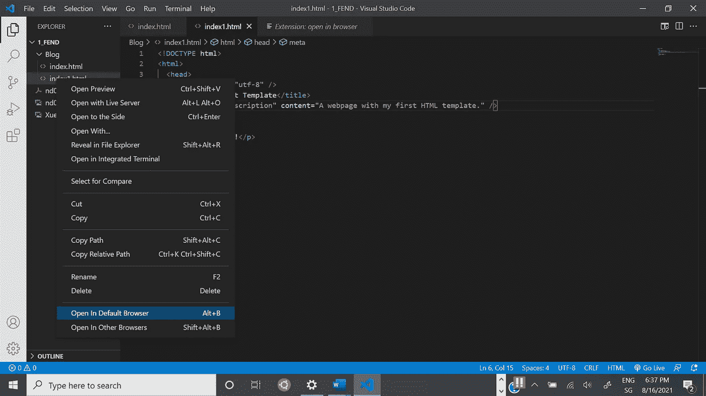
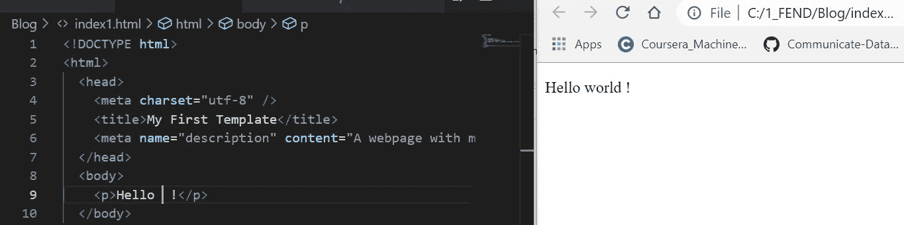

# 如何在 Visual Studio 代码中运行 HTML

> 原文：<https://medium.com/geekculture/how-to-run-html-in-visual-studio-code-ba4c6818c919?source=collection_archive---------3----------------------->

## 扩展:HTML 预览，实时服务器和在浏览器中打开

Photo by [Ferenc Almasi](https://unsplash.com/@flowforfrank?utm_source=unsplash&utm_medium=referral&utm_content=creditCopyText) on [Unsplash](https://unsplash.com/s/photos/vscode?utm_source=unsplash&utm_medium=referral&utm_content=creditCopyText)

您可以使用 Visual Studio Code (VSC)作为编码编辑器。在 VSC，你有没有遇到过活泼地浏览 HTML 文件的问题？

我试过三次延期，想分享一下经验。

1.  HTML 预览

HTML 预览可以在 VSC lively 中打开渲染网页。

一旦以下版本的 HTML 预览(如图片 1)被安装，将有一个名为“打开预览到一边”的图标，如图片 2 所示。

Pic1: HTML Preview

Pic2: HTML file and Preview in VSC

结果可以在 VSC 生动地展示出来。但是我面临一个问题，要改变预览的背景颜色。比方说:保持编辑器为黑色，但预览为白色，就像这样。有什么想法请不吝赐教。谢了。

2.实时服务器

Live Server 可以为静态和动态页面启动具有实时重新加载功能的开发本地服务器。

Pic3: Live Server

安装完扩展后，图标“上线”会显示在底部，如下图 4:

Pic4: bar with Go Live

选择 HTML 文件，点击 Go Live，将在开发本地服务器 127.0.0.1:5500 打开，如下图。

Pic5: display with Live Server

窗口可以安排如下，这可以帮助我生动地检查结果。

Pic6: rearrange the windows

3.在浏览器中打开

Pic7: open in browser

一旦扩展被安装，写点击文件，你会发现有两个项目被添加到下拉菜单:在默认浏览器中打开和在其他浏览器中打开。点击它，文件将在弹出窗口中打开。

Pic 8: new drop down menu

带有这种扩展的显示器不能生动地显示，一旦 HTML 文件发生变化就必须刷新，如下所示:HTML 已经改为“hello！”，显示不会自动改变。但这是我的经验，如有不妥，请不吝赐教。

Pic 9 : rearrange the windows

总而言之，我的经验是:

1.  HTML 预览是很好的显示渲染网页内 VSC 生动。如果背景能换就再好不过了。
2.  Live Server 将打开一个新的开发本地服务器，并实时显示更改。
3.  在浏览器中打开将打开一个新网站，但需要刷新网站以显示更改。

感谢您的阅读。