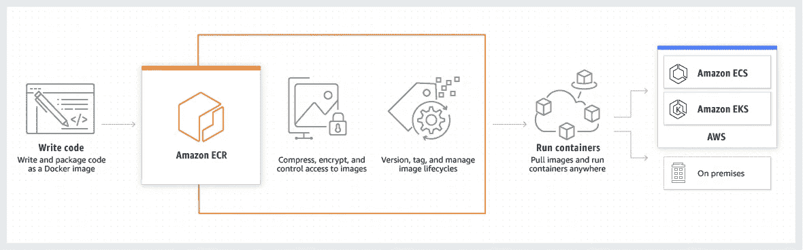
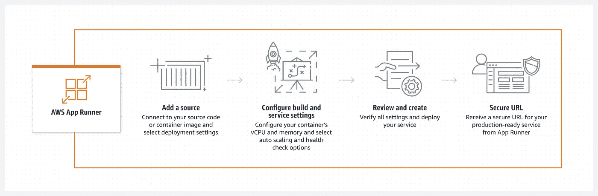
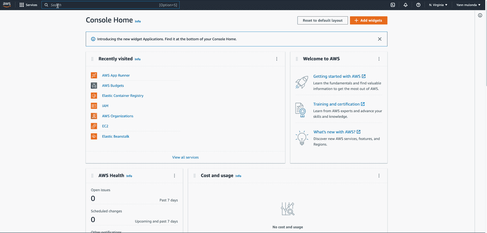
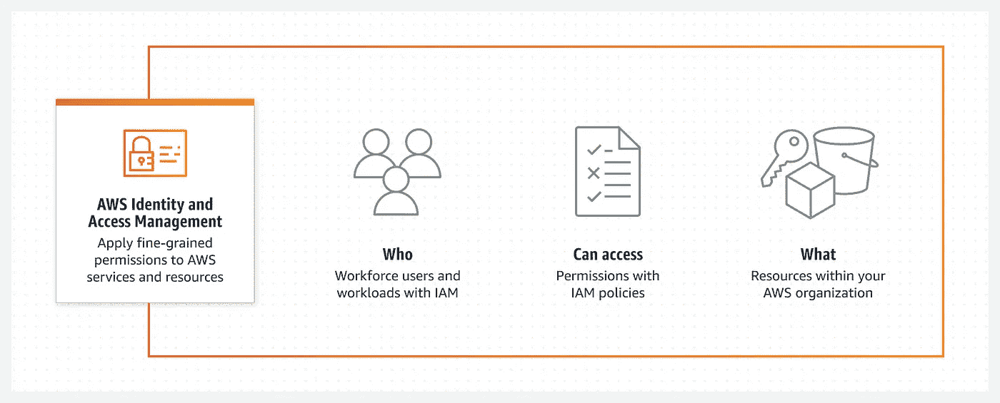
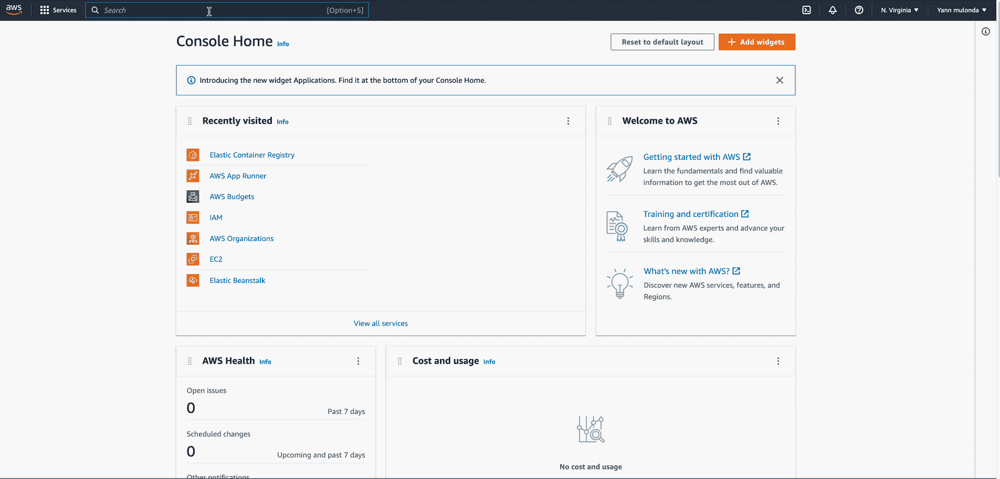
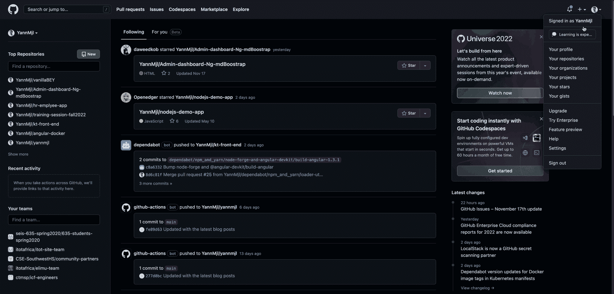
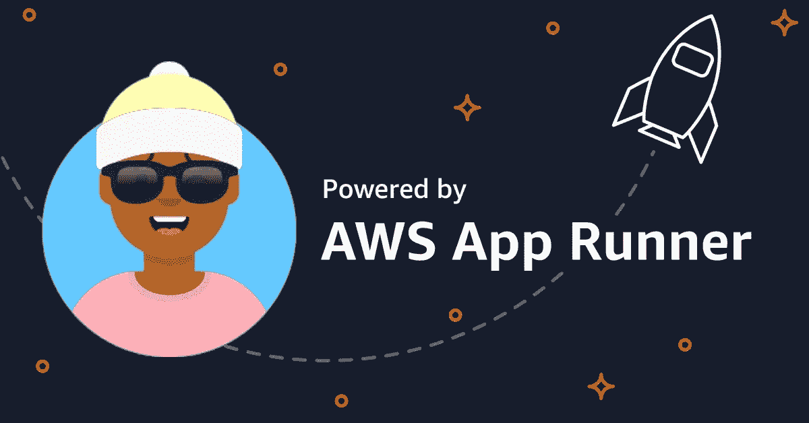
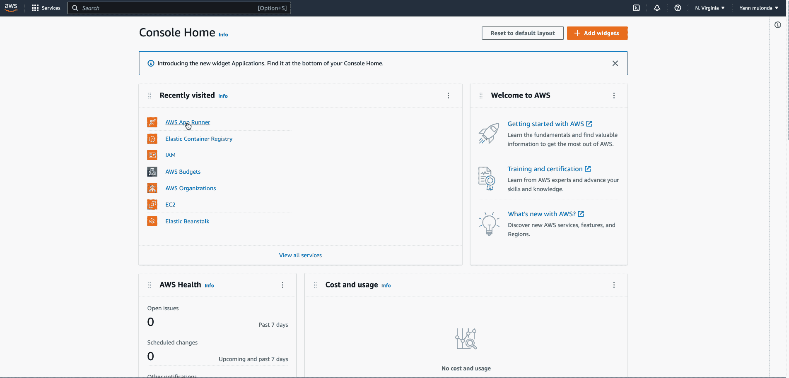

# 如何使用亚马逊 ECR 在 AWS App Runner 上运行 NodeJS app

> 原文：<https://medium.com/geekculture/how-to-run-nodejs-app-on-aws-app-runner-using-amazon-ecr-50698436fa47?source=collection_archive---------4----------------------->

具有 GitHub 操作的 AWS 云 CI/CD 管道

首先，本文建立在我发表的上一篇教程的基础上。我建议您在开始之前先完成它们:

1.  [如何使用 Docker & GitHub Actions](https://blog.devgenius.io/how-to-build-and-run-a-nodejs-app-with-docker-github-actions-59eb264dfef5) 构建并运行 NodeJS 应用
2.  [如何使用 Docker](https://blog.devgenius.io/how-to-deploy-to-kubernetes-heroku-using-docker-c2556a9584df) 部署到 Kubernetes & Heroku

> **假设&先决条件**

出于本文的目的，我假设您已经完成了前面的教程，并且已经设置了 AWS 帐户。或者至少对 NodeJS、Docker 和 GitHub 动作有所了解。

# 入门指南

我们将执行两个非常简单的任务来让我们的应用程序托管在 AWS 上:

1.  在 Amazon Elastic Container Registry(又名 Amazon ECR)上构建并推送我们的 nodeJS 应用程序的 docker 映像
2.  然后，我们将获取 ECR 中的 docker 映像，并使用 AWS App Runner 服务在一个容器中运行它。

> **什么是 AWS ECR 服务？**

Source: [aws.amazon.com/ecr](https://aws.amazon.com/ecr/)

Amazon Elastic Container Registry(**ECR**)是一个完全托管的 Docker 容器注册表，可以轻松存储、共享和部署容器映像。它和 Docker Hub 差不多，只是一个你可以存储 Docker 图片的地方。

> **什么是 AWS App Runner 服务？**

Source: [aws.amazon.com/apprunner](https://aws.amazon.com/apprunner/)

[AWS App Runner](https://console.aws.amazon.com/apprunner/home) 是在 AWS 中构建和运行容器化 web 应用程序的最简单方式。App Runner 为您提供完全托管的容器原生服务。不需要配置协调器，不需要建立管道，不需要优化负载平衡器，也不需要轮换 TLS 证书。当然，也没有需要管理的服务器。

在托管和运行容器化的应用程序方面，它在某种程度上做了和 Heroku 差不多的事情。

# 1.创建 AWS ECR 报告

要创建一个新的回购，我们将在其中推广我们的应用程序 docker 映像:

1.  转到 ECR 服务—点击**创建存储库**
2.  选择可见性下的 ***私有***—为您的回购起一个有意义的名字。我将我的名字命名为: ***nodejs-demo —*** ，点击**创建库**。

Create ECR repo

# 2.使用 AWS IAM 创建服务帐户用户

因此，让我们从将 GitHub 操作与 AWS 帐户集成开始。这是为了允许 GitHub 动作将构建映像上传到 ECR 中的 repo。我们实际上是创建一个服务帐户用户，该用户拥有将映像推送到 ECR 所需的访问和权限。

> **什么是 AWS IAM 服务？**

source: [aws.amazon.com/iam](https://aws.amazon.com/iam/)

借助 AWS 身份和访问管理(IAM)，您可以**指定谁或什么可以访问 AWS 中的服务和资源，集中管理细粒度的权限，并分析访问以细化 AWS 中的权限**。

因此，要创建新的服务帐户用户:

1.  转到 IAM 服务并选择**用户**
2.  在用户下，点击**添加用户**并按照提示进行操作
3.  给一个有意义的名字。在我的例子中，我将其命名为:***GitHub-Action-user-ECR***，并检查**编程访问(**允许创建密钥对)——点击 **Next: Permissions**
4.  在下一个屏幕上，选择“ ***直接附加现有策略*** ”选项卡。搜索“ ***亚马逊 2c containerregistryfullacess***”并查看。
5.  点击**下一步:标签**跳过—点击**下一步:查看—** 并确认**创建用户。**
6.  确保将**“访问密钥 ID”**和**“秘密访问密钥”**复制到某处。这些是我们要用来在 GitHub Repo 上添加秘密操作的细节。

Create a Service Account User

# 3.将 AWS 服务帐户添加到 Github

1.  进入你的 GitHub Repo——在设置下，点击**秘密——操作**。
2.  在 secrets 下，点击 **New Repository Secret** 并添加以下变量及其各自的值。

*   添加 **AWS_ECR_REPO_NAME** —在“值”部分，添加您的 ECR repo 的名称。我的是 **nodejs-demo**
*   接下来，在 value 部分添加**AWS _ ACCESS _ KEY _ ID**—**，粘贴您之前在创建服务帐户用户时复制的“*ACCESS KEY ID”*。**
*   **在值部分添加 **AWS_SECRET_ACCESS_KEY** ，粘贴“秘密访问密钥”。**

****

**Add GitHub Actions Secrets**

# **4.在 GitHub 操作工作流程中添加作业**

**现在，让我们添加将在 Github 操作管道中运行的作业，以 CI/CD 方式构建应用程序映像并将其推送到 ECR:**

*   **转到**。github/workflows** 并将以下作业添加到您的生产工作流程*。yml* 文件。我的名字叫 main.yml:**

**你回顾一下[***my main . yml workflow***](https://github.com/YannMjl/vanillaBEY/blob/main/.github/workflows/main.yml)*的全部内容，这样会更好的解释上面第 6 行和第 7 行关于我的工作。***

*   ***提交并推送代码——一旦更改被推送到存储库，检查 **Actions** 选项卡——并检查构建应用程序的炊具图像并将其推送到 AWS ECR 的新工作。***
*   ***转到 AWS ECR 并进行审查，以确保 docker 图像已成功推送到您的 ECR 报告中***

# ***5.在 AWS App Runner 上设置新服务***

******

***Source: [aws.amazon.com](https://aws.amazon.com/blogs/containers/introducing-aws-app-runner/)***

***启动并运行我们的应用程序所需的最后一项任务是获取 ECR 中的 docker 映像，并使用 AWS App Runner 服务在一个容器中运行它:***

1.  ***转到 AWS App Runner——点击**创建服务**,并完成下一页配置。***
2.  ***在**仓库类型**下，选择****容器注册表*** —在**提供者**下，选择 ***“亚马逊 ECR”*******
3.  ****在**容器图像 URI** 下，浏览您的 Amazon ECR 注册表并选择您的图像存储库和标签。****
4.  ****在**展开设置**和 T **装配工**下——选择“手动”触发连续投放——选择“自动”触发连续展开****
5.  ****在 **ECR 访问角色**下，选择 ***“创建新的服务角色”***——(如果你是第一次这样做，你肯定没有现有的服务角色)****
6.  ****保留默认设置，创建应用程序需要一些时间****

****如果一切顺利，您就大功告成了！****

********

****Creating App Runner Service****

****现在，对您的应用程序代码进行一些更改——将代码推送到您的 GitHub 存储库——观看 GitHub 工作流构建并以 CI/CD 方式将您的应用程序部署到 ECR——App Runner。****

> *****你可以在这里查看完整的演示代码: [github repo](https://github.com/YannMjl/nodejs-demo-app) 。****
> 
> *****我的网站是这样运行的:[https://5mf4qafkmw.us-east-1.awsapprunner.com/](https://5mf4qafkmw.us-east-1.awsapprunner.com/)****
> 
> ****如果你喜欢这个，你可能也会喜欢:"[使用 Docker、Kubernetes、Terraform 和 GitHub 动作部署到 GCP](https://blog.devgenius.io/how-to-provision-configure-deploy-to-google-cloud-platform-97dbbe36fcde)"****