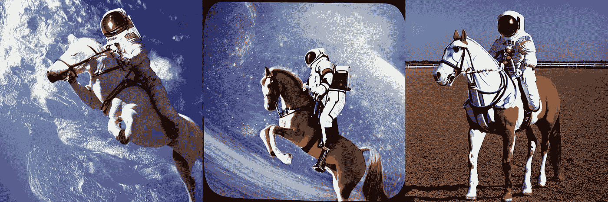

# 如何运行稳定扩散

> 原文：<https://medium.com/geekculture/how-to-run-stable-diffusion-f9dcd2c790af?source=collection_archive---------2----------------------->

总部位于伦敦和加州的初创公司 **Stability AI** 发布了**Stability Diffusion**，这是一种生成图像的人工智能，可以向公众生成高质量的图像，看起来就像是由人类艺术家绘制的。

该模型在**创意 ML OpenRAIL-M 许可**下发布，该许可**也允许商业使用**。