# 如何使用 GitLab CI/CD 运行 terraform 脚本？

> 原文：<https://medium.com/geekculture/how-to-run-terraform-script-using-gitlab-ci-cd-b6f448ab0232?source=collection_archive---------0----------------------->

# 什么是 GitLab CI/CD？

**GitLab CI/CD** 是**git lab**的一部分，用于所有的**连续方法(连续集成、交付和部署)**。使用 **GitLab CI/CD** ，您可以**测试**，**构建**，以及**发布**您的代码，无需第三方应用或集成。

点击 阅读更多关于 **GitLab CI/CD** [**。**](https://docs.gitlab.com/ee/ci/)

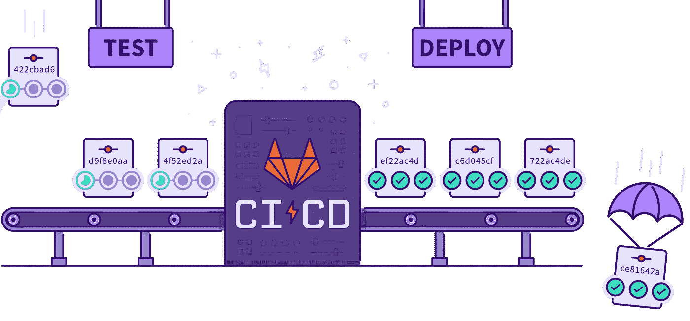

GitLab CI/CD

# 什么是 Terraform？

**Terraform** 是一个开源**基础设施，作为一个代码(IAC)** 工具，允许创建、管理&部署生产就绪环境。Terraform 将云 API 编译成声明性的配置文件。Terraform 可以管理现有的服务提供商和定制的内部解决方案。

从 [**这里**](https://www.terraform.io/intro/index.html) **阅读更多关于 **Terraform** 的内容。**


Terraform

在本教程中，我将 **Terraform** 与 **GitLab CI/CD** 集成在一起，并在 **AWS** 上创建了各种资源。


Terraform + GitLab CI/CD

# 先决条件:

*   **AWS & GitLab 账户**
*   [**AWS**](https://docs.aws.amazon.com/) ，[**terra form**](https://www.terraform.io/intro/index.html)**&**[**git lab CI/CD**](https://docs.gitlab.com/ee/ci/)
*   在 **AWS** 中创建的**访问密钥** & **秘密密钥**

让我们从项目的配置开始

**步骤 1:-** 创建一个**存储库**

*   在你的 GitLab 帐户中创建一个存储库，并给它起一个你自己选择的名字

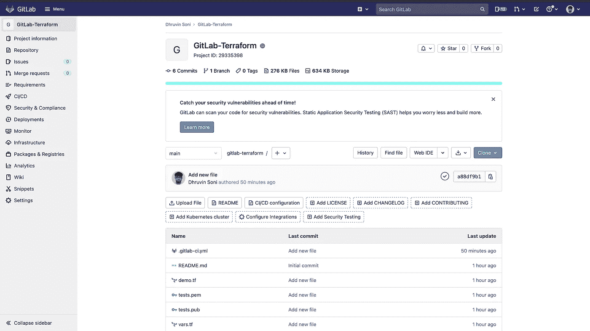

GitLab Project

**步骤 2:-** 为资源创建创建一个 **terraform** 文件

*   在根目录下创建一个`.tf`文件，并在其中添加下面的代码。

```
# Configure and downloading plugins for aws
provider "aws" {
  region     = "${var.aws_region}"
}

# Creating VPC
resource "aws_vpc" "demovpc" {
  cidr_block       = "${var.vpc_cidr}"
  instance_tenancy = "default"

  tags = {
    Name = "Demo VPC"
  }
}

# Creating Internet Gateway 
resource "aws_internet_gateway" "demogateway" {
  vpc_id = "${aws_vpc.demovpc.id}"
}

# Grant the internet access to VPC by updating its main route table
resource "aws_route" "internet_access" {
  route_table_id         = "${aws_vpc.demovpc.main_route_table_id}"
  destination_cidr_block = "0.0.0.0/0"
  gateway_id             = "${aws_internet_gateway.demogateway.id}"
}

# Creating 1st subnet 
resource "aws_subnet" "demosubnet" {
  vpc_id                  = "${aws_vpc.demovpc.id}"
  cidr_block             = "${var.subnet_cidr}"
  map_public_ip_on_launch = true
  availability_zone = "us-east-1a"

  tags = {
    Name = "Demo subnet"
  }
}

# Creating 2nd subnet 
resource "aws_subnet" "demosubnet1" {
  vpc_id                  = "${aws_vpc.demovpc.id}"
  cidr_block             = "${var.subnet1_cidr}"
  map_public_ip_on_launch = true
  availability_zone = "us-east-1b"

  tags = {
    Name = "Demo subnet 1"
  }
}

# Creating Security Group
resource "aws_security_group" "demosg" {
  name        = "Demo Security Group"
  description = "Demo Module"
  vpc_id      = "${aws_vpc.demovpc.id}"

  # Inbound Rules
  # HTTP access from anywhere
  ingress {
    from_port   = 80
    to_port     = 80
    protocol    = "tcp"
    cidr_blocks = ["0.0.0.0/0"]
  }

  # HTTPS access from anywhere
  ingress {
    from_port   = 443
    to_port     = 443
    protocol    = "tcp"
    cidr_blocks = ["0.0.0.0/0"]
  }

  # SSH access from anywhere
  ingress {
    from_port   = 22
    to_port     = 22
    protocol    = "tcp"
    cidr_blocks = ["0.0.0.0/0"]
  }

  # Splunk default port
  ingress {
    from_port   = 8000
    to_port     = 8000
    protocol    = "tcp"
    cidr_blocks = ["0.0.0.0/0"]
  }

  # Replication Port
  ingress {
    from_port   = 8089
    to_port     = 8089
    protocol    = "tcp"
    cidr_blocks = ["0.0.0.0/0"]
  }

  # Management Port
  ingress {
    from_port   = 4598
    to_port     = 4598
    protocol    = "tcp"
    cidr_blocks = ["0.0.0.0/0"]
  }

  # Ingestion Port
  ingress {
    from_port   = 9997
    to_port     = 9997
    protocol    = "tcp"
    cidr_blocks = ["0.0.0.0/0"]
  }

  # Outbound Rules
  # Internet access to anywhere
  egress {
    from_port   = 0
    to_port     = 0
    protocol    = "-1"
    cidr_blocks = ["0.0.0.0/0"]
  }
}

# Creating key pair
resource "aws_key_pair" "demokey" {
  key_name   = "${var.key_name}"
  public_key = "${file(var.public_key)}"
}

# Creating EC2 Instance
resource "aws_instance" "demoinstance" {

  # AMI based on region 
  ami = "${lookup(var.ami, var.aws_region)}"

  # Launching instance into subnet 
  subnet_id = "${aws_subnet.demosubnet.id}"

  # Instance type 
  instance_type = "${var.instancetype}"

  # Count of instance
  count= "${var.master_count}"

  # SSH key that we have generated above for connection
  key_name = "${aws_key_pair.demokey.id}"

  # Attaching security group to our instance
  vpc_security_group_ids = ["${aws_security_group.demosg.id}"]

  # Attaching Tag to Instance 
  tags = {
    Name = "Search-Head-${count.index + 1}"
  }

  # Root Block Storage
  root_block_device {
    volume_size = "40"
    volume_type = "standard"
  }

  #EBS Block Storage
  ebs_block_device {
    device_name = "/dev/sdb"
    volume_size = "80"
    volume_type = "standard"
    delete_on_termination = false
  }

  # SSH into instance 
  connection {

    # Host name
    host = self.public_ip
    # The default username for our AMI
    user = "ec2-user"
    # Private key for connection
    private_key = "${file(var.private_key)}"
    # Type of connection
    type = "ssh"
  }

  # Installing splunk on newly created instance
  provisioner "remote-exec" {
    inline = [
      "sudo yum update -y",
      "sudo amazon-linux-extras install docker -y",
      "sudo service docker start",
      "sudo usermod -a -G docker ec2-user",
      "sudo chkconfig docker on",
      "sudo yum install -y git",
      "sudo chmod 666 /var/run/docker.sock",
      "docker pull dhruvin30/dhsoniweb:v1",
      "docker run -d -p 80:80 dhruvin30/dhsoniweb:latest"   
  ]
 }
}
```

**步骤 3:-** 为变量创建 **terraform** 文件

*   在资源创建文件中，我使用了多个变量，因此我们需要创建一个包含变量定义的变量文件
*   在根目录下创建一个`vars.tf`文件，并将下面的代码添加到其中
*   下面的代码将在 AWS 上创建各种资源。如果你不能理解代码中的任何内容，你可以从 [**这里**](https://devopsquare.com/how-to-create-various-aws-resources-using-terraform-dd9ad2bc374b) 更好地理解

```
# Defining Public Key
variable "public_key" {
  default = "tests.pub"
}

# Defining Private Key
variable "private_key" {
  default = "tests.pem"
}

# Definign Key Name for connection
variable "key_name" {
  default = "tests"
  description = "Desired name of AWS key pair"
}

# Defining Region
variable "aws_region" {
  default = "us-east-1"
}

# Defining CIDR Block for VPC
variable "vpc_cidr" {
  default = "10.0.0.0/16"
}

# Defining CIDR Block for Subnet
variable "subnet_cidr" {
  default = "10.0.1.0/24"
}

# Defining CIDR Block for 2d Subnet
variable "subnet1_cidr" {
  default = "10.0.2.0/24"
}

# Defining AMI
variable "ami" {
  default = {
    eu-west-1 = "ami-0ea3405d2d2522162"
    us-east-1 = "ami-09d95fab7fff3776c"
  }
}

# Defining Instace Type
variable "instancetype" {
  default = "t2.medium"
}

# Defining Master count 
variable "master_count" {
  default = 1
}
```

**步骤 4:-** 存储 **AWS** **密钥**

*   为了在 AWS 帐户中创建资源，我们必须需要拥有 **AWS 访问密钥** & **AWS 秘密密钥**
*   现在，我们需要将 **AWS 访问密钥** & **AWS 秘密密钥**存储在存储库的 secrets 部分
*   转到变量部分下的**设置**->-**CI/CD**->创建以下变量并存储您的 **AWS 访问密钥** & **AWS 秘密密钥**

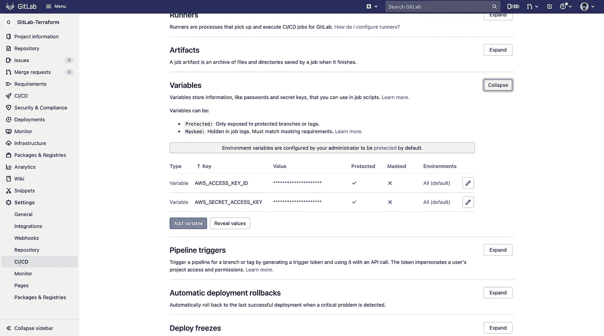

Environment Variable

**第四步:-** 创建一个**工作流**文件

*   现在为了自动创建 terraform 资源，我们需要创建一个工作流文件
*   创建`.gitlab-ci.yml`文件，并将下面的代码添加到其中
*   以下作业将在主分支上发生的每个**推**和**拉请求**上运行。在构建部分，我已经在脚本部分指定了映像名称和命令。

```
stages:
  - validate
  - plan
  - applyimage:
  name: hashicorp/terraform:light
  entrypoint:
    - '/usr/bin/env'
    - 'PATH=/usr/local/sbin:/usr/local/bin:/usr/sbin:/usr/bin:/sbin:/bin'before_script:
  - export AWS_ACCESS_KEY=${AWS_ACCESS_KEY_ID}
  - export AWS_SECRET_ACCESS_KEY=${AWS_SECRET_ACCESS_KEY}
  - rm -rf .terraform
  - terraform --version
  - terraform initvalidate:
  stage: validate
  script:
    - terraform validateplan:
  stage: plan
  script:
    - terraform plan -out "planfile"
  dependencies:
    - validate
  artifacts:
    paths:
      - planfileapply:
  stage: apply
  script:
    - terraform apply -input=false "planfile"
  dependencies:
    - plan
  when: manual
```

我们来理解一下上面的代码。

*   下面的代码用于声明阶段的名称

```
stages:
  - validate
  - plan
  - apply
```

*   我们使用`terraform`图像来运行地形脚本，并设置地形路径的`entrypoint`

```
image:
  name: hashicorp/terraform:light
  entrypoint:
    - '/usr/bin/env'
    - 'PATH=/usr/local/sbin:/usr/local/bin:/usr/sbin:/usr/bin:/sbin:/bin'
```

*   在`before_script`部分，我们导出 AWS 访问密钥&秘密密钥，检查 terraform 的版本，做一些清理工作，并通过运行`terraform init`初始化工作目录

```
before_script:
  - export AWS_ACCESS_KEY=${AWS_ACCESS_KEY_ID}
  - export AWS_SECRET_ACCESS_KEY=${AWS_SECRET_ACCESS_KEY}
  - rm -rf .terraform
  - terraform --version
  - terraform init
```

*   在`validate`部分，我们正在验证地形脚本

```
validate:
  stage: validate
  script:
    - terraform validate
```

*   在`plan`部分，我们正在生成地形图并存储在工件中，以便我们可以在下一阶段使用它

```
plan:
  stage: plan
  script:
    - terraform plan -out "planfile"
  dependencies:
    - validate
  artifacts:
    paths:
      - planfile
```

*   在`apply`部分，我们正在运行`terraform apply`，以便 terraform 可以在 AWS 上创建资源
*   `dependencies`将确保`apply`阶段仅在`plan`阶段成功时运行
*   `when: manual`将确保我们需要手动触发这个阶段

```
apply:
  stage: apply
  script:
    - terraform apply -input=false "planfile"
  dependencies:
    - plan
  when: manual
```

**步骤 5:-** 检查**输出**

*   现在，只要你提交你的工作流文件，GitLab 就会触发这个动作，资源就会在 AWS 帐户上创建。

> `validate`和`plan`作业将自动运行，但您需要手动触发`apply`作业


CI/CD Output

*   运行作业后，您将看到所有步骤都运行良好，没有错误。因此，当每一步工作成功时，您将拥有用绿色书写的`passed`。

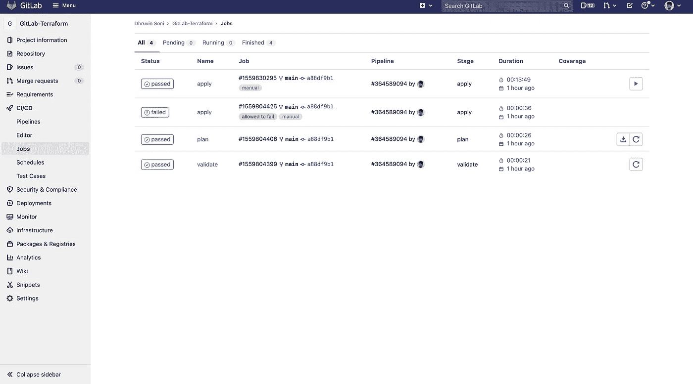

Jobs

*   您还可以通过单击来检查每个步骤的输出

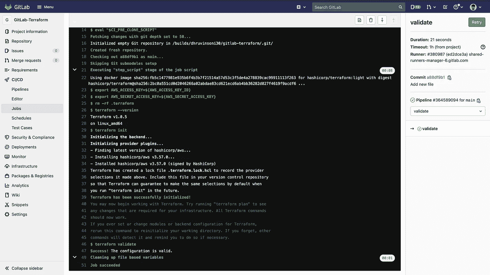

Output of Job

**步骤 6:-** 检查 **AWS 上的资源**

*   一旦作业运行完成，您就可以导航到 AWS 并检查所有资源
*   Terraform 将创建以下资源

1.  **VPC**

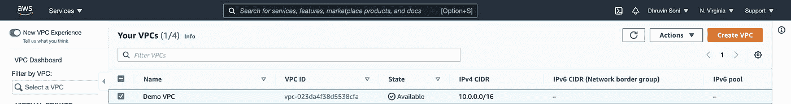

VPC

**2。子网**

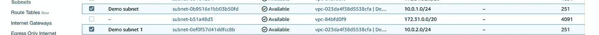

Subnets

**3。互联网网关**

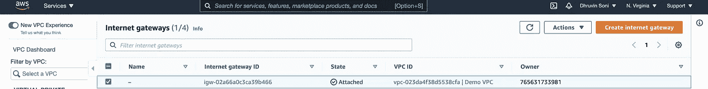

Internet Gateway

**4。Rouet 表**

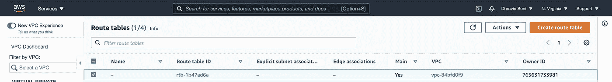

Route Table

**5。安全组**

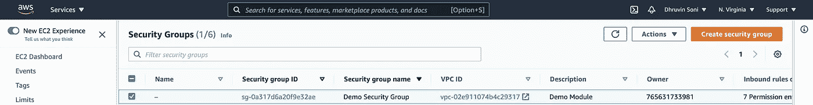

Security Group

6。密钥对

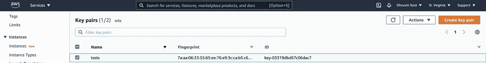

Key Pair

7。EC2 实例

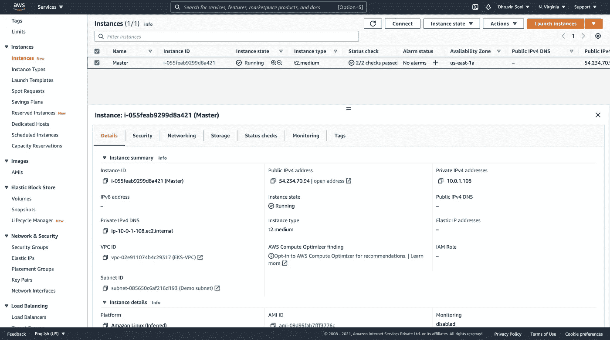

EC2 Instance

**步骤 7:-** 验证**输出**

*   在 Terraform 配置代码中，我们使用远程供应器安装 docker，并在其上运行 docker 映像
*   为了检查输出，导航至 **< public-ip:80 >**
*   您应该会看到如下所示的输出


Output

现在就这样，你已经学会了如何将 Terraform 与 GitLab CI/CD 集成。您现在可以使用它并对其进行相应的修改。

你可以在我的 [**GitLab**](https://gitlab.com/dhruvinsoni30/gitlab-terraform) 账号找到完整的代码。也可以随意查看我的其他库。

如果您觉得本指南很有帮助，请点击👏按钮，也可以随意发表评论。

关注更多类似的故事😊