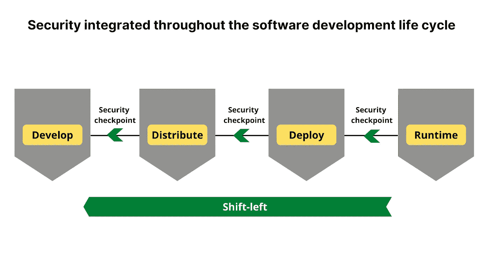
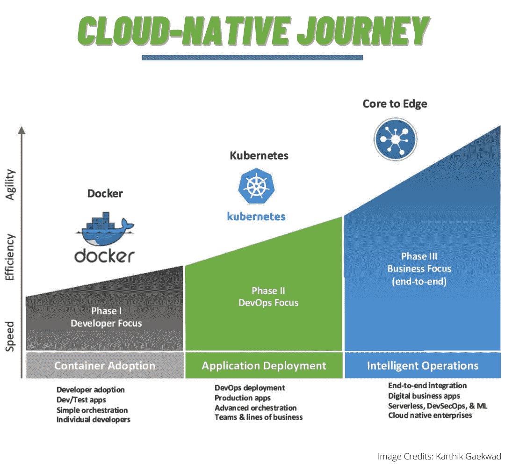
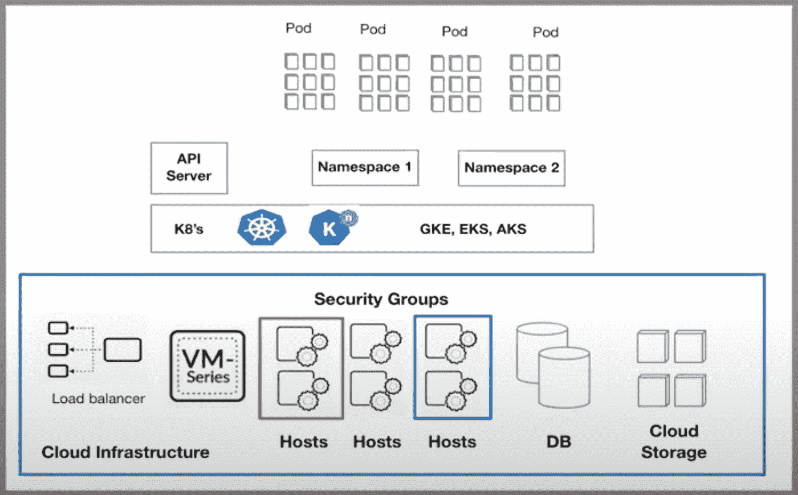
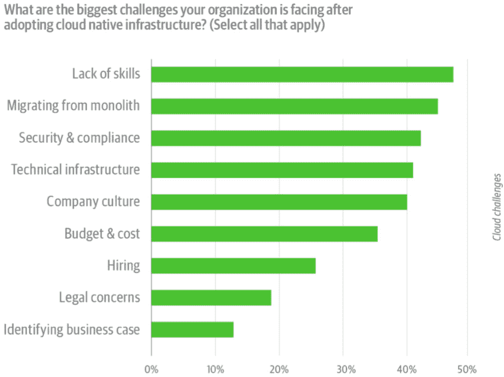
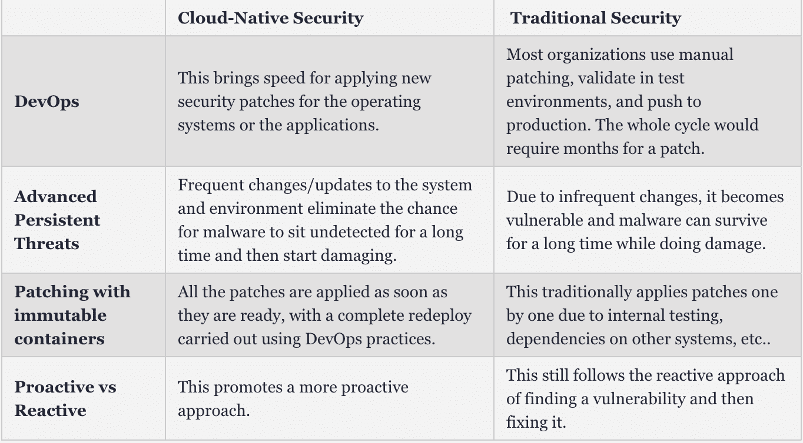
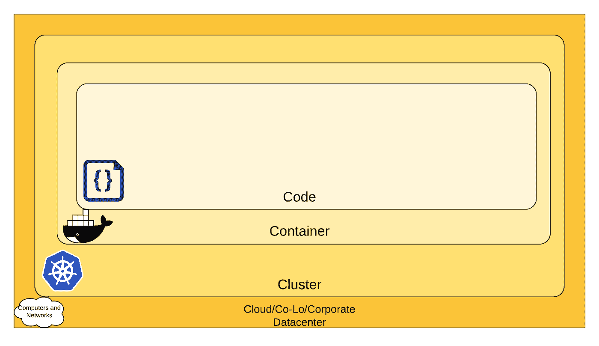
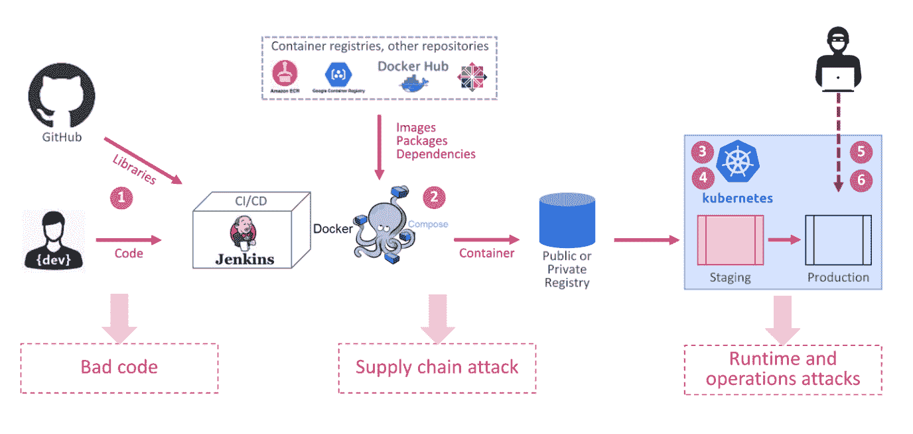
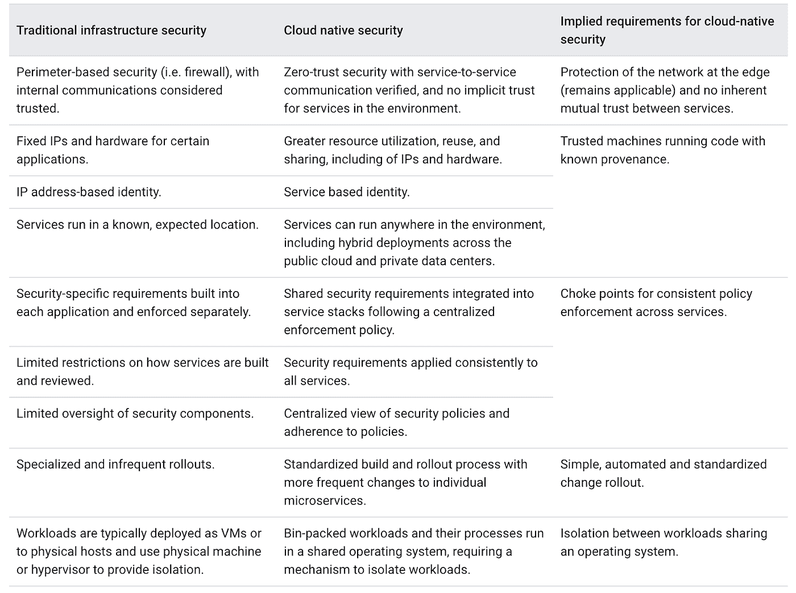
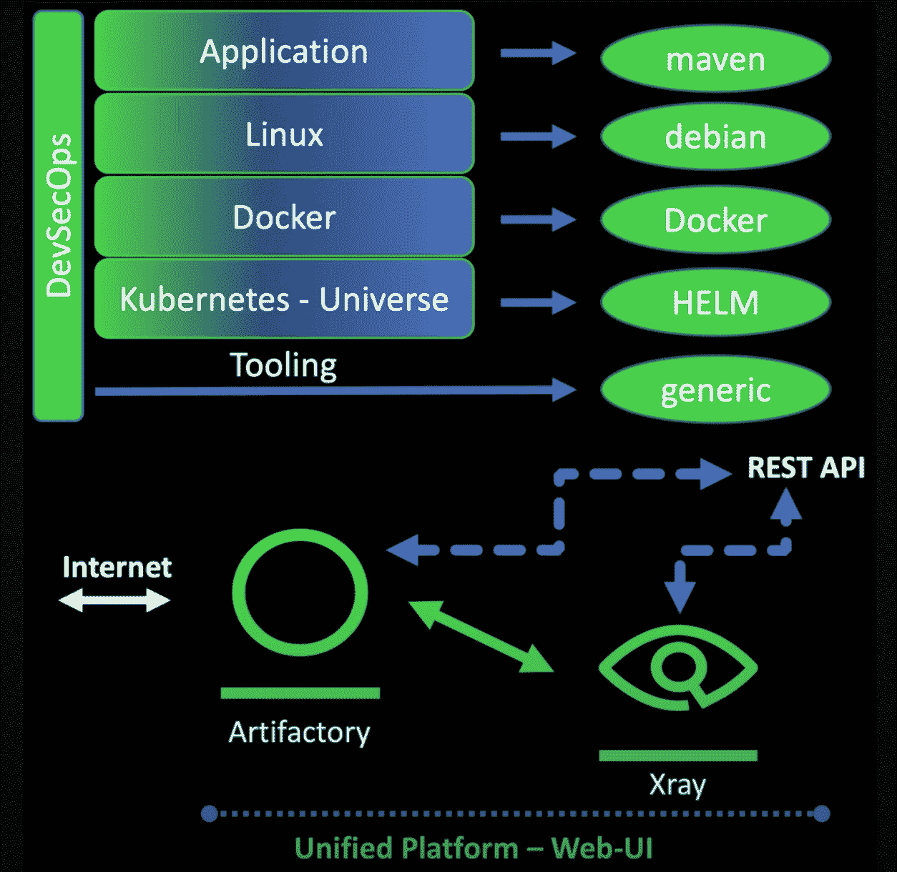

# 如何扫描云原生应用的漏洞？

> 原文：<https://medium.com/geekculture/how-to-scan-for-vulnerabilities-in-cloud-native-applications-eeaf5b66e1de?source=collection_archive---------23----------------------->

Image created by the author

*文章原载于'* [*集装箱杂志*](https://containerjournal.com/editorial-calendar/cloud-native-security/the-what-and-why-of-cloud-native-security/) *'*

在采用 DevOps 的过程中，许多 IT 组织仍然依赖传统的安全实践、策略和工具，而这些安全实践、策略和工具并不能承受现代云原生方法的扩展和复杂性。随着对安全性关注的减少，组织无法在这个快速变化的数字世界中实现自我转型。最近的调查和研究人员发现，安全性在软件开发生命周期中变得多么重要，而这可能是多年来被忽视的“安全团队的问题”

[DevSecOps](https://jfrog.com/devops-tools/what-is-devsecops/)的出现帮助组织将安全性向左转移，但这就足够了吗？组织几乎还没有开始了解与他们的云原生之旅相关的复杂性和安全威胁。强烈建议使用现代的云原生最佳实践和工具来解决 SDLC 中发现的漏洞和威胁。

# 什么是云原生？

大约十年前，网飞和亚马逊等公司创造了“原生云”这个词。他们利用现代云实践、工具和技术。对于许多公司来说，云原生意味着创新，重塑，改变我们做软件开发的方式。

云原生软件应用程序采用部署在轻量级容器中的微服务，这些容器使用低开销的编排、运行时和网络服务。云原生应用利用云计算框架和基础设施，并鼓励加快上市时间。

这些应用程序使用现代云实践，如不可变基础设施、基础设施即代码(IaC)、容器和容器注册、服务网格、声明性和 API。

***图片来源:***[***DZone***](https://dzone.com/articles/securing-your-cloud-native-journey)

一家公司可以采取多个步骤来开始并推进这一旅程。Cloud-native 的基本原则包括可扩展的应用程序、弹性架构和频繁更改的能力。

旅程中要提到的三个阶段。

第一阶段>开发者焦点>容器采用

第二阶段>开发运维重点>应用部署

第三阶段>业务重点(端到端)>智能运营

**现代云原生应用程序堆栈示例**

***图片来源:***[***Linux 基础***](https://linuxfoundation.org/webinars/cloud-native-security-exposed/)

从根本上说，在较低层，您将拥有典型的 it 访问方面，即负载平衡器，您的网络负载平衡器或应用程序负载平衡器。然后您有大量的子网，在这些子网中您已经部署了所有的主机，在这些子网之上，我们实际上可以部署托管或自托管的 Kubernetes:用于我们的容器部署的 Kubernetes orchestrator。

我们还需要存储，无论是数据库还是云存储。因此，一旦我们有了所有这些工件，我们就部署我们的容器编排器。我们在 orchestrator 上利用、配置和部署应用程序的主要途径之一是使用 orchestrator API。

orchestrator 公开了 API 服务器和一组非常丰富的功能，客户端可以利用这些功能在 orchestrator 上执行各种操作。现在，下一个方面是我们想要确保我们有隔离，在 Kubernetes 环境中有助于实现的一个方面是使用名称空间。这些名称空间将最终部署应用程序单元。因此，所有这些不同的工件构成了新的云原生应用程序堆栈。

# 为什么选择云原生安全性？

虽然将安全性“向左”转移近来得到了极大的关注，但是强烈建议将安全性集成到整个软件开发生命周期中，并且在每个阶段设置安全检查点被认为更有效。安全性左移意味着在开发生命周期的早期就优先考虑安全性，并使它(安全性)成为每个人的工作。通过这种方式，可以防止任何可能影响软件交付的漏洞和生产中的瓶颈。

[O'Reilly](https://www.helpnetsecurity.com/tag/oreilly/) 对来自世界各地的 590 名安全从业者、开发运维经理和 cxo 进行的“公司如何采用和应用云原生基础架构”调查报告发现，安全性和合规性障碍是采用云原生基础架构的最大挑战之一。

***图片来源:***[***helpnet security***](https://www.helpnetsecurity.com/2019/05/01/cloud-native-adoption-obstacles/)

云原生安全性解决了相关的安全问题。

[云原生安全性](https://jfrog.com/webinar/devsecops-for-kubernetes-based-applications/)迫使人们重新关注安全性，并将安全性转移到 SDLC 中。云原生应用必须得到保护，才能成功实现数字化转型。因此，云原生安全性可确保在 SDLC 中适时检测、识别和修复漏洞。这就是我们回忆 DevSecOps 方法的地方，在整个软件开发生命周期中烘焙安全性。

***图片来源:***[***DZone***](https://dzone.com/articles/securing-cloud-native-apps)

云原生安全性就像一个看门人，防范所有可能进入软件流程的安全漏洞。

## 云原生安全性的 4 C(关于 Kubernetes)

***图片来源:***[***kubernetes . io***](https://kubernetes.io/docs/concepts/security/overview/)

*   **云基础设施**

云被认为是安全层的基础。必须在云级别采取措施，因为开发人员无法在代码级别配置应用程序安全性。这一切都是为了在各自的云提供商环境中运行安全的工作负载。

*   **集群**

云之后是集群层，Kubernetes 被认为是事实上的编排工具。使用 Kubernetes 时，有一些事情需要考虑——RBAC、Pod 安全和网络策略、秘密管理、日志记录和监控。

*   **集装箱安全**

这一层讨论容器安全管理和最佳实践。

当应用程序构建在容器中时，需要遵循某些安全最佳实践。首先，避免运行特权容器。大多数应用程序不需要 root 访问权限就可以运行，除了像监控或日志代理这样的系统容器。这应该可以防止入侵者获得对容器的根访问权限并访问主机节点。

*   **代码**

云原生安全层的最后一个 C 是代码。增强应用程序代码的安全性是 DevSecOps 中的最佳实践之一。

一切都从源代码开始。通过在软件开发生命周期(SDLC)的早期捕捉安全漏洞，公司可以节省开发人员的时间、成本和精力。

限制代码漏洞的一个最佳策略是使用专门为此目的而构建的工具，比如 JFrog 的 Xray。

## 云原生安全方法

***图片来源:*** [***检查点***](https://www.checkpoint.com/downloads/products/checkpoint-cloud-native-security.pdf)

典型的软件开发流程包括以下步骤:开发人员开发代码/软件，在他/她的机器上进行本地测试，然后将代码提交给所使用的版本控制系统；CI/CD 工具获取代码，构建代码，然后将代码推送到 Docker compose，Docker compose 还利用来自公共存储库的映像和包构建一个容器。然后将其放入注册表中；在成功分级的步骤之后，容器继续生产。所有这些步骤在每一点上都存在安全风险，因此必须小心处理。

工作流可能包含带有漏洞的代码、库、从未知来源下载的图像、与许可相关的问题等。因此，作为 DevSecOps 的最佳实践，建议在开发工作流的每个阶段都有常规的检查点，以及云原生安全工具。

[Google cloud](https://cloud.google.com/security/beyondprod) 列出了迁移到云原生架构的安全隐含要求。

***图片来源:*** [***谷歌云***](https://cloud.google.com/security/beyondprod)

## 扫描云原生应用中的漏洞

在一个应用程序中，从代码到产品，通常会有许多依赖层。

例如，当应用程序用 Java 编写时，您可能会有 Maven 依赖项。下一步将是在 Linux 上运行这个应用程序，然后您将在 Debian 仓库中拥有依赖项。下一步是把它包装在 Docker 中，因为你想把它放在 Kubernetes 上，然后你将立即拥有 Docker 存储库。Kubernetes 宇宙将会有像头盔中心这样的仓库。

云原生企业利用一个专门的地方来管理和存储所有这些依赖项、二进制文件和库，它是 Artifactory。它拥有来自可信来源的所有依赖项和库。使用 Artifactory 可以让开发人员在开发时轻松获得单一的事实来源，并且可以使用这个名为 Xray 的工具轻松扫描任何依赖关系。 [Artifactory](https://jfrog.com/artifactory/) 和 [Xray](https://jfrog.com/xray/) 都是相互连接的，因此在处理云原生应用程序时，它们都具有成熟的安全工具。

## 结论

安全已经走过了漫长的道路，并将继续存在。DevOps 侧重于速度和敏捷性，而云原生安全性则侧重于整个基于云的 SDLC 的安全性方面。结合速度和安全性，企业可以轻松实现他们想要的数字化转型之旅。随着越来越多地采用云原生原则、工具和平台，存在安全风险的可能性，这可以通过使用安全工具和 DevSecOps 原则来缓解。采用一流的工具来检测和分析漏洞，在整个 SDLC 中集成安全检查点，让安全成为每个人的工作。让我们让黑客和攻击者远离我们的系统。

希望你喜欢这篇文章。更多此类云原生文章，关注 Pavan on[**Twitter**](https://twitter.com/Pavan_Belagatti)**。**