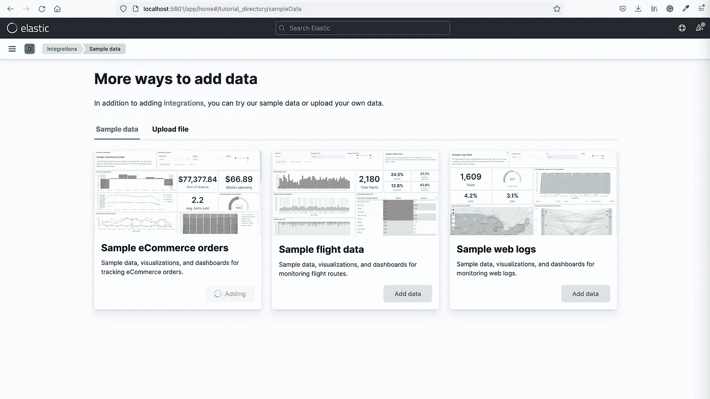
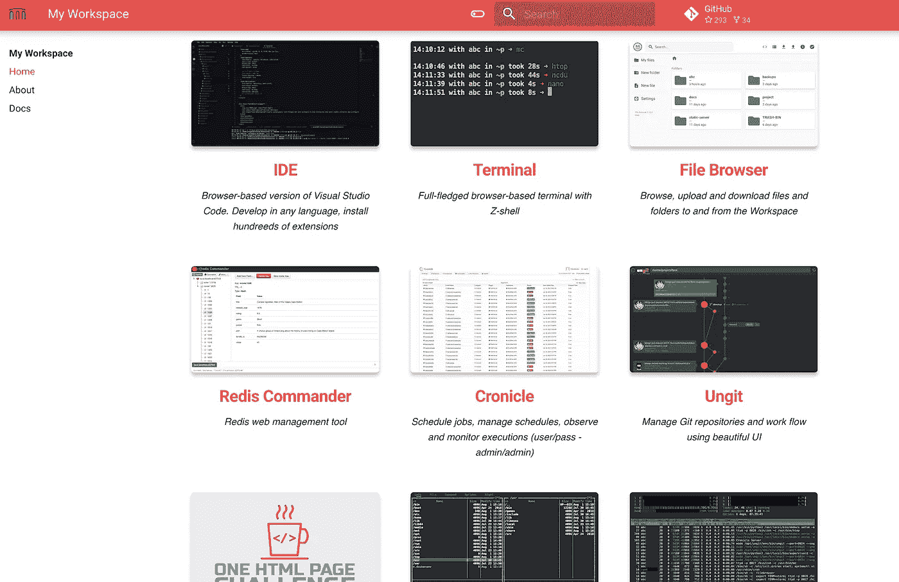
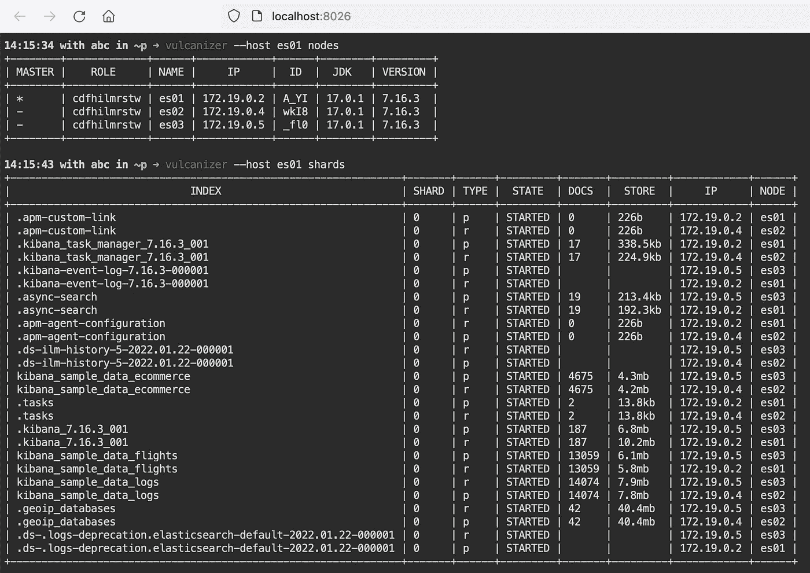
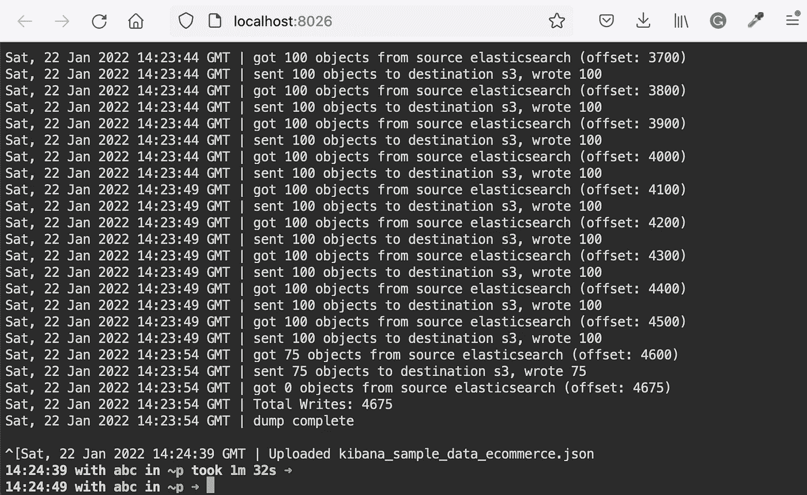
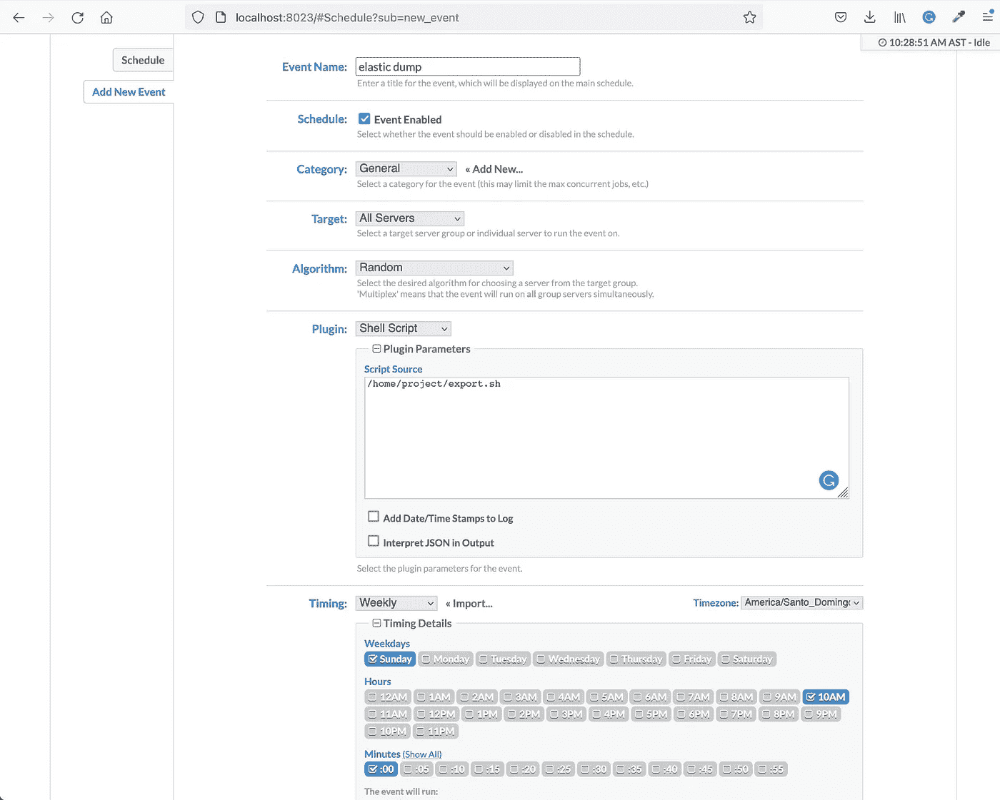

# 如何为自托管 Elasticsearch/Opensearch 集群安排维护任务

> 原文：<https://medium.com/geekculture/how-to-schedule-maintenance-tasks-for-self-hosted-elasticsearch-opensearch-cluster-be0148553ad6?source=collection_archive---------9----------------------->

如果您运行自己的 Elasticsearch/Opensearch 部署，您可能需要安排维护脚本。例如拍摄索引的快照/备份、迁移到另一个 Elasticsearch 集群、将 Elasticsearch 数据转移到 S3、将数据导入 Elasticsearch、删除/移动/存档旧索引、重新编制索引、重新平衡不均匀的碎片分布、将报告查询导出到 S3 等。

为此，一个小型开源工具 [Elasticsearch-Workspace](https://github.com/bluxmit/alnoda-workspaces/tree/main/workspaces/elasticsearch-workspace) 可能会派上用场。本文将演示如何使用 Kibana 和 Elasticsearch-Workspace 启动本地 Elasticsearch 集群，加载测试数据，将 Elasticsearch 索引导出到 S3，并安排定期备份。

创建`docker-compose.yaml`文件，使用 Kibana 在本地启动 3 节点 Elasticsearch 集群

```
version: '2.2'
services:
  es01:
    image: docker.elastic.co/elasticsearch/elasticsearch:7.16.3
    container_name: es01
    environment:
      - node.name=es01
      - cluster.name=es-docker-cluster
      - discovery.seed_hosts=es02,es03
      - cluster.initial_master_nodes=es01,es02,es03
      - bootstrap.memory_lock=true
      - "ES_JAVA_OPTS=-Xms512m -Xmx512m"
    ulimits:
      memlock:
        soft: -1
        hard: -1
    volumes:
      - data01:/usr/share/elasticsearch/data
    ports:
      - 9200:9200
    networks:
      - elastices02:
    image: docker.elastic.co/elasticsearch/elasticsearch:7.16.3
    container_name: es02
    environment:
      - node.name=es02
      - cluster.name=es-docker-cluster
      - discovery.seed_hosts=es01,es03
      - cluster.initial_master_nodes=es01,es02,es03
      - bootstrap.memory_lock=true
      - "ES_JAVA_OPTS=-Xms512m -Xmx512m"
    ulimits:
      memlock:
        soft: -1
        hard: -1
    volumes:
      - data02:/usr/share/elasticsearch/data
    networks:
      - elastices03:
    image: docker.elastic.co/elasticsearch/elasticsearch:7.16.3
    container_name: es03
    environment:
      - node.name=es03
      - cluster.name=es-docker-cluster
      - discovery.seed_hosts=es01,es02
      - cluster.initial_master_nodes=es01,es02,es03
      - bootstrap.memory_lock=true
      - "ES_JAVA_OPTS=-Xms512m -Xmx512m"
    ulimits:
      memlock:
        soft: -1
        hard: -1
    volumes:
      - data03:/usr/share/elasticsearch/data
    networks:
      - elastickib01:
    image: docker.elastic.co/kibana/kibana:7.16.3
    container_name: kib01
    ports:
      - 5601:5601
    environment:
      ELASTICSEARCH_URL: [http://es01:9200](http://es01:9200)
      ELASTICSEARCH_HOSTS: '["[http://es01:9200](http://es01:9200)","[http://es02:9200](http://es02:9200)","[http://es03:9200](http://es03:9200)"]'
    networks:
      - elastic

  workspace:
    image: alnoda/elasticsearch-workspace
    container_name: workspace
    ports:
      - 8020-8030:8020-8030
    networks:
      - elasticvolumes:
  data01:
    driver: local
  data02:
    driver: local
  data03:
    driver: localnetworks:
  elastic:
    driver: bridge
```

并以`docker-compose up`开始。等到集群完全准备好，打开 [http://localhost:5601](https://github.com/bluxmit/alnoda-workspaces/blob/main/http:/localhost:5601) 上的 Kibana，导入所有样本数据集。



打开工作区 UI[http://localhost:8020/](http://localhost:8020/)快速访问所有工作区工具



打开基于浏览器的终端 [http://localhost:8026/](http://localhost:8026/) ，检查集群节点和碎片

```
vulcanizer --host es01 nodes
vulcanizer --host es01 shards
```



使用 elasticdump 将索引`kibana_sample_data_ecommerce`(来自电子商务样本数据集)导出到 S3。改变你的 S3 密钥，秘密和桶名

```
elasticdump \
  --s3AccessKeyId "${access_key_id}" \
  --s3SecretAccessKey "${access_key_secret}" \
  --input=http://es01:9200/kibana_sample_data_ecommerce \
  --output "s3://${bucket_name}/kibana_sample_data_ecommerce.json"
```



检查导出的指数是否出现在您的 S3 时段中。

现在，让我们定期安排导出。打开基于浏览器的 IDE[http://localhost:8026/](http://localhost:8026/)，用脚本创建文件`/home/project/export.sh` file，将数据导出到 S3。用`chmod +x /home/project/export.sh`使其可执行


打开基于浏览器的调度程序[http://localhost:8026/](http://localhost:8026/)(user/pass:admin/admin)，并调度脚本，例如每周。选择类别—“常规”，插件—“外壳脚本”



Cronicle 仪表板将显示执行日志。

***披露者:*** *我是 elasticsearch-workspace(以及该 repo 中的其他工作区)的创建者。我将它们用于自己的发展，并乐于与社区分享。希望你觉得有用！*