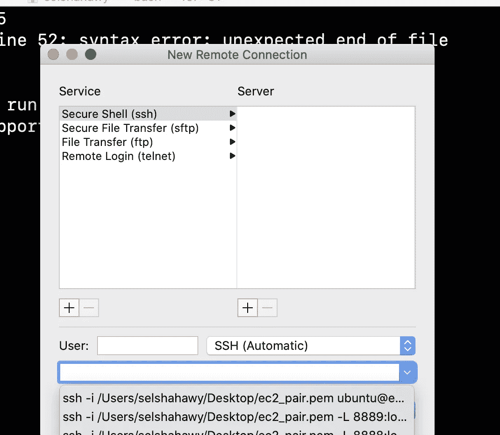
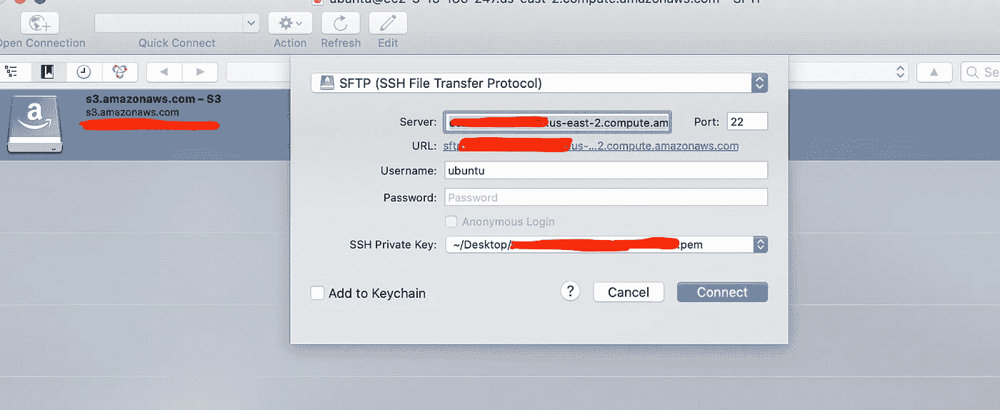

# 如何以最简单的方式在 AWS 上调度 ETL 作业

> 原文：<https://medium.com/geekculture/how-to-schedule-the-etl-jobs-on-aws-the-easy-way-41c7ef26c96?source=collection_archive---------10----------------------->

## 5 分钟内从 EC2 自动执行数据提取作业的分步指南


Photo by [Debby Hudson](https://unsplash.com/@hudsoncrafted?utm_source=unsplash&utm_medium=referral&utm_content=creditCopyText) on [Unsplash](https://unsplash.com/s/photos/calendar?utm_source=unsplash&utm_medium=referral&utm_content=creditCopyText)

# 介绍

根据维基百科， [cron](https://en.wikipedia.org/wiki/Cron) 是一个软件实用程序，是一个基于时间的任务调度程序，可以在类似 Unix 的操作系统中找到。Cron 在后台运行，使用 cron 执行计划的作业，称为“cron 作业”。

本指南提供了如何使用 cron 的正确语法来调度作业的高级概述。它还介绍了一些使作业时间表更容易编写和理解的方法。

# 先决条件

要完成本指南，您需要

1.获取一个 AWS EC2 实例，本教程基于 Ubuntu 18.04 版本

2.EC2 凭证，存储在一个`.pem`文件中

3.安全传输应用程序，如 Windows 的 WinSCP 或 macOS 的 Cyberduck。

4.Cron 已经在 EC2 上安装并配置好了。

5.有一个测试脚本运行在任何语言，我会使用 python。

6.任何代码编辑器，我用的是 vscode

# 介绍

作为我日常职业的一部分，我从不同的 API 中提取数据，并将它们加载到数据库中，以便为其他业务部门生成每日/每月报告。在某些情况下，运行脚本并等待它成功加载到数据库中是非常乏味的。因此，我们决定更进一步，将这些 python 脚本部署到 AWS-EC2 中，并将它们放在一个 cron 作业上，以便在特定时间运行。

日程安排的好处是巨大的，可以节省大量的时间和精力；例如:

1.  ETL 独立运行，不管谁应该运行它。
2.  避免在高峰时间消耗大数据的 API 避免失败。
3.  避免在个人电脑上运行脚本。
4.  避免生成临时或定期报告的延迟。
5.  易于维护

在所有这些优点之后，让我们开始步骤

# 步伐

1.  在第一步中，您需要使用以下命令安全地登录到 EC2 实例:

```
$ssh -i <key-pairs.pem> <ec2_address> 
```

Mac 用户可以直接通过终端 ssh。


selecting a new remote connection for ec2 — image by the author



running the command from the interface — Image by the author

2.登录到 ec2 实例后，运行以下命令，通过运行以下命令确保 cron 设置为在后台运行:

```
sudo systemctl enable cron
```


running sudo systemctl — image by the author


[https://www.cyberciti.biz/humour/top-xkcd-comics-for-linux-and-unix-fans/](https://www.cyberciti.biz/humour/top-xkcd-comics-for-linux-and-unix-fans/)

3.接下来，cron 将被安装到您的系统上，并准备好让您开始调度作业。

Crontab 是一个负责监控和管理 cron 作业的文件。

要调度一个作业，您需要编辑您的 crontab 并以 cron 语法的形式编写作业。语法很简单，它有两个部分，调度和运行**命令。**

该命令是您通常在本地运行以执行脚本的终端命令。语法的 schedule 元素有五个不同的字段，按以下顺序编写:

综合来看，crontab 中调度的作业类似于以下内容:

```
minute hour DayOfTheMonth month DayOfTheWeek RunningCommand
```

这里有一个 cron 作业的工作示例。该表达式在每周二下午 5:30 运行命令`python3.8 src/<my_script.sh>`:

```
30 17 * * 2 python3.8 src/<my_script.sh>
```

此外，您可以在 cron 脚本的 schedule 部分插入一些特殊字符，以简化调度:

1.`*`:在 cron 表达式中，星号是一个通配符变量，代表“所有”因此，一个被调度的任务`* * * * *`将在每月每天每小时的每一分钟运行。

2.`,`:逗号将时间表值作为一个列表。如果您需要在每小时开始和结束时运行一个任务，而不是写出两个单独的任务。(例如`0 * * * *`和`30 * * * *`)，你可以用`0,30 * * * *`做同样的事情

5.`/`:使用带星号的正斜杠创建步长值。例如，不是每三个月编写四个独立的 cron 任务来运行一个脚本，而是可以将其调度为`0 * * */3 *`。

对于进一步的调度任务组合，有一个由 [Cronitor](https://cronitor.io/) 命名为[“Crontab Guru”](https://crontab.guru/)的 cron 编辑器，您可以编写您的 cron，它会显示与您提供的表达式相对应的预期日期和时间。

# 管理 Crontabs

一旦你决定了一个时间表，就需要把它放在当前的守护进程中以便阅读。

必须知道 crontab 是一个特殊的文件，它保存着 cron 将要运行的作业的时间表。但是，直接编辑它们是一种不好的做法。或者，您可以使用 crontab 命令；这使您能够在不改变`sudo`权限的情况下更新您的用户配置文件的 crontab。

要编辑 crontab，可以运行以下命令:

```
crontab -e
```

第一次运行 crontab 命令时，您需要选择编辑 crontab 时要使用的编辑器。我用的是 nano！

```
OUTPUT
no crontab for sammy - using an empty one
Select an editor.  To change later, run 'select-editor'.
1\. /bin/nano        <---- easiest
2\. /usr/bin/vim.basic
3\. /usr/bin/vim.tiny
4\. /bin/edChoose 1-4 [1]:
```

输入与您选择的编辑器相对应的编号。或者，您可以只按`ENTER`来接受默认选择`nano`。

之后，你会看到这个屏幕，你可以在文件的末尾添加任务

```
# Edit this file to introduce tasks to be run by cron.
#
# Each task to run has to be defined through a single line
# indicating with different fields when the task will be run
# and what command to run for the task
#
# To define the time you can provide concrete values for
# minute (m), hour (h), day of month (dom), month (mon),
# and day of week (dow) or use '*' in these fields (for 'any').#
# Notice that tasks will be started based on the cron's system
# daemon's notion of time and timezones.
#
# Output of the crontab jobs (including errors) is sent through
# email to the user the crontab file belongs to (unless redirected).
#
# For example, you can run a backup of all your user accounts
# at 5 a.m every week with:
# 0 5 * * 1 tar -zcf /var/backups/home.tgz /home/
#
# For more information see the manual pages of crontab(5) and cron(8)
#
# m h  dom mon dow   command
```

# 将文件从本地传输到 ec2

## 使用 Cyberduck(仅限 macOS)

1.打开 Cyberduck，它通常位于“应用程序”文件夹中。或者通过简单的 Spotlight 搜索打开。

2.单击打开连接，并从下拉列表中选择从 SFTP (SSH 文件传输协议)。



configure cyber duck — image by the author

3.如上所述，输入 EC2 实例服务器名称和用户名。

4.使用下拉菜单选择您的私钥 pem 文件，以选择文件的位置。

到目前为止，您应该已经有了一个到 EC2 实例的 SFTP 连接。这就是全部了！此时，您可能希望创建一个书签来保存您的设置以备将来使用。

您现在可以轻松地传输文件夹/文件，而不会有任何痛苦！

# 在 EC2 上设置目录 env

脚本目录应该已经转移到 ec2 实例。下一步是创建一个 bash 脚本来模拟这个过程，如果您在本地运行相同的脚本的话。

为你正在工作的项目文件夹创建一个虚拟环境是一个很好的实践，如果你不熟悉或者需要复习，你可以查看[如何以正确简单的方式](https://towardsdatascience.com/how-to-set-up-python3-the-right-easy-way-11c18b0b4ac0)设置 python3。一旦我们有了 requirements.txt 文件，我们就可以开始部署过程了。

复制项目目录后，您需要安装所有必需的包，并在根路径下创建一个虚拟 env。

当您在上传 cron 作业所需的脚本后登录 EC2 时，您需要遵循以下步骤:

1.  确保该脚本在您的本地计算机上运行。
2.  创建一个 requirements.txt 文件，包括脚本中使用的所有包
3.  使用 SFTP 将脚本传输到 EC2 实例
4.  移动到目录并使用创建一个虚拟环境

```
virtualenv --python=python venv
```

5.激活虚拟

```
source venv/bin/activate
```

5.安装所有软件包

```
pip install -rrequirements.txt
```

6.在您的本地上，创建一个新的 shell 脚本，并在其中编写以下代码

```
cd <path_to_script_directory>
source <virtual_env_name>/bin/activate
python <script_name.py>
```

7.将此文件另存为<cron_name>。嘘</cron_name>

8.使用 SFTP 接口将该文件上传到 EC2 的主目录

9.从 EC2 终端，通过启动一个新的 crontab 来编写一个 cron 作业

```
crontab -e
```

10.如下记下 cron 作业:

```
* * * * * bash /home/ubuntu/<cron_name>.sh
```

# 笔记

在将来运行 crontab -e 时，它会自动将您带到文本编辑器。然后你可以在新的一行写下每项任务的时间表。完成后，可以使用以下命令保存并关闭 crontab

CTRL + X -> Y -> ENTER 如果选择了 nano。

如果您想列出您拥有的 crontabs，应该使用以下命令:

```
crontab -l
```

# 结束语

通过本指南，我们已经探索了如何在基于 Linux 的系统上编写您的第一个 cron 作业。为作业设置时间表是自动化 ETL 任务并监控其性能的一个好方法。我希望这个指南能帮助你轻松地安排你的工作。

最后，我希望这给出了一个关于实现 cronjobs 的全面指南，并从中获得最大收益。如果你遇到任何问题，请在评论区列出来；我很乐意帮忙。鼓励我的最好方式是在[**Medium**](/@salmaeng71)[**LinkedIn**](https://www.linkedin.com/in/salma-elshahawy/)**或 [**Github**](https://github.com/salma71) **上跟随我。**快乐学习！**

# **参考**

1.  **如何每三个月运行一次 cron 作业，[服务器保险库-堆栈交换](https://serverfault.com/questions/129633/how-to-run-cron-job-every-3-months)**
2.  **监控任何 cron 作业或计划任务— [Cronitor](https://cronitor.io/cron-job-monitoring?utm_source=crontabguru&utm_campaign=cronitor_top)**
3.  **如何在 Linux 上使用 cron—[开源](https://opensource.com/article/17/11/how-use-cron-linux)**
4.  **如何在 Linux 中设置 cron 作业— [phoenixnap](https://phoenixnap.com/kb/set-up-cron-job-linux)**
5.  **如何列表显示查看所有 cron 作业 Linux — [phoenixnap](https://phoenixnap.it/kb/how-to-list-display-view-all-cron-jobs-linux)**