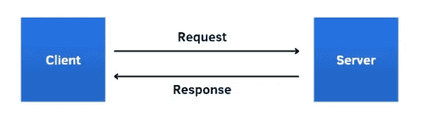
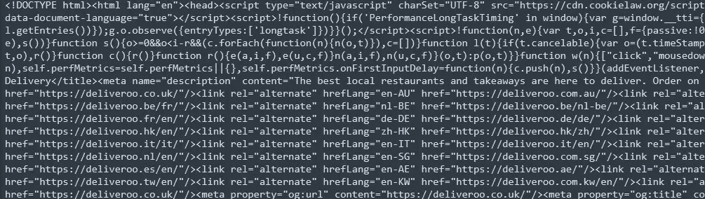
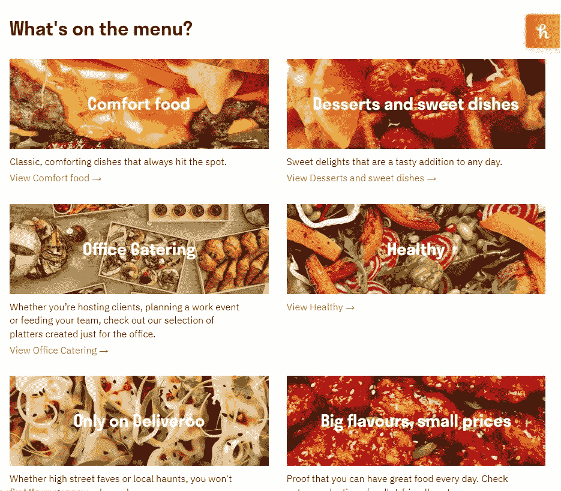
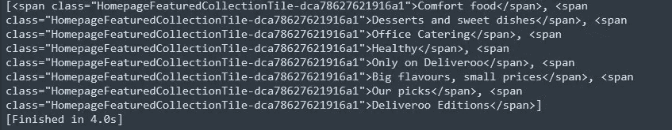
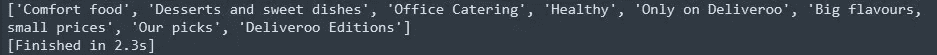
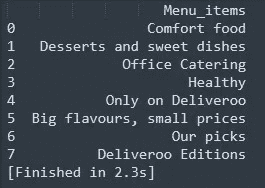

# 如何从公开可用的资源中收集数据？

> 原文：<https://medium.com/geekculture/how-to-scrape-data-from-publically-available-sources-e9697981ed71?source=collection_archive---------12----------------------->

一个简单的一步一步的网络抓取数据指南。

写这篇文章的主要动机是详细了解网络抓取 101。为了使它更有趣，让我们通过实现它来浏览一个网站。

当你试图从网站上抓取数据时。首先决定你想分析什么，你想从网站上得到什么类型的数据和数据元素？

例如，我想提取 deliveroo 中的食物类型？Deliveroo 是一家食品配送公司，类似于其他流行的应用程序，如 uber eats、zomato 等。总部设在伦敦。

现在，有两种收集数据的方法:

1.  单独从页面上刮掉(使用漂亮的汤)
2.  自动抓取并使用网页(使用 Selenieum)

这是 python 中用来抓取数据的两个流行的包。了解这些包的最好方法是从文档中学习。我认为阅读软件包的文档通常是最好的资源。

人们确实发现最初阅读软件包有点困难，我自己强迫自己阅读文档，因为它们是可信的，并且有你需要或拥有的所有信息。您可以关注或阅读可用的文章和视频，因为我发现它们有助于理解软件包的用法。

我想分享一个我从导师那里得到的建议。

# 尝试阅读和学习包装文档和技术文件。阅读它们是你们一起发展的另一项技能。

如果你想学习如何阅读[文档](/@laymanExplained/layman-explained-reading-documentation-36c450e77e6b)或技术/学术[论文](https://towardsdatascience.com/guide-to-reading-academic-research-papers-c69c21619de6)。可以参考附文。

回到我们的话题！如前所述，这篇文章将主要集中在使用美丽的汤，并希望在探索硒之后，我将能够在其他文章中详细解释它。

**什么是美人汤？**

简单来说，Beautiful Soup 是一个 python 包，用于从 HTML 和 XML 文件中提取数据。它用于导航、搜索和从网站中提取数据。

**刮之前需要了解 HTML 吗？**

你根本不需要了解 html，但是了解 html 页面的基本语法是很有帮助的，因为它有助于导航你想要的正确数据。

您需要了解的一些基本主题:

1.  头球
2.  类和 ID(它们是什么，用来做什么？)
3.  表格和列表(它们在 html 中是如何表示的？)

你可以从[这里](https://betterprogramming.pub/understanding-html-basics-for-web-scraping-ae351ee0b3f9)详细了解。

**Find 和 FindAll 函数的区别？**

从任何网站提取数据都至关重要的两个主要功能。

查找( )

1.  当在第一页(即，在项目列表中)找到搜索的元素时，它返回，显示满足条件的第一个元素。
2.  只有第一个搜索显示为输出。
3.  Find 函数语法，find(标签、属性、文本、关键字等。)

findAll()

1.  它可以用来获取满足条件的所有元素。主要是满足条件的所有项目的列表。
2.  将所有搜索作为输出打印出来。
3.  findAll(标签，属性，文本，限制，关键字)语法。

因此，最初我们将使用 2 个软件包，所以首先我们需要安装，如果你没有在你的本地系统。

```
!pip install BeautifulSoup4
!pip install requests
```

安装后，我们需要导入所需的库。

```
import requests
import bs4 as bs
import pandas as pd
```

在进一步讨论之前，最好先了解我们为什么需要这些库。

*   ***请求*** :向网站(服务器)请求数据，并将响应发送回您的本地系统(客户端)或您请求的系统。



Simple process by using requests library (source: [https://www.analyticsvidhya.com/blog/2021/08/a-simple-introduction-to-web-scraping-with-beautiful-soup/](https://www.analyticsvidhya.com/blog/2021/08/a-simple-introduction-to-web-scraping-with-beautiful-soup/))

*   ***beautiful soup(bs4):***如上所述，请求接收的数据然后从 HTML 解析。它有助于与网页进行交互，就像您使用开发人员工具进行交互一样。
*   ***【pandas(PD)***:提取所需数据后，我们可以将数据组织成一个漂亮的表格，供以后分析使用。

因此，在导入所需的库之后，您需要将网站(您想要从中抓取数据)分配给一个变量，或者您甚至可以将它与 requests 函数一起使用。

我将请求进入[网站](https://deliveroo.co.uk/)并右击网页，点击“检查”以浏览网页的 html 代码。

```
url = '[https://deliveroo.co.uk/](https://deliveroo.co.uk/)'
results = requests.get(url)
```

通俗地说，你将要求服务器(通过你提供的链接)从整个静态网页中提取数据。

如果你愿意的话，你可以在网站上查询你收到的数据。



Image by Author

您可以从上面的输出中看到，我们正在获得带有 HTML 数据标签和各种链接的全部数据。

现在，为了访问我们获得的数据，我们使用 BeautifulSoup 解析 HTML，然后使用开发人员的函数访问和提取数据。

```
soup = bs.BeautifulSoup(results.content, "html.parser)
```

关键的一步来了。我曾经发现最初试图理解我需要哪个 html 标签来提取数据。

我的目标是以后从一个数据框架中提取网站上所有不同的菜单。听起来很简单。



Image from [Deliveroo](https://deliveroo.co.uk/)

*   首先是检查页面，找到正确的 HTML 标签，在标签下我们可以看到想要的列表。
*   发现所有列表下的一个公共类都带有‘span’标签。

```
menu = soup.find_all('span',class_ = 'HomepageFeaturedCollectionTile-dca78627621916a1')
```

上面将列出所有提到的带有类名的标签。



Image by Author

从上面的输出中，下一步是只提取没有 html 标签的文本。

```
list_of_menu = []
[list_of_menu.append(types.text) for typesin menu]
print(list_of_menu)
```

因此，我将获得 deliveroo 中可用菜单类型的列表。



Image By Author

如果你想要数据帧格式的。

```
df = pd.DataFrame(list_of_menu)
df.columns = ['Menu_items']
print(df)
```



Image By Author

就是这样！该列表可能没有用，但是对于您想要从静态网页中提取的任何类型的数据，步骤都是相同的。

现在如果你想自动进入并点击 cookies，我们可以使用 Selenieum 软件包。(这是另一篇文章的主题)

希望你能发现这个实践教程是有用的，如果你不明白，请随意评论。