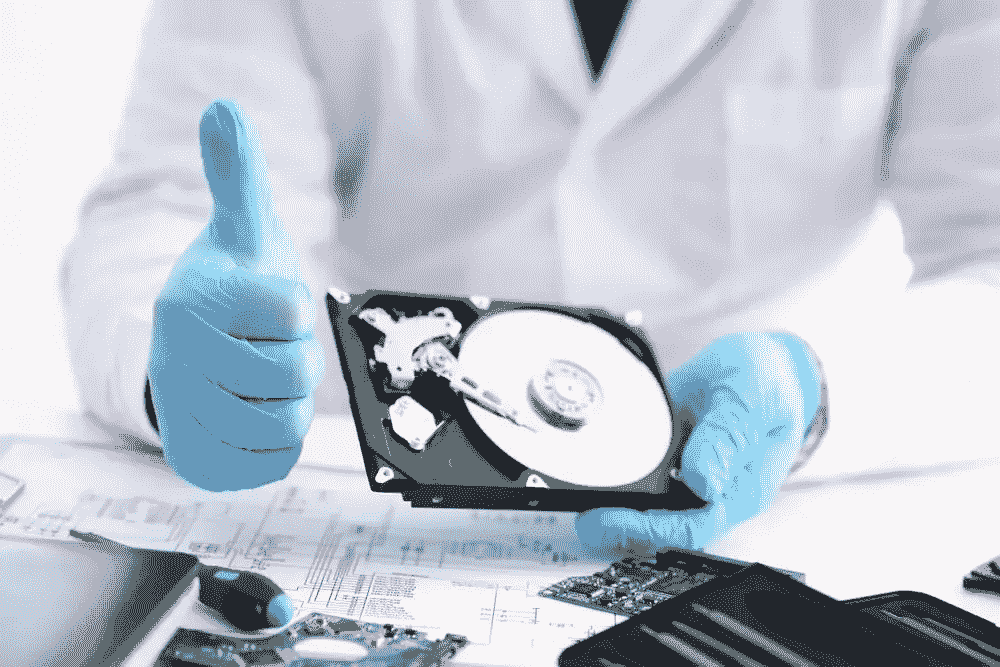
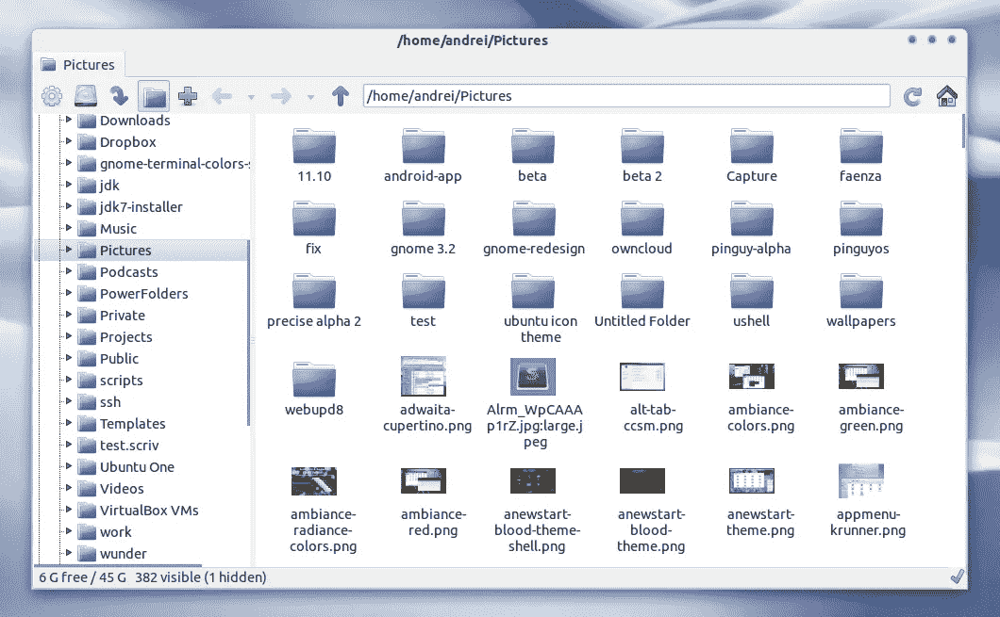

# 如何在 Linux 中安全删除文件？

> 原文：<https://medium.com/geekculture/how-to-securely-delete-files-in-linux-ce6ad1205922?source=collection_archive---------5----------------------->

## 了解如何安全地从 Linux 系统中删除文件


Photo by [Michał Jakubowski](https://unsplash.com/@jaqbovsky?utm_source=medium&utm_medium=referral) on [Unsplash](https://unsplash.com?utm_source=medium&utm_medium=referral)

有一种常见的误解，认为通过运行 GNU remove 命令可以删除 Linux 系统上的文件。然而，现在的情况是，您正在从操作系统文件索引器中移除指向存储介质的指针。这种想法会导致错误的保证，即您的数据已经从您的系统中删除。

以下是如何在 Linux 上安全地删除文件。

## Linux 下删除文件的标准方法

下面是在 Linux 上用来删除文件的命令。

```
rm -rf [path]
```

这个命令不会删除 Linux 系统上的任何文件。为什么删除文件实际上并没有删除文件？

一个原因是，通过删除硬件中的文件，您正在提交一个双重写入，这将使任何存储设备的寿命减半。这对于写入周期有限的固态硬盘尤为突出。为了解决这个问题，计算机将删除指针。

有一种观点认为，不真正删除任何东西，会使数据恢复容易得多。这种观点没有认识到，通过安全地备份你的数据，并确保所有的备份都在现场和云中加密，你可以达到同样的效果，而不会让自己面临安全风险。如果您的备份策略围绕着等待数据恢复服务，那么作为一名 IT 专业人员，您就失败了。我会写一篇博文，介绍如何使用 TrueNAS 专业地在现场和云中备份您的数据资产。

## **你如何专业地恢复数据**



Photo from weirdword.com

假设您未能正确备份您的系统，不得不调用数据恢复服务来恢复数据。

如果你学过像 C++这样的低级编程，你就会知道在字符串的末尾有一个终止字符。类似地，操作系统会自动在文件末尾放置一个终止字符。通常，一个文件会有一个文件头，告诉你文件的元数据，如文件类型，创建日期等。[只要你知道将文件写入存储介质的操作系统，那么在软件](https://www.pandorarecovery.com/best-recovery-apps.html)中恢复丢失的数据就相当容易。

有时硬盘读写头可能会出错。[您只需要有合适的设备和干净的实验室来执行数据恢复。](https://www.provendatarecovery.com/blog/hard-drive-recovery-service/)

一个训练有素的专业人员应该能够在软件或硬件中恢复硬盘上的任何数据。

## 如何安全地删除文件


Photo by [Christopher Gower](https://unsplash.com/@cgower?utm_source=medium&utm_medium=referral) on [Unsplash](https://unsplash.com?utm_source=medium&utm_medium=referral)

删除文件最安全的方法是在每次删除后用字符覆盖每个文件。可能是零或随机值。没关系。只要这些文件在删除后被覆盖。

有一个程序命令程序叫做 **srm** 。该程序允许您从设备上删除文件。

[](https://sourceforge.net/projects/srm/) [## 安全 rm

### 免费下载安全 rm。srm 是一个安全删除文件的命令行程序。srm(安全 rm)是一个命令行…

sourceforge.net](https://sourceforge.net/projects/srm/) 

它具有与标准 remove 相同的所有标志。但是，它有几个附加选项，例如

— dod:符合美国国防部标准的 7 遍覆盖

— doe:符合美国能源部标准的三遍覆盖

— openbsd:符合 openbsd 的 rm。文件在被删除之前会被覆盖 3 次。

— rcmp:加拿大皇家骑警 3 遍兼容覆盖

— [古特曼](https://en.wikipedia.org/wiki/Gutmann_method) : 35 遍覆盖古特曼方法

美国国防部正在使用的东西对大多数人来说可能是足够安全的。然而，如果你想成为超级偏执狂，你可以使用古特曼方法。

**别名命令**

您希望以某种方式为该命令设置别名，以便整个系统都使用该命令来删除文件，从而确保您的文件被正确删除。需要安全删除的最重要的文件是包含大量敏感信息的个人文件。

在。aliasrc 文件，您可以添加以下别名来覆盖 rm 命令。请记住，这样做后，您将无法恢复文件。这就是为什么你需要正确地备份你的系统。

```
alias \
  rm=srm --dod
```

您可以继续在您的脚本中使用 rm，就像什么都没有改变一样。除了在后台，您的设备将在文件删除时自动执行数据清理。

## 下载可扩展文件管理器

一些文件管理器将调用库来执行文件的删除。我还建议您使用 spacefm 这样的可扩展文件管理器。并设置一个使用 alias 命令删除文件的菜单选项。

大多数“机密”信息是由用户创建的，因此您的 GUI 文件管理器必须安全地删除文件。



Photo from blogspot.com

您不希望在将要安装 Linux 发行版的每台计算机上手动执行此操作。因此，我建议您创建自己的 Linux 发行版来执行文件的安全删除。这里有一个教程，教你如何创建你自己的 Arch Linux 发行版。

[](/geekculture/the-quick-and-easy-way-to-install-arch-linux-70b9bfc35863) [## 安装 Arch Linux 的快速简单的方法

### 如何轻松安装 Arch Linux？

medium.com](/geekculture/the-quick-and-easy-way-to-install-arch-linux-70b9bfc35863) 

IT 和工程领域是快速发展的领域。跟不上意味着你将被落在后面。跟上的最好方法是保持最新的新闻和教育内容。[订阅免费电子邮件列表，将您的职业生涯提升 10 倍。](/subscribe/@dretechtips)

**加入我们吧，因为 50 多位想要快速提升职业生涯和知识基础的人已经注册了。**

**相关内容**

*   [如何在 Linux 中查找文件？](/geekculture/how-to-find-files-in-linux-6ed09a98c899)
*   [Linux 内核初学者指南](/geekculture/the-beginners-guide-to-the-linux-kernel-29743b1a2daf)
*   [如何重置任何 Linux OS 的 root 密码？](/@drechang/how-to-reset-the-root-password-on-any-linux-os-7b2075eed7dc)