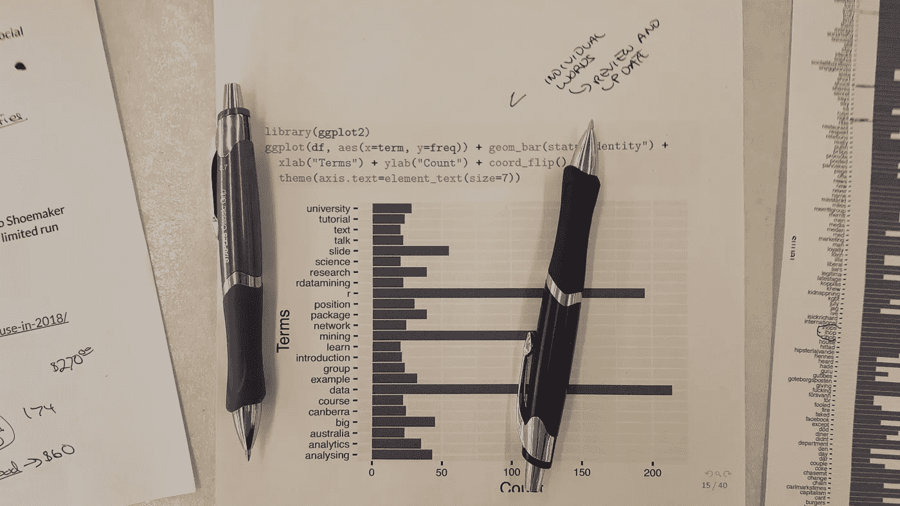

# 如何选择教育你的好的技术内容

> 原文：<https://medium.com/geekculture/how-to-select-good-technical-content-that-educates-you-868c6a2bde33?source=collection_archive---------14----------------------->

## 网上有许多支持框架和概念的选项，人们面临着令人眼花缭乱的选择，这些选择可能会也可能不会教授有用的概念。以下是如何知道选择什么对你的教育最有帮助。

Languages like R Programming require dedication to learn. Choosing the right education is essential for gaining the most of technology and associated programs.