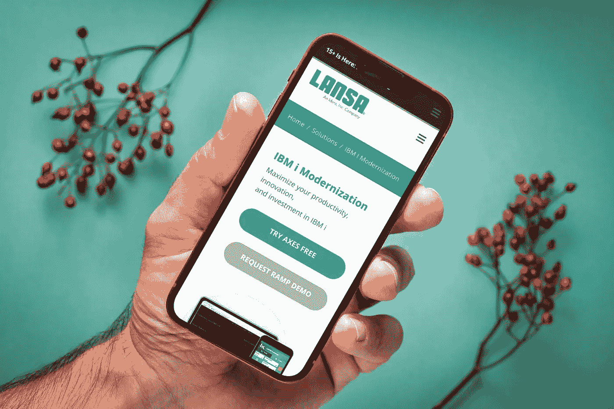

# 如何向首席财务官推销应用程序现代化

> 原文：<https://medium.com/geekculture/how-to-sell-application-modernization-to-your-cfo-b8992894e183?source=collection_archive---------27----------------------->

在 2021 年底，数字化转型和根据新一代企业技术实现业务应用程序现代化的需求并不新鲜。事实上，这是一个已经讨论了十年的话题。对许多人来说,[应用程序现代化战略](https://lansa.com/products/ramp-overview/?utm_source=Medium&utm_medium=Leads%20Acquisition&utm_content=HowToSellApplicationModernizationToYourCFO12302021&utm_campaign=HowToSellApplicationModernizationToYourCFO12302021)似乎不再适用。毕竟，多年来，公司已经意识到技术的变化和对传统应用进行现代化的需要——他们中的大多数人现在肯定已经从他们的 5250 绿屏中走出来。

不幸的是，事实并非如此。尽管数字化转型的数量有所增加，但还远未普及。大量组织仍在使用遗留应用程序。他们都有一个共同点，那就是他们不愿意现代化，也不想急于现代化。

# 指挥链延迟是数字化的障碍吗？

让我们跳过关于这种方法的短视和推迟现代化的长期负面影响的谬论。有许多论证证明了业务 IT 系统的转型是正确的，但它们只能到此为止。

一如既往，技术创新的传播受到人为因素的阻碍，也称为指挥链延迟。即使最高层的非 IT 高层管理者意识到遗留工具转换的重要性，在批准新应用程序项目的预算之前也要三思。

事实是，许多首席财务官从完全不同的角度看待这些问题。他们更愿意优先考虑其他需求，而不是对看起来运行良好的 IT 基础架构进行成本高昂且有潜在风险的更改。为了说服他们放手一搏，你需要的不仅仅是数字转型的轶事和 IT 解决方案的代际转变。

那么，如何才能让首席财务官参与应用程序现代化项目呢？总的来说，沟通需要为新应用程序更新旧应用程序的方法多年来没有太大变化。尽管如此，还有一种新的紧迫感需要考虑——在 2022 年使用传统的 5250 绿屏与在 2000 年代末或 2010 年代初依赖它们完全不同。

# 向首席财务官证明应用现代化的 5 个技巧

根据我们的经验，并与当前的业务环境生态系统相关，以下是向您的首席财务官“推销”应用程序现代化计划的一些技巧。

# 1.我应该估计遗留维护造成的财务损失吗？

向首席财务官提供信息，解释为什么从财务角度来看维持现状不是一个好的解决方案，这是一个很有意义的做法。遗留工具的维护成本通常会持续增长，因此得出令人信服的数字应该不会太难。增加对低效应用程序造成的财务损失的估计，是展示现代化延迟如何造成财务负担和预算漏洞的一个很好的方式。

# 2.我是否应该展示由于没有尽早实施项目而带来的节约和利润损失？

另一个对首席财务官和其他高层管理人员有效的方法是估计由于实施延迟而错过的潜在节约和财务收益。看到真实支出和失去的潜在收益在同比图表上持续上升，通常会让首席财务官心跳加速。

# 3.有没有办法突出时间的重要性和最新的趋势？

用一种更夸张的说法，提醒你的首席财务官，时代在变，迟到的领先者已经远远落后了。毕竟，数字化转型正在加速并推动整个商业和工业的快速变化。最近的全球事件，如新冠肺炎，也在动荡的经济和不断变化的市场需求中推动了对工业 4.0 解决方案的需求。因此，请提醒您的首席财务官，与五年前相比，现在更新过时的传统应用程序的需求更加迫切。

# 4.我能提出估计的收益和可衡量的影响吗？

另一种赢得首席财务官信任的方法是，对应用程序现代化的影响和收益进行清晰明了的计算。一般来说，列出一个现代化的应用程序的可衡量的业务影响总是一个好主意。评估引入现代业务应用程序所带来的财务收益是你的首席财务官应该做的事情。

# 5.我应该计算预期风险吗？

潜在的风险是限制高层管理者真正批准许多现代化项目的主要因素之一。这就是计算现代化项目的潜在风险和负面影响非常重要的原因。识别所有潜在的风险，估计它们的可能性，并给出每个风险的预期成本，以表明你已经做了功课。

# 终极秘诀是什么？使用经济实惠且经过验证的应用现代化工具！

也就是说，说服首席财务官的最好方法是向他们展示一个他们无法拒绝的现代化项目。如果你的预算是合理的，并且你能减轻风险，你的工作就完成了。

为此，请为您的应用程序现代化项目选择合适的工具。这使您能够最大限度地降低项目成本，按时交付新应用，控制流程并降低风险。

[Visual LANSA](https://lansa.com/products/visual-lansa/?utm_source=Medium&utm_medium=Leads%20Acquisition&utm_content=HowToSellApplicationModernizationToYourCFO12302021&utm_campaign=HowToSellApplicationModernizationToYourCFO12302021) 是一个低代码开发平台。它通过简化 IBM i 应用程序开发和最小化对技术技能的需求来加速应用程序开发。

LANSA 整合了各种强大的工具。这些工具包括几个专为 IBM i 开发的工具，使其应用程序和系统的现代化变得尽可能容易。

# 蔓延

快速应用程序现代化过程(RAMP)是一种渐进的现代化方法。它结合了重构现有应用程序和新开发的优点。通过使用 RAMP 整合现有功能和新功能，您可以获得您想要的应用程序，而无需放弃一切。您分阶段进行现代化，逐渐增加新功能，而不会对业务运营产生严重影响。您还可以在所有应用程序中获得一致的用户界面。

# 远程

LongRange 是一个移动应用构建器，用于使用 RPG、COBOL 或 CL 编程语言为 IBM i 构建原生应用。借助 LongRange mobile app builder，您可以快速、经济地向用户交付、维护和更新移动应用。

# 如何用 aXes 瞬间改造过时的 5250 绿屏？

LANSA 的工具可以完全帮助您消除与首席财务官讨论批准现代化项目的需要。使用 LANSA 工具，您可以用最少的时间和精力更新传统应用程序。 [IBM i 现代化](https://www.axeslive.com/?_ga=2.189723435.1836335152.1640847608-2017432776.1640204493&utm_source=Medium&utm_medium=Leads%20Acquisition&utm_content=HowToSellApplicationModernizationToYourCFO12302021&utm_campaign=HowToSellApplicationModernizationToYourCFO12302021)的 aXes 就是一个完美的例子。

aXes 允许您自动启用 IBM i 5250 应用程序的 web 功能。将现有的 5250 屏幕转换成现成的网页，无需更改源代码。您还可以更改现代化规则以满足您的需求，并将您的更改自动应用到所有应用程序屏幕。

发布于 2021 年 12 月 16 日

在[应用现代化](https://lansa.com/blog/category/application-modernization/?utm_source=Medium&utm_medium=Leads%20Acquisition&utm_content=HowToSellApplicationModernizationToYourCFO12302021&utm_campaign=HowToSellApplicationModernizationToYourCFO12302021)、[坐标轴](https://lansa.com/blog/category/ibm-i-modernization/axes/?utm_source=Medium&utm_medium=Leads%20Acquisition&utm_content=HowToSellApplicationModernizationToYourCFO12302021&utm_campaign=HowToSellApplicationModernizationToYourCFO12302021)、 [IBM i 现代化](https://lansa.com/blog/category/ibm-i-modernization/?utm_source=Medium&utm_medium=Leads%20Acquisition&utm_content=HowToSellApplicationModernizationToYourCFO12302021&utm_campaign=HowToSellApplicationModernizationToYourCFO12302021)、[斜坡](https://lansa.com/blog/category/ibm-i-modernization/ramp/?utm_source=Medium&utm_medium=Leads%20Acquisition&utm_content=HowToSellApplicationModernizationToYourCFO12302021&utm_campaign=HowToSellApplicationModernizationToYourCFO12302021)