# 如何用 Express.js 从表单发送和接收数据

> 原文：<https://medium.com/geekculture/how-to-send-data-from-a-form-and-receive-it-with-express-js-3c03af6275b2?source=collection_archive---------0----------------------->


我正在用 forms 和 Express.js 练习如何发送数据和如何捕捉数据，这将是创建一个拥有数据库的网页的好方法，我可以保存来自客户端的信息。这看起来很棒，但我需要继续学习和分享！

想看就看视频吧

# 启动 NPM

```
npm init -y
```

# 安装依赖项

我们需要安装 Express.js、express-handler、body-parser，这就是目前的全部内容

```
npm i express --savenpm i express-handlebarsnpm i body-parser// just one line
npm i express express-handlebars body-parser --save
```

# 我们目录的结构

首先，我们需要创建我们的视图目录，并在其中添加视图和布局，我们将为我们的表单示例添加 404 视图、500、home 和 form 视图。

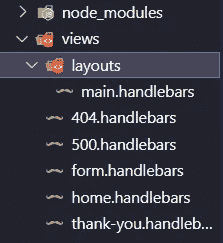

Example views and layouts structure

我们可以像这样给它们添加一些信息

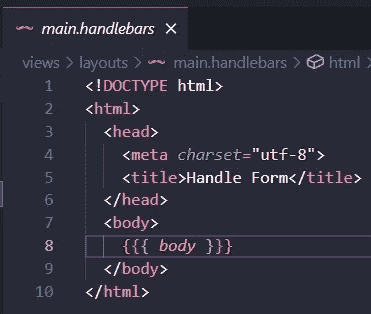

Main handlebars file

```
<!DOCTYPE html>
<html>
<head>
<meta *charset=*"utf-8">
<title>Handle Form</title>
</head>
<body>
{{{ *body* }}}
</body>
</html>
```

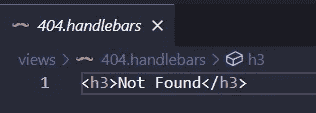

Example 404 handlebars’ file

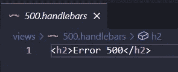

Example 500 handlebars’ file

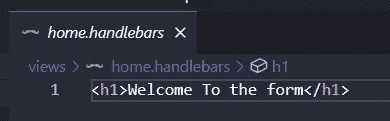

Example home handlebars’ page

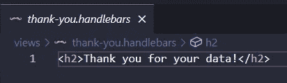

Example thank-you handlebars’ page

最重要的是要像一个普通的表单一样，不要忘记方法和动作，因为这将把数据发送到 Express.js

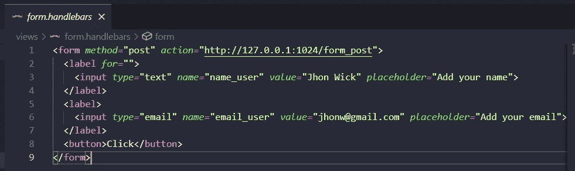

Form handlebars’ file

```
<form *method=*"post" *action=*"http://127.0.0.1:1024/form_post">
<label *for=*"">
<input *type=*"text" *name=*"name_user" *value=*"Jhon Wick" *placeholder=*"Add your name">
</label>
<label>
<input *type=*"email" *name=*"email_user" *value=*"jhonw@gmail.com" *placeholder=*"Add your email">
</label>
<button>Click</button>
</form>
```

这真的很重要，我们需要指定名称，因为通过它我们可以看到当我们发送数据时，Express.js 将接收到它，并且它将创建一个将名称和值链接起来的对象。

# 用 Express.js 和 Node.js 创建我们的服务器

第二，我们创建一个名为 formexpress.js 的文件，我们需要调用 express 来创建我们的带有 express 和调用引擎的应用程序。这是为了新版本的 express-handlebars 6.0.1，端口和 bodyParser 来帮助我们解析数据，它将为我们提供所需的信息。

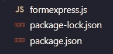

Example js file for our server

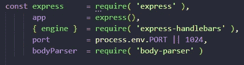

creating variables and calling all the libraries that we need

```
const express     = require( 'express' ),
app         = express(),
{ engine }  = require( 'express-handlebars' ), // before 6.0.0
port        = process.env.PORT || 1024,
bodyParser  = require( 'body-parser' )
```

# 指定引擎

这真的很重要，因为在这一步中，我们保证使用 express-handlebar 和视图引擎，我们还可以添加布局，从而添加我们之前创建的主手柄，我们需要使用 bodyParser 并添加扩展为 false 的信息

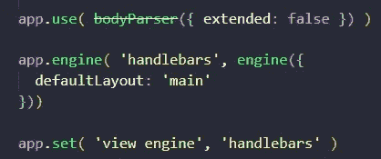

Specifying the engine

```
app.use( bodyParser({ extended: false }) )
app.engine( 'handlebars', engine({
defaultLayout: 'main'
}))
app.set( 'view engine', 'handlebars' )
```

# 为请求创建 get 函数

这是另一个关键部分，因为有了它，我们将从服务器获得我们请求的视图

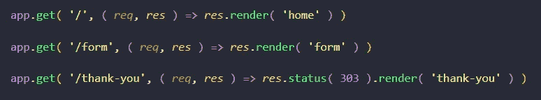

Example requested and response pages

```
app.get( '/', ( *req*, *res* ) => *res*.render( 'home' ) )
app.get( '/form', ( *req*, *res* ) => *res*.render( 'form' ) )
app.get( '/thank-you', ( *req*, *res* ) => *res*.status( 303 ).render( 'thank-you' ) )
```

# 张贴回复以及 404 和 500 次查看

最后，我们必须创建 post，以及在客户端发送数据后将会做什么，我们需要将 post 方法添加到应用程序中，我们需要设置 URL 以及 req 和 res 参数，然后我们需要使用 req.body 来检查客户端发送给我们的内容，我们可以重定向到感谢页面。

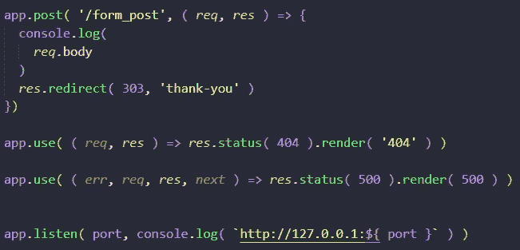

Example Post data and 400 and 500 responses

```
app.post( '/form_post', ( *req*, *res* ) => {
console.log(*req*.body)
*res*.redirect( 303, 'thank-you' )})
app.use( ( *req*, *res* ) => *res*.status( 404 ).render( '404' ) )
app.use( ( *err*, *req*, *res*, *next* ) => *res*.status( 500 ).render( 500 ) )
app.listen( port, console.log( `http://127.0.0.1:${ port }` ) )
```

# 测试一下

运行我们的 JS 文件

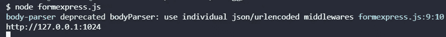

Example output js file

主页

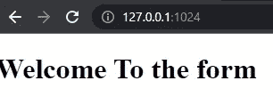

Example Home page

表单页面

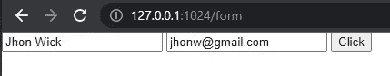

Example Form page

点击和我们会有什么？

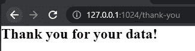

Example redirection to the thank you page

在控制台日志中，我们将会看到来自客户端的信息

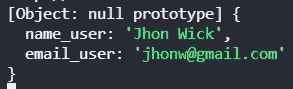

Example output the data from the client

我们从客户那里得到了信息，我们重定向到一个感谢页面，每个人都很高兴。

# 结论

这一步非常重要，因为我们将有价值的信息从客户端传输到服务器，用 Express.js 发送和接收数据，这是一个非常有趣的步骤，下一步将是保存数据库或 API，但这是一个非常大的突破。

# 来源

[](http://expressjs.com/) [## Express - Node.js web 应用程序框架

### Express 是一个最小且灵活的 Node.js web 应用程序框架，它为 web 和…

expressjs.com](http://expressjs.com/) [](https://www.npmjs.com/package/express-handlebars) [## 快速把手

### 一个车把查看引擎的表达，不吸。这个套件过去被命名为 express 3-handlebar。的…

www.npmjs.com](https://www.npmjs.com/package/express-handlebars) [](https://www.npmjs.com/package/body-parser) [## 正文分析器

### Node.js 主体解析中间件。在您的处理程序之前，在中间件中解析传入的请求体，可在…

www.npmjs.com](https://www.npmjs.com/package/body-parser) [](https://www.amazon.com/Web-Development-Node-Express-Leveraging-dp-1492053511/dp/1492053511/ref=dp_ob_image_bk) [## 使用 Node 和 Express 进行 Web 开发:利用 JavaScript 堆栈

### 使用 Node 和 Express 进行 Web 开发:利用 Amazon.com 的 JavaScript 堆栈。*免费*送货到…

www.amazon.com](https://www.amazon.com/Web-Development-Node-Express-Leveraging-dp-1492053511/dp/1492053511/ref=dp_ob_image_bk)