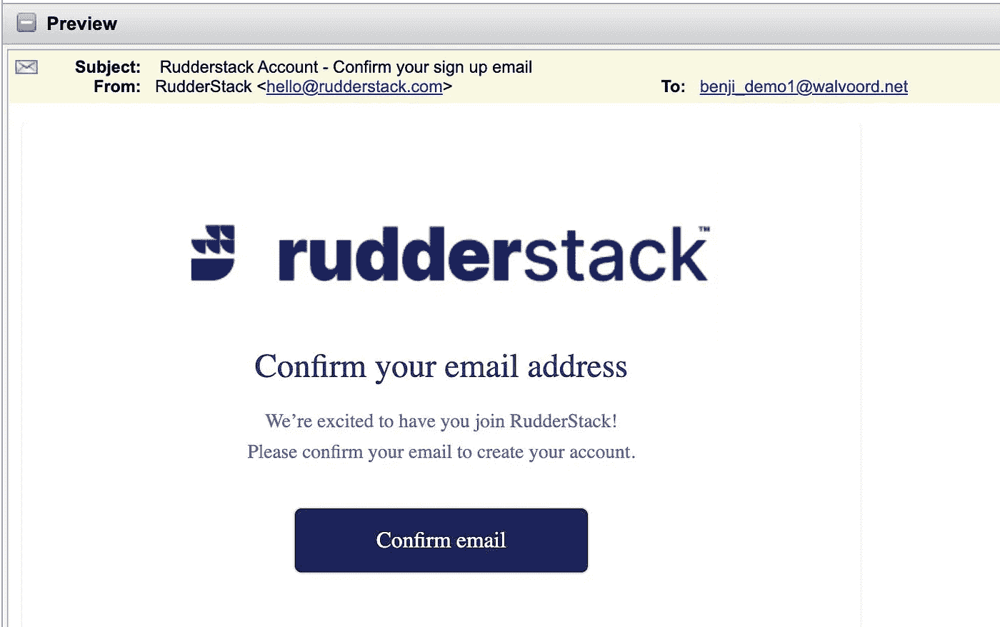
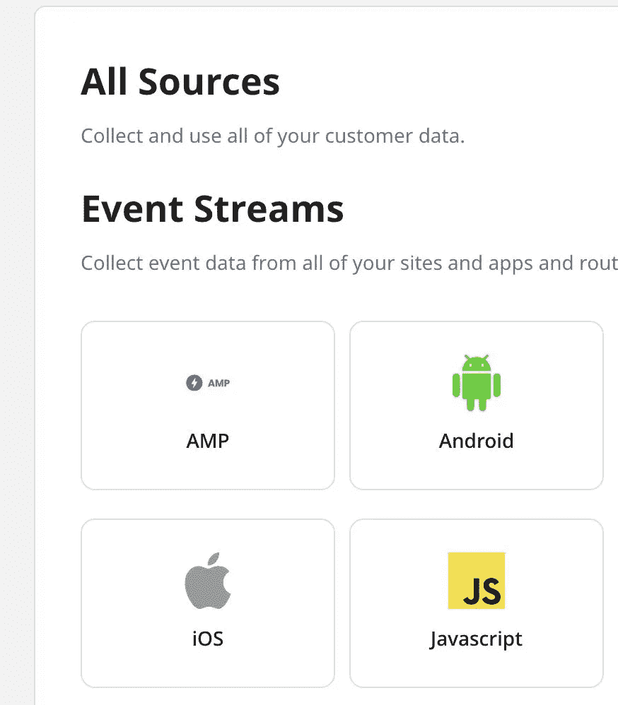
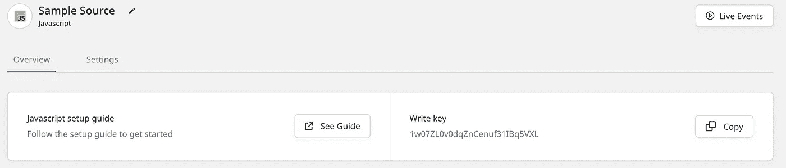
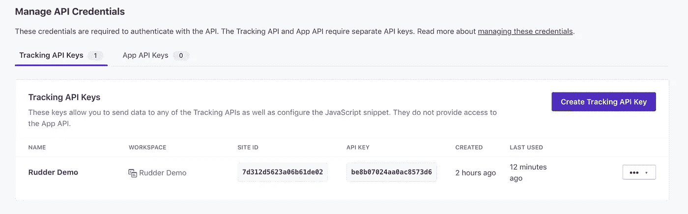
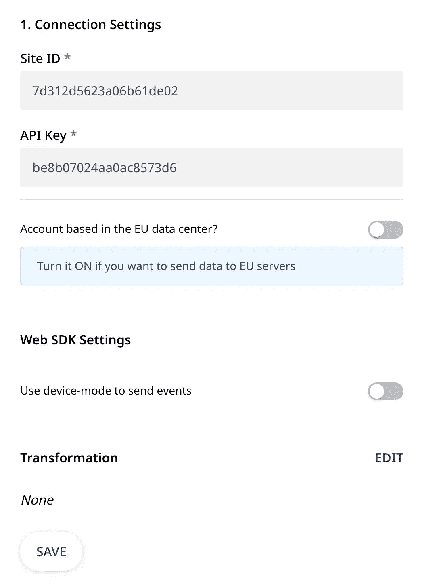
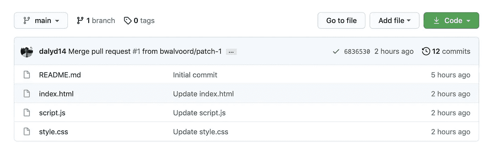
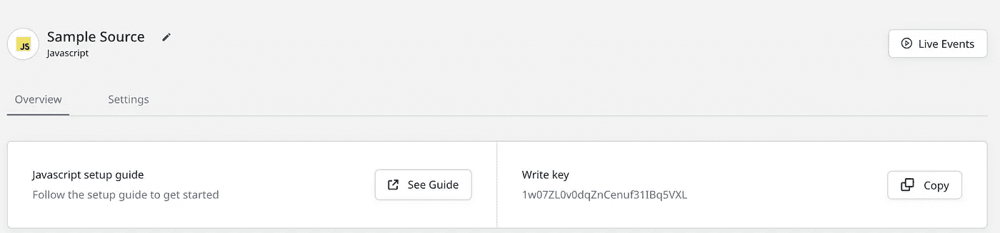
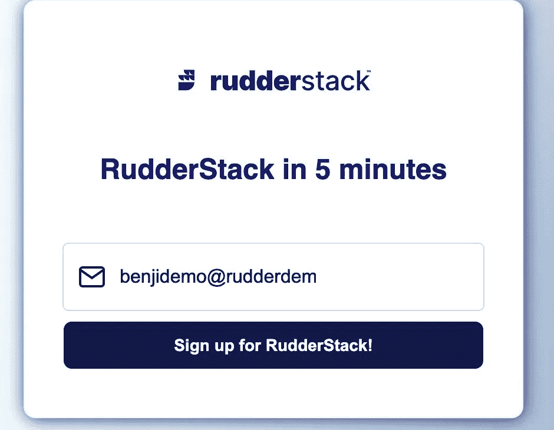
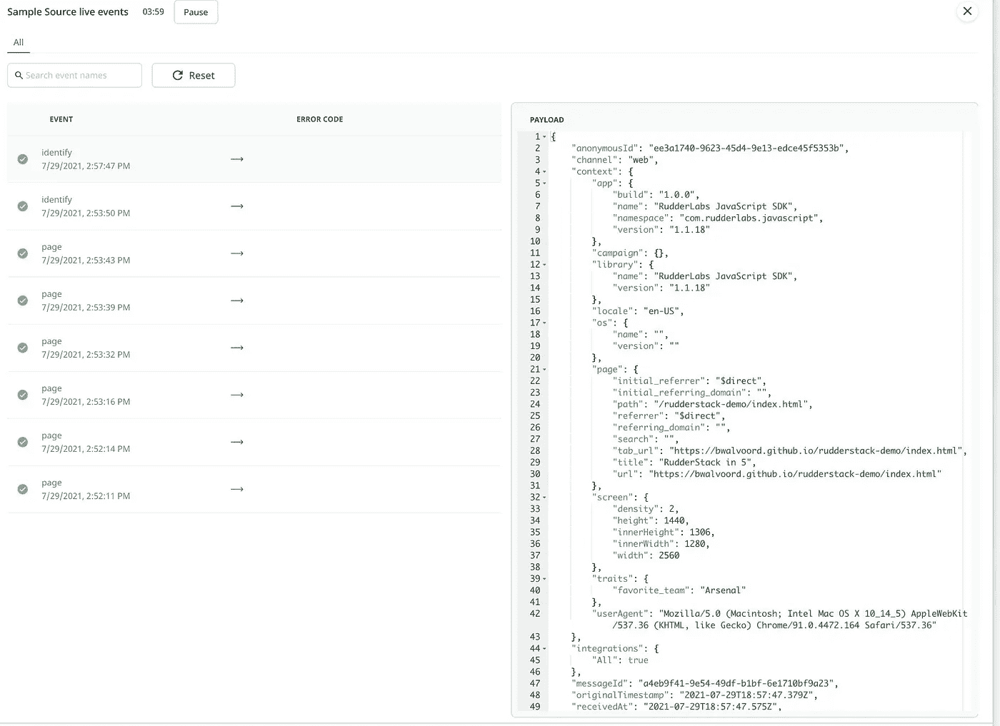
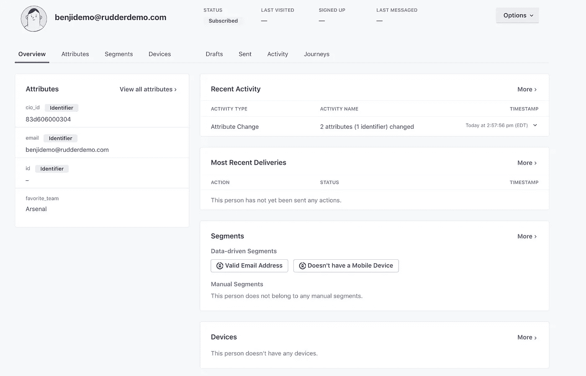

# 如何使用 RudderStack 在 5 分钟内发送数据

> 原文：<https://medium.com/geekculture/how-to-send-data-in-5-minutes-using-rudderstack-eb140053c5ec?source=collection_archive---------18----------------------->


几周前，我们发布了一个关于使用 RudderStack 在 5 分钟内发送数据的视频指南，我们认为制作一个概述演示中讨论的具体步骤和链接的配套文档可能会有所帮助。要自行复制视频内容，请创建一个免费试用账户 [customer.io](https://fly.customer.io/signup) (不需要信用卡)和一个 [GitHub](https://github.com/signup) 账户，用于创建和发布 HTML 表单。你需要的 HTML 和事件处理文件附在这篇文章的底部。

# 将数据从您的网站发送到云工具

在本指南中，您将学习如何使用 RudderStack 设置一个免费帐户，并使用 Javascript SDK 源创建一个连接，以便在 git 中从您的网站收集表单提交，并将它们发送到 customer.io。

1.点击这里注册一个免费的 RudderStack 云账户[，然后等待大约 10 秒钟，刷新你的电子邮件。](https://app.rudderlabs.com/signup?type=freetrial)

2.确认您的电子邮件地址以完成您的帐户注册。



3.设置 Javascript 源。在 RudderStack 应用程序中，单击 Connections，并创建一个新的 Javascript 源。

*要了解更多信息并复制项目稍后使用的代码，请查看*[*ruder stack 文档—设置 Javascript SDK 源*](https://docs.rudderstack.com/stream-sources/rudderstack-sdk-integration-guides/rudderstack-javascript-sdk) *。*



创建信号源时，务必记下信号源的**写入键**。稍后您将需要它来将 SDK 代码片段添加到您的 HTML 表单页面。

**注意:**在开始发送事件之前，您不必设置目的地。



4.设置 Customer.io 目的地。在帐户设置菜单中，单击 API 凭证。您将需要来自 Customer.io 的站点 ID 和 API 密钥来插入 RudderStack。



**站点 ID:** 7d312d5623a06b61de02(您的会有所不同)

**API Key:**BE 8b 07024 aa 0ac 8573d 6(你的会不一样)

对于此设置，我们只需输入来自 Customer.io 的站点 ID 和 API 密钥。因为我们不使用欧盟数据中心，所以我们将关闭该值。



Customer.io 目标支持来自云模式和设备模式的数据。由于我们是从示例 web 表单中提交这些数据的，因此我们将使用默认的云模式选项。

*有关云模式和设备模式之间的差异的更多信息，请查看我们的文档* [*方向舵堆栈连接模式:云模式与设备模式*](https://docs.rudderstack.com/connections/rudderstack-connection-modes#device-mode)

一旦在 RudderStack 中创建了连接，您就需要将 Javascript SDK 片段添加到您的 webform 中，并更新您的事件监听器，然后您就可以开始比赛了。

5.复制这篇文章底部的代码，创建一个 index.html 和 script.js 文件。然后将它们上传到您的 git 存储库。



6.修改 HTML 以向您的 RudderStack 发送一个标识调用。这包括对代码进行三项更新:

添加(1) **数据面板 URL** 和(2) **源写入键**，这两个键都可以在 RudderStack 仪表板中找到。

数据平面地址:[https://walvoordbxzie.dataplane.rudderstack.com/](https://walvoordbxzie.dataplane.rudderstack.com/)

写入键:1w07ZL0v0dqZnCenuf31IBq5VXL

**注**:原来的写键和数据面板行被注释掉。

```
<head>
    <meta charset="UTF-8">
    <meta http-equiv="X-UA-Compatible" content="IE=edge">
    <meta name="viewport" content="width=device-width, initial-scale=1.0">
    <link rel="stylesheet" href="style.css"> <!-- Start RudderStack Snippet -->

    <script>
        rudderanalytics = window.rudderanalytics = [];

        var  methods = [
            "load",
            "page",
            "track",
            "identify",
            "alias",
            "group",
            "ready",
            "reset",
            "getAnonymousId",
            "setAnonymousId"
        ];

        for (var i = 0; i < methods.length; i++) {
              var method = methods[i];
              rudderanalytics[method] = function (methodName) {
                    return function () {
                          rudderanalytics.push([methodName].concat(Array.prototype.slice.call(arguments)));
                    };
                  }(method);
        }
        rudderanalytics.load("1w07ZL0v0dqZnCenuf31IBq5VXL", "https://walvoordbxzie.dataplane.rudderstack.com");
        //For example,
        //rudderanalytics.load("write_key_from_source", "dataplane_from_rudderapp");
        rudderanalytics.page();
    </script>

    <script src="https://cdn.rudderlabs.com/v1/rudder-analytics.min.js"></script> <!-- End RudderStack Snippet -->

    <title>RudderStack in 5</title>
</head>
```

将(3) **Rudder Analytics 事件**添加到 script.js 文件中的事件监听器

```
// Event listener on the form submit
document.querySelector("#email-form").addEventListener("submit", function(event){
    event.preventDefault() const emailForm = document.querySelector("#email")
    const email = emailForm.value console.log(email)

    // Add Rudder Event Handler Here:
    rudderanalytics.identify(email, { favorite_team: "Arsenal" }) emailForm.value = ""
} )
```

**注意:**我们在我们的 identify 调用中添加了一个额外的用户特征。枪手加油！

7.保存并提交更改后，您可以打开表单并进行测试，但在单击 submit 之前，请在另一个浏览器中打开 RudderStack 应用程序以访问实时事件查看器。打开 Javascript 源代码，然后单击“播放实时事件”按钮。



到你的表单的链接应该是这样的:[https://bwalvoord.github.io/rudderstack-demo/index.html](https://bwalvoord.github.io/rudderstack-demo/index.html)



8.点击按钮后，查看事件查看器。您可以选择任何事件来查看 JSON 包:



9.直接进入您的 Customer.io 实例，查看获得的线索:



恭喜你，你现在正在你自己的 RudderStack 实例中流式传输数据。接下来，我鼓励您在现有连接中添加一个仓库目的地。您可能还想尝试创建一个用户转换来排除电子邮件地址中包含“_test”的电子邮件。

如果你有问题或者想了解更多关于方向舵堆栈的信息，[请求一个演示](https://rudderstack.com/request-demo)，或者加入我们的 [slack](https://resources.rudderstack.com/join-rudderstack-slack) 与我们的团队和其他方向舵堆栈用户实时聊天。

# 引用的文件

样本表单—index.html

```
<!DOCTYPE html>
<html lang="en">
<head>
    <meta charset="UTF-8">
    <meta http-equiv="X-UA-Compatible" content="IE=edge">
    <meta name="viewport" content="width=device-width, initial-scale=1.0">
    <link rel="stylesheet" href="style.css"> <!-- Start RudderStack Snippet -->

    <script>
        rudderanalytics = window.rudderanalytics = [];

        var  methods = [
            "load",
            "page",
            "track",
            "identify",
            "alias",
            "group",
            "ready",
            "reset",
            "getAnonymousId",
            "setAnonymousId"
        ];

        for (var i = 0; i < methods.length; i++) {
              var method = methods[i];
              rudderanalytics[method] = function (methodName) {
                    return function () {
                          rudderanalytics.push([methodName].concat(Array.prototype.slice.call(arguments)));
                    };
                  }(method);
        }
        rudderanalytics.load("1w07ZL0v0dqZnCenuf31IBq5VXL", "https://walvoordbxzie.dataplane.rudderstack.com");
        //For example,
        //rudderanalytics.load("write_key_from_source", "dataplane_from_rudderapp");
        rudderanalytics.page();
    </script>

    <script src="https://cdn.rudderlabs.com/v1/rudder-analytics.min.js"></script> <!-- End RudderStack Snippet -->

    <title>RudderStack in 5</title>
</head>
<body>

    <section>
        <form id="email-form" action="submit" class="email-form">
            
            <h1>RudderStack in 5 minutes</h1>
            <div class="email-field">
                
                <input type="email" name="email" id="email" placeholder="your@email.com" required>
            </div>
            <div class="submit-button">
                <button type="submit">Sign up for RudderStack!</button>
            </div>
        </form>        
    </section> <script src="script.js"></script></body>
</html>
```

**事件处理程序— script.js**

```
// Event listener on the form submit
document.querySelector("#email-form").addEventListener("submit", function(event){
    event.preventDefault() const emailForm = document.querySelector("#email")
    const email = emailForm.value console.log(email)

    // Add Rudder Event Handler Here:
    rudderanalytics.identify(email, { favorite_team: "Arsenal" }) emailForm.value = ""
} )
```

*本博客最初发表于:* [*https://rudder stack . com/blog/how-to-send-data-in-5-minutes-using-rudder stack*](https://rudderstack.com/blog/how-to-send-data-in-5-minutes-using-rudderstack)