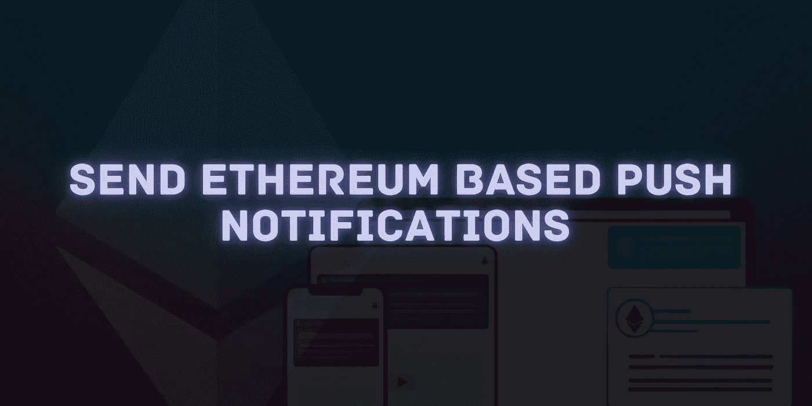
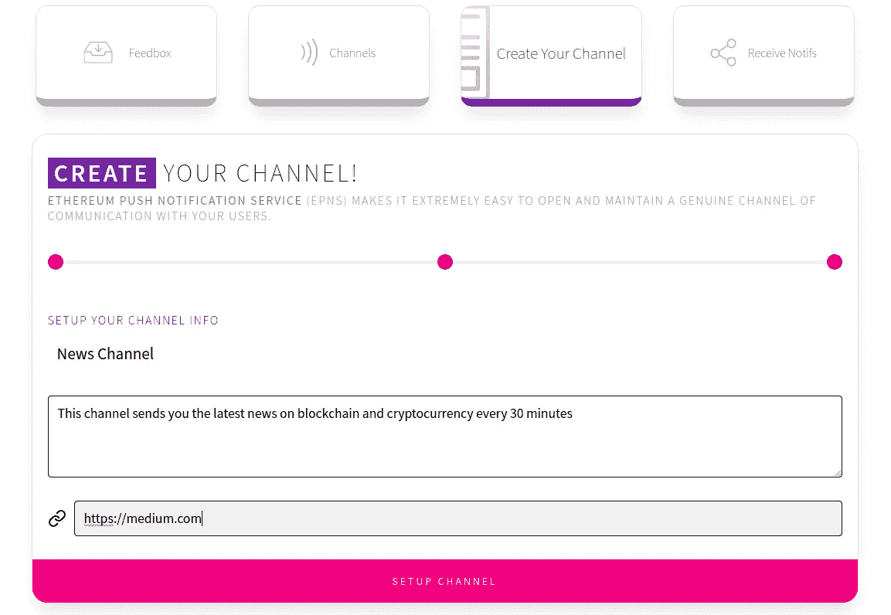
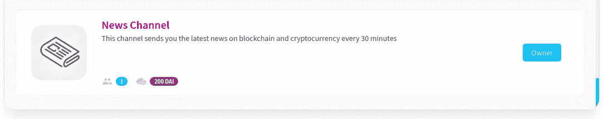
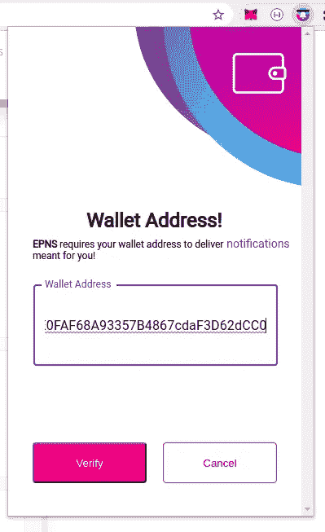
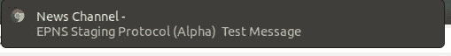
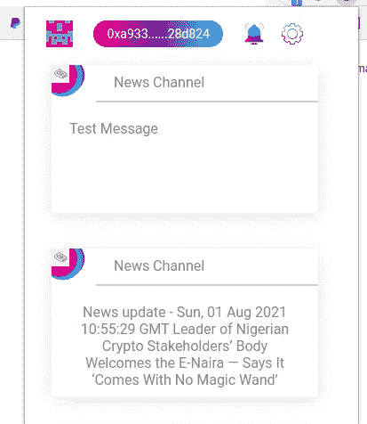

# 如何发送分散推送通知？

> 原文：<https://medium.com/geekculture/how-to-send-decentralized-push-notifications-d851ae0a95ea?source=collection_archive---------11----------------------->

## 使用 NodeJS &以太坊区块链

耶！确实如此。现在，我们可以使用公共区块链以太坊以分散的方式发送推送通知。

推送通知在任何改善用户体验的应用中都是至关重要的。人们对应用程序更感兴趣，他们更喜欢实时信息，而不是通过电子邮件或短信延迟通知。但是 DeFi 空间仍然是新的，每天都在出现，它需要一些方法来通知他们的用户，这与他们的个人数据无关。在 DeFi 世界中，用户的唯一身份是他/她的钱包地址。

而这正是 EPNS(以太坊推送通知服务)所做的。它帮助我们向用户发送推送通知，而不需要用户的任何个人信息。我们需要的只是用户的钱包地址。

让我们用一个简单的例子来说明传统的推送通知系统是如何工作的:

*   用户使用凭证登录到移动应用程序。
*   与用户设备相关联的唯一`device token`被发送到服务器。
*   服务器使用 Firebase 或 Apple 推送通知服务器，使用用户的设备令牌向设备发送推送通知。

传统的应用程序可以实现这个方法。但是不适合 DeFi 应用程序遵循相同的流程。

所以让我们来看看 EPNS 是如何工作的(简而言之)。

*   DeFi 应用程序管理员/所有者/管理者为应用程序创建一个通道。
*   如果用户想要接收关于重要事件的通知，如清算他们在货币市场协议中的头寸等，他们可以使用他们的钱包订阅该频道。,
*   通知引擎可以监视平台上的事件，并向通道发送推送通知。它可以向特定的电子钱包地址广播或发送目标通知。
*   用户可以通过 EPNS 浏览器扩展(或)EPNS 移动应用程序接收通知。

就这么简单！

让我们构建一个简单的 NodeJS 服务进行演示。这是一个简单的新闻服务，每 30 分钟发送一次关于加密货币的最新消息。虽然它与 DeFi 无关，但足以演示频道创建和向频道订户广播消息。

# 创建我们的新闻频道:

我们有两个选择:

*   使用 NodeJS 脚本创建通道
*   使用 EPNS web 界面创建频道。

在本次演示中，我将使用 EPNS web 界面创建频道。

> 请参考[此链接](https://gist.github.com/PraneshASP/3f72eb906df2fec432d7558c39bc9a3b)，其中包含可用于创建频道的 NodeJS 脚本。

让我们打开他们的分期应用——[https://staging-app . epns . io](https://staging-app.epns.io)

连接您的 web3 钱包。在这个演示中，我将使用 MetaMask。连接后，点击`Create Your Channel`选项卡。

通过上传频道图标、频道名称、图片等，可以从界面创建频道。,

对于这个演示，我创建了一个简单的新闻频道，详细信息如下

> **注意**:你需要一些戴代币来创建一个频道。可以从`Get Free DAI for Channel`按钮或者 mint 手动获取。

创建频道后，您可以在`Channels`选项卡下看到频道名称和描述。

太好了！现在，其他用户可以订阅该频道来接收通知。

# 发送通知:

我们可以通过编程以及通过接口发送通知。如果我们需要发送我们平台的重要消息，那么我们可以使用接口来发送。但是如果我们想要基于一些事件来自动化它，那么通知可以以编程方式发送。

下面是一个简单的脚本，用于将新闻数据发送给所有订阅者(广播)

您可以看到`sendMessage`方法接收新闻的`title`和`description`，并使用 EPNS 智能合约的`sendNotification`方法广播它。

下面是新闻服务如何每 30 分钟调用一次`sendMessage`函数。

您可以使用 staging EPNS chrome 扩展来接收通知。android 和 iOS 上也有针对 EPNS 的移动应用程序，但它们只针对 app.epns.io 上创建和列出的频道，出于测试目的，我们可以使用它们的浏览器扩展来接收通知。

我们需要首先添加我们的钱包地址来接收通知。

添加钱包地址后，您就可以从订阅的频道接收通知

EPNS 仍处于开发阶段，还没有为每个应用程序创建频道做好生产准备。EPNS 团队正在与一些著名的协议合作，如 AAVE、PoolTogether，以集成推送通知。希望它能很快为所有用户推出。与此同时，我们可以玩阿尔法分期应用程序。

编码快乐！