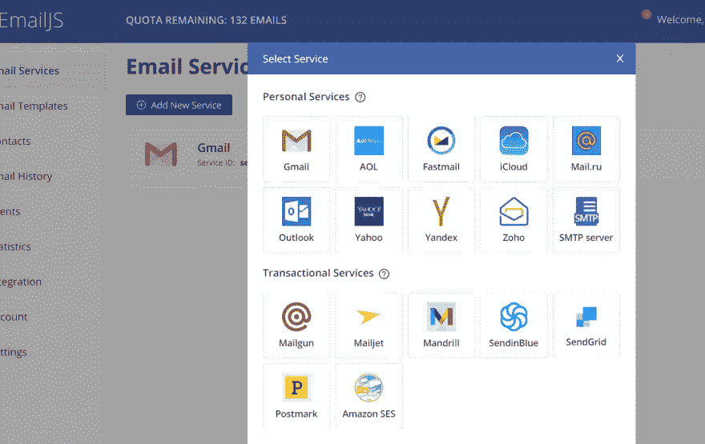
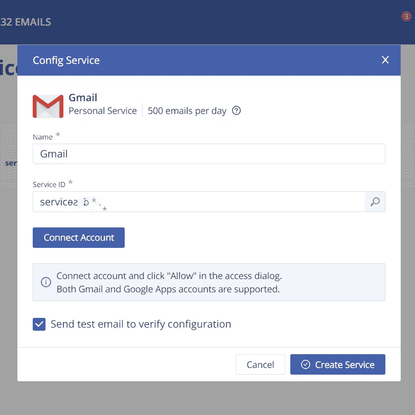

# 如何从 React (EmailJS)中的表单发送电子邮件

> 原文：<https://medium.com/geekculture/how-to-send-emails-from-a-form-in-react-emailjs-6cdd21bb4190?source=collection_archive---------1----------------------->

# 介绍

这篇文章将指导你在 ReactJS(带钩子)中创建一个表单和功能，使我们能够发送电子邮件。我们将使用名为 [EmailJS](https://www.emailjs.com/) 的第三方服务。

Photo by [Maxim Ilyahov](https://unsplash.com/@glvrdru?utm_source=medium&utm_medium=referral) on [Unsplash](https://unsplash.com?utm_source=medium&utm_medium=referral)

# 简单地说，电子邮件

仅使用客户端技术发送电子邮件。**不需要服务器**。

1.  选择一种受支持的电子邮件服务
2.  创建电子邮件模板
3.  使用 JS 库触发电子邮件

# 设置电子邮件

让我们首先[创建一个免费账户](https://dashboard.emailjs.com/sign-up)。现在，我们将进行第一步。简介:我们将选择 Gmail 作为我们的电子邮件服务。

在“电子邮件服务”选项卡上。点击“添加新服务”按钮后，您应该会看到类似上面照片的内容。点击 Gmail(这是我们在这种情况下要用的)。

要将服务与您的 Gmail 帐户连接，请点击“连接帐户”按钮。此外，请记住您的服务 ID，因为我们稍后会用到它。最后，点击“创建服务”并检查您的收件箱，看看您是否收到了测试电子邮件。
懂了吗？厉害！👍

在简介**步骤 2 中。**表示创建模板。让我们现在做那件事。转到侧面菜单上的“电子邮件模板”选项卡，然后单击“创建新模板”按钮。出于测试目的，我们将使用这个默认的。一个**警告**，双花括号中的变量是动态变量，将被我们在方法`emailjs.send`中提供的数据替换，在我们的例子中，是在 React 中。点击“保存”,我们就可以继续了。

## 恭喜，第一部分完成了！🥳

# 反应

我假设你知道如何创建一个反应应用程序。如果不是，检查[这个](https://reactjs.org/docs/create-a-new-react-app.html)出来。

让我们安装 emailjs 包。
`npm i emailjs-com`

现在，我们导入它(获取[用户 ID](https://dashboard.emailjs.com/admin/integration) )。

现在让我们在 div 中创建表单。应用

太棒了，我们继续。现在，您的应用程序组件应该如下所示:

你看，我们使用了`useState()`钩子，让你可以给函数组件添加反应状态。**我们使用与 emailjs 模板中的动态实例名称相同的“toSend”对象来初始化状态。**我们还创建了两个用于操作表单数据的方法。`handleChange`更新状态，`onSubmit`处理提交；通过`emailjs.send`发送数据，这是我们马上要实现的方法。

这就是`onSubmit`应该有的样子:

请添加您可以在 emailjs 仪表板上找到的`send`方法中所需的唯一 id。

好吧，这里什么都没有…

运行那个应用程序(`npm start`)。填写表格并点击提交。
查看您的 Gmail 收件箱。
懂了吗？

恭喜你。你真棒！🥳

希望你觉得我的帖子有用！非常感谢任何反馈！

> ***如果你喜欢这篇文章，你可能会喜欢我的其他相关文章***

*   [**是编码还是无聊**](/geekculture/is-coding-fun-or-boring-5ff4d99df6af)
*   [**软件工程师的 11 大生产力技巧**](/geekculture/the-top-11-productivity-tips-for-software-engineers-5e58ddb5aaa)
*   [**这些 NPM 的招数会让你成为一个高手**](https://javascript.plainenglish.io/these-npm-tricks-will-make-you-a-pro-1373e7fd34f7)