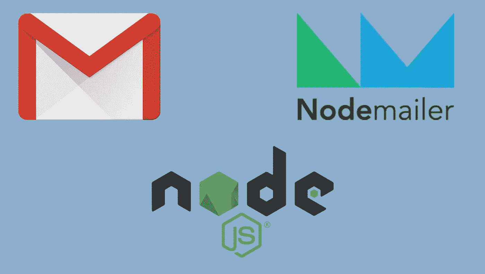
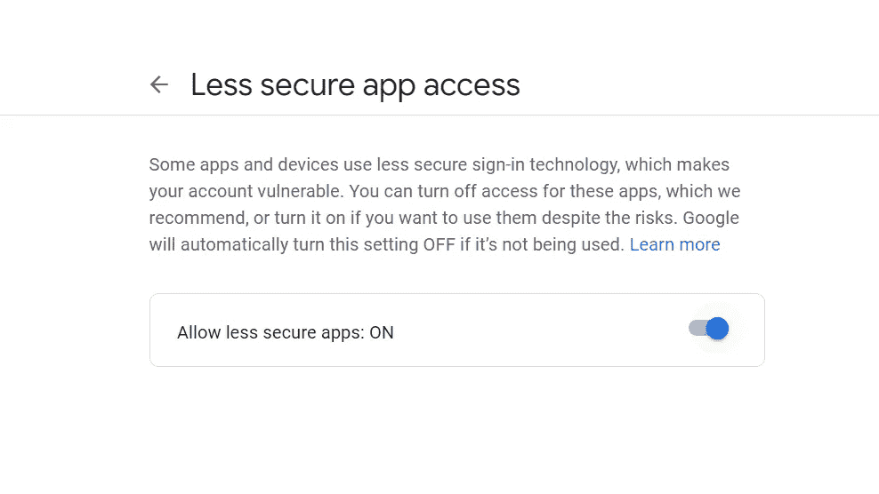

# 如何使用 Gmail 从 Node.js 服务器发送邮件？

> 原文：<https://medium.com/geekculture/how-to-send-emails-from-node-js-server-using-gmail-a34d3514a38d?source=collection_archive---------17----------------------->



在现实生活中，我们可能会收到来自我们使用的某些网站的电子邮件，作为验证或通知。当我们经历它的时候，我们可能不会想这些事情是如何发生的，因为这种机制在今天已经不是什么大事了。但是，当谈到我们是否能够实施这样一种机制时，我们就会开始挠头。但是你再也不用担心了，在这里我将展示如何使用 Gmail 和 Nodemailer 从 Node.js 服务器发送电子邮件。Nodemailer 是一个 npm 模块，帮助我们轻松地从 Nodejs 应用程序发送电子邮件。

所以让我们开始…

首先，您必须使用“npm i nodemailer”命令在您的应用程序中安装“nodemailer”模块。然后，您必须使用 require 关键字将它传递给一个变量。

```
let nodemailer = require('nodemailer');
```

此后，我们必须初始化一个传输服务对象，该对象保存我们将要使用的电子邮件服务的详细信息，以及我们将要发送邮件的邮件地址的帐户凭证。在这里，我将使用 Gmail。

```
let transporter = nodemailer.createTransport({

    service:'gmail',
    auth: {
        user: 'sender@gmail.com',
        pass: 'password'
    }
});
```

现在，我们必须为消息配置初始化另一个对象，该对象由发送者地址、接收者地址和我们将要发送的消息的细节组成。如果你愿意，你甚至可以在这个对象中添加更多的字段(参考链接 [**这里**](https://nodemailer.com/message/) )。为了让你容易理解，我尽量保持简单。

```
let mailOptions = {
    from: 'sender@gmail.com',
    to: 'reciever@gmail.com',
    subject: 'subject',
    text: 'The message'
};
```

好了，现在我们都准备好做最后的工作了，那就是发送邮件。

```
transporter.sendMail(mailOptions,(error,info)=>{
    if (error) {
        ***console***.log(error);
    } else {
        ***console***.log('Email sent: ' + info.response);
    }
});
```

为此，我们必须调用这个 nodemailer 的传输服务的一个内置函数，我将它命名为 **transporter** ，并传递消息配置对象( **mailOptions** )和一个回调函数作为参数来通知事务的错误或成功。

如果你在这一步之前遵循了我提到的所有内容，那么你现在可以运行你的文件了。不幸的是，由于谷歌的安全政策，你会在控制台上看到一个错误。谷歌制定了一项安全政策，如果有任何不符合他们预期的安全标准的第三方来源试图登录该帐户，那么它将不允许从这些来源登录，因此它会自动阻止用户登录。在这里，如果您查看 transporter 对象，它由运行我们的文件时将用于登录的帐户凭证组成。

因此，为了阻止这种屏蔽，我们必须允许不安全的应用程序访问我们的 Gmail 帐户。你可以通过点击**链接**和进行必要的修改，如下所示。现在，如果你运行你的 js 文件，它应该能够运行没有任何错误，你的邮件应该成功地到达收件人的地址。



这个安全事实可能听起来很吓人，或者让你觉得不安全。如果您担心使用自己的帐户进行此操作，那么您可以创建另一个没有您个人详细信息的 Gmail 帐户，并使用其凭据，而不是使用您的个人帐户。不管怎样，这取决于你。所以尝试一下吧，祝一切顺利。