# 如何使用 Express.js 的 GET、POST、PUT、DELETE 和 Fetch 发送表单数据

> 原文：<https://medium.com/geekculture/how-to-send-forms-data-with-fetch-using-get-post-put-delete-and-catching-with-express-js-bfdb85b99709?source=collection_archive---------2----------------------->


又见面了。很抱歉延迟了，但这是很好的信息，它有太多的数据要分析，但它是值得的，我们将使用 GET，POST，PUT，DELETE 和 fetch 方法，最棒的是，我们将使用 Express.js 捕捉所有数据，这太棒了！[我来分享一下代码](https://github.com/rodrigofigueroa/formsexpress)。

YouTube 上的视频
-目录
-NPM
-结构
-Express.js 服务器
-GET 请求方法
-POST 请求方法
-POST 请求方法使用 Fetch
-PUT 请求方法使用 Fetch
-DELETE 请求方法使用 Fetch
-结论

如果你愿意，你也可以看！！

# 创建目录

在这里您可以添加包 JSON 和 node_modules、视图、布局和我们的 JavaScript 文件。

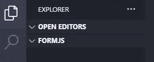

Example Directory

我创建了一个目录调用 formjs，你可以随便叫它什么，但是你需要一个你只需要这个项目的目录。

# 启动包 JSON

您需要运行这个命令来初始化 JSON 包，然后我们就可以开始安装包了。

```
npm init -y
```

这个命令将创建我们的包 JSON

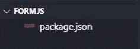

Create Package JSON

# 安装依赖项

我们需要安装快速和快速把手，使我们的服务器动态。

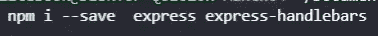

Example install dependencies

运行以下命令

```
npm i --save express express-handlebars
```

使用这些命令，我们实际上添加了 express 和 express handlebars，我们将使用它们记住**express-handler 在 6.0.2 之后，您需要调用引擎，而不是保存在变量上。**

# 结构

结构很简单，只需创建一个目录调用视图，在里面，我们需要创建布局，并添加所有的视图和布局，我们需要为该项目，在这种情况下，主页，表单，404，500，主，谢谢，这就是现在所有的。

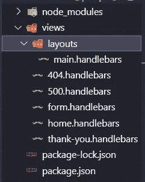

Example structure handlebars

然后，我们需要向每个视图和主视图添加信息

到主页(布局)

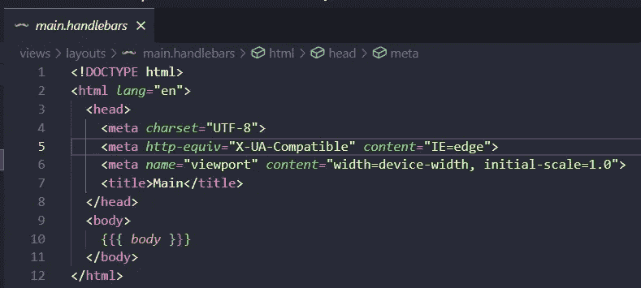

Example adding information to the main layout page

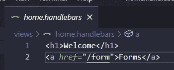

Example adding information to the Home view

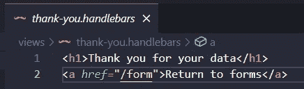

Example adding information to the thank-you view

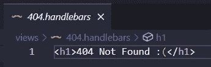

Example adding information to the 404 view


Example adding information to the 500 view

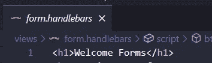

Example adding information to the Form view

请记住，在表单视图中，我们将添加更多信息以及表单和脚本来发送数据，现在添加 h1 是可以的。

# 创建 Express.js 服务器

然后，我们需要创建我们的 Express.js 服务器，我们开始添加变量并保存 Express、express-handlebars、port，之后我们需要添加引擎并设置服务器的视图，之后我们需要处理页面的请求客户端(在这种情况下为 home、form 和 thank you)并呈现其各自的视图。

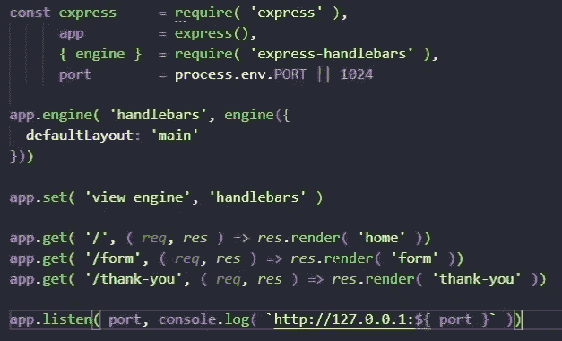

Example to create simple server with Express.js

如您所见，我们将引擎添加到手柄和默认布局(main ),然后我们指定引擎(在本例中为手柄),然后我们接受请求并更改为用户需要的渲染视图，最后，我们使用 app.listen 监听请求，在本例中服务器位于 [http://127.0.0.1:1024](http://127.0.0.1:1024) 上。

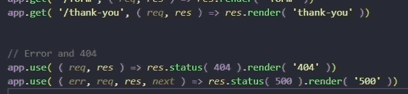

Example 404 and 500 views

我们不要忘记 404 和 500 服务器错误视图。

# 获取请求方法

在本例中，我们将从服务器获取所有用户。

让我们打开我们的 server.js 文件并创建一个名为 users 的变量，它将是一个对象(USERS)数组

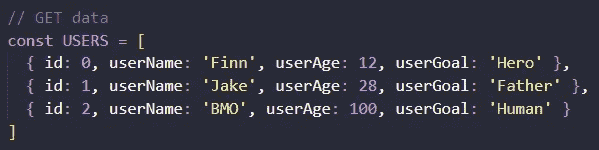

Example variable Users inside our server.js file

之后，我们需要创建对客户端的响应，添加 URL 和带有请求和响应参数的函数，它将以 JSON 格式响应用户。

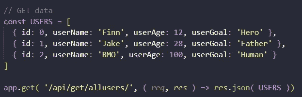

Example complete for GET, response USERS

然后，我们应该转到表单视图，添加 id 为“users”的 ul、id 为“getUsr”的 li 和 button HTML 标记，这样我们就可以开始了

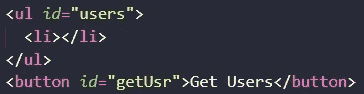

Example adding tags to our form view

然后我们创建一个脚本文件，我们将在其中添加所有的 JavaScript 和 fetch 方法来发送和获取数据，在本例中是获取数据。

将 ul 和按钮保存到一个变量中，如果需要，可以调用 ul 和 btn

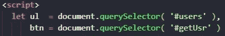

Example variable ul and btn saving tags

要将用户添加到我们的 ul 中，我们需要使用 fetch，但我们需要向按钮添加 eventListener，使用 preventDefault 刷新页面，并使用 get 服务器的 URL 调用 fetch 方法，我们可以在那里获取用户，因为 fetch use 承诺我们使用 then 方法返回服务器给我们的 JSON 格式的数据，最后我们使用 innerHTML 添加来自服务器的所有用户，并使用 join 方法连接所有字符串。

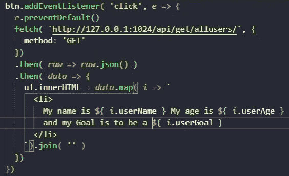

Example btn click event and geting all the users from the server and print in on the ul

从服务器获取用户的结果，我们可以看到我们将服务器中的所有用户添加到我们的 ul 和 li 标记中

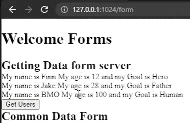

Example result get all the users from the server with GET

# 发布请求方法

首先，要发出 POST 请求，我们需要在 server.js 文件中创建方法。

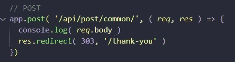

Example POST method with function and request and response parameters

现在，因为在本例中，我们将使用 formData 帖子，如[我的上一篇帖子](/geekculture/how-to-send-data-from-a-form-and-receive-it-with-express-js-3c03af6275b2)，但我们将更改一些内容，我们需要指定 URL，我们可以推送到用户数组，但这是为了下一个示例，在本例中，我们将把它发送到感谢页面。

让我们为表单视图创建表单

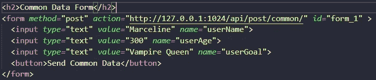

Example POST data with FormData

我们创建表单，将方法 post、action 等属性添加到 POST URL 和 id 中，在这种情况下，与我们在 server.js 文件中编写的相同，然后我们需要将名称添加到每个输入中，因为这非常重要，服务器知道确切的信息和值。

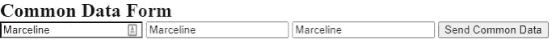

Example common form data page view

但是如果我们点击发送公共数据按钮，我们将一无所获:(

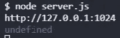

Example output console log after the POST

**为什么！这真的很重要，伙计们！因为 Node.js 使用中间件，我们实际上需要给我们的 server.js 文件添加一个中间件**

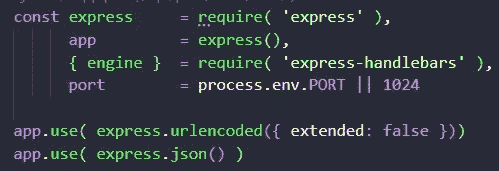

Example adding Middlewares to our server.js file

在我们的服务器变量之后，我们需要添加这个中间件，第一个是简单的文本数据请求( **x-www-form-urlencoded)** ，第二个是发送 JSON 数据( **application/json** )，在这种情况下，Express.js 知道发送给客户端的是什么类型的数据，我们可以捕获它！

添加它们并重新运行我们的 server.js，点击按钮就酷了！

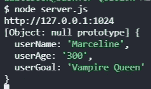

Example output server.js and data from Form

# 使用 Fetch 的 POST 请求方法

然后我们将使用 Fetch 方法。首先，我们需要在 server.js 文件中创建 POST 方法，在这种情况下，我们将保存用户


Example POST method in our server.js file with push to the USERS Array

这是我们将新用户推送到我们的用户数组的时候。首先，我们需要用一个 try 和 catch 语句开始，这样我们就可以在服务器失败时保存服务器。其次，我们用 find 方法开始一个微小的验证来搜索用户名(我们可以添加更多的验证，但现在这很好)。添加一个 if 语句，如果存在，它将向用户发送用户存在的消息， 如果没有，它将循环搜索正确的 id，我们需要使用 Object.assign 将{ id: n }连接到 req.body 对象，并通过这个 pushin 到 USERS 数组，并在响应中返回一个 JSON，带有 success: true，如果有任何问题，它将捕获它并向用户发送错误，我们可以稍后管理该错误。

让我们转到 form 视图，克隆我们的最后一个表单，但是改变 id 并删除方法和动作。

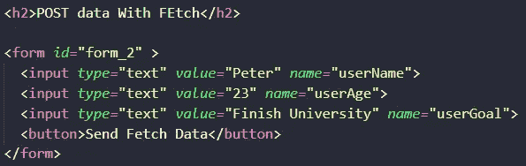

Example creating form to the form view

让我们创建我们的脚本，我们需要添加一个变量 fm2 并保存表单标签

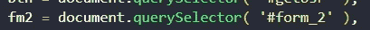

Example saving the form_2 to the fm2 variable

首先，我们需要向 fm2 添加一个 eventListener，而不是 click，我们使用 submit，然后添加 preventDefault 方法来停止页面的刷新，并创建一个常量变量 call o 和 empty object，在这里我们可以使用 FormData 的对象添加表单中的所有名称和值，其次，我们需要启动 fetch 方法并添加来自 POST 服务器的 URL，我们必须指定方法， 头并添加主体，在这种情况下是 POST，“Content-Type”:“application/json”和 stringify o 对象，添加一个然后接收原始数据，然后将其转换为 JSON 并将数据发送到控制台。

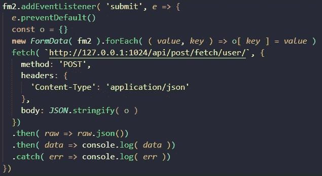

Example send POST data with fetch and with the submit of the Form

我们可以看到它正在向我们的服务器发送数据，不要忘记添加 JSON 中间件！

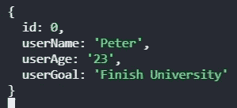

Example server’s output from client

让我们再次单击 Get Users 按钮，我们将从服务器中获得新用户，这真是太棒了！

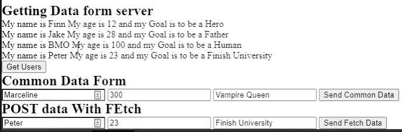

Example form view POST user and get all users again

# 使用 Fetch 的 PUT 请求方法

使用 put 请求，我们可以从我们的 USERS 数组中更新用户，首先我们需要将 PUT 方法添加到我们的应用程序(服务器)server.js 文件中，但是要搜索正确的用户，我们需要使用 **req.params.id** 在这种情况下，我们将再次使用 find 方法来搜索用户，如果找到用户，我们可以更新用户的姓名、年龄， 这取决于客户端的信息，这就是为什么我们添加 if 语句来检查是否存在，如果不存在，则响应为状态 404 找不到用户，这对于添加:id 很重要，因为我们需要指定将被更新的用户的 id。

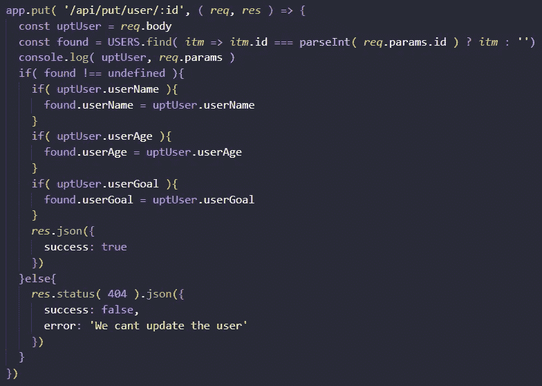

Example put method in our server,js file updating the user

让我们创建表单来更新我们的用户


Example create update form from form view

然后让我们创建脚本，它与 POST 脚本几乎相同，我们只需要更改 PUT 方法和 URL，因为在这种情况下，我们需要指定用户的 id，并添加到 URL 以匹配我们需要更新的用户。

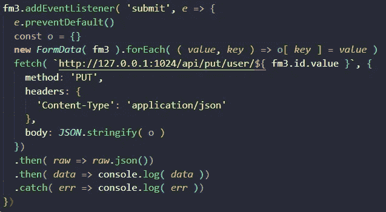

Example script to update the user with fetch

让我们将 Jake 的用户更新为 Flame Princess，我们需要再次单击 get Users 并查看发生了什么，我们可以看到我们正确地看到了更改。

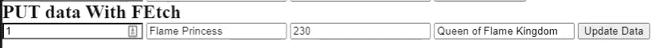

Example update the user with fetch form view

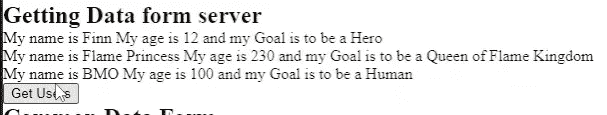

Example update succesfully

# 使用 Fetch 删除请求方法

最后，我们有删除请求方法，我们需要在我们的 server.js 文件上创建它。对于此方法，我们只需要使用 findIndex 方法与 req.params.id 进行比较，以匹配将要删除的用户，然后如果它存在，我们只需使用 splice 创建一个 if 语句来删除它，如果不存在，我们返回响应，告诉我们找不到用户 404 not found。

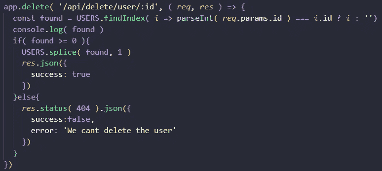

Example create request DELETE method in our server.js file

其次，让我们创建一个按钮，只需单击一下就可以删除每个用户，为此，我们必须对表单视图脚本中的 GET 请求方法稍作修改， 但首先，我们需要在用户信息之后添加一个按钮，并且 data-delete 等于用户的 id，因为这样我们可以调用 addEventListener 来获取和删除用户，因为我们只需要更改方法来删除，然后我们需要使用 e.target.dataset.delete 将用户的 id 也添加到 URL，这样它将删除特定的用户。

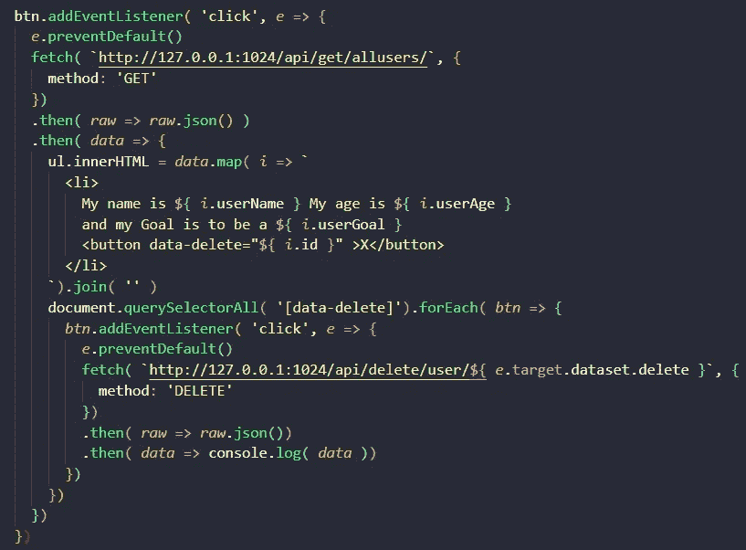

Example adding button to the GET user and adding fetch method to delete it

检查删除请求方法

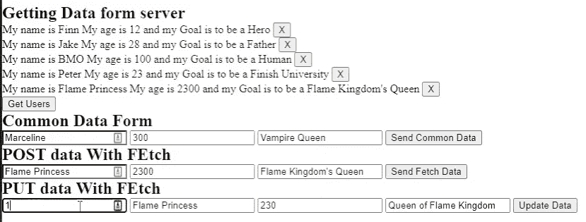

Example adding more users

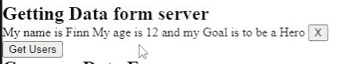

Example Deleting all users with the DELETE request method

看起来棒极了！

# 结论

总之，这些例子真的很棒！因为它们展示了创建、更新、删除和从服务器获取用户的常用方法，使用 fetch 是因为它非常有用，我们需要指定一些配置，但我们可以捕捉错误，并保证使用起来更整洁，对我来说很神奇，因为我正在学习 Node.js 和 Express.js 的许多新东西，使用它我们可以增强验证或与 Mongodb 混合，但现在我们如何使用这个小示例来创建一些令人惊叹的东西真的很神奇！

# 感谢你们的阅读和支持，我真的很高兴有你们！！！

如果你想给我推荐，或者只是说声谢谢或嗨，你可以给我发一条 DM 到我的 [Twitter 账户](https://twitter.com/shadowbeat274)，或者你可以写一条评论。

# 来源

[](https://www.npmjs.com/package/express-handlebars) [## 快速把手

### 一个车把查看引擎的表达，不吸。这个套件过去被命名为 express 3-handlebar。的…

www.npmjs.com](https://www.npmjs.com/package/express-handlebars) [](https://phpenthusiast.com/blog/javascript-fetch-api-tutorial) [## 带有 fetch API | PHPenthusiast 的现代 AJAX

### Fetch 是处理 JavaScript 时执行 AJAX 的现代方式。而不是编写繁琐的 AJAX 代码或使用…

phpenthusiast.com](https://phpenthusiast.com/blog/javascript-fetch-api-tutorial) [](https://javascript.info/fetch) [## 取得

### 编辑描述

javascript.info](https://javascript.info/fetch) [](https://www.amazon.com/Web-Development-Node-Express-Leveraging/dp/1492053511/ref=sr_1_19?__mk_es_MX=%C3%85M%C3%85%C5%BD%C3%95%C3%91&keywords=node.js+express.js&qid=1639443417&sr=8-19) [## 使用 Node 和 Express 进行 Web 开发:利用 JavaScript 堆栈

### 使用 Node 和 Express 进行 Web 开发:利用 Amazon.com 的 JavaScript 堆栈。*免费*送货到…

www.amazon.com](https://www.amazon.com/Web-Development-Node-Express-Leveraging/dp/1492053511/ref=sr_1_19?__mk_es_MX=%C3%85M%C3%85%C5%BD%C3%95%C3%91&keywords=node.js+express.js&qid=1639443417&sr=8-19) [](https://github.com/rodrigofigueroa/formsexpress) [## GitHub-rodrigofigeroa/forms express

### 此时您不能执行该操作。您已使用另一个标签页或窗口登录。您已在另一个选项卡中注销，或者…

github.com](https://github.com/rodrigofigueroa/formsexpress) 

[视频](https://www.youtube.com/watch?v=1cjdlfB11Ss)

[](https://stackoverflow.com/questions/26723467/postman-chrome-what-is-the-difference-between-form-data-x-www-form-urlencoded) [## postman Chrome:form-data，x-www-form-urlencoded 和 raw 有什么区别

### 注意。请参考 RFC2388 以获得更多关于文件上传的信息，包括向后兼容性问题…

stackoverflow.com](https://stackoverflow.com/questions/26723467/postman-chrome-what-is-the-difference-between-form-data-x-www-form-urlencoded)