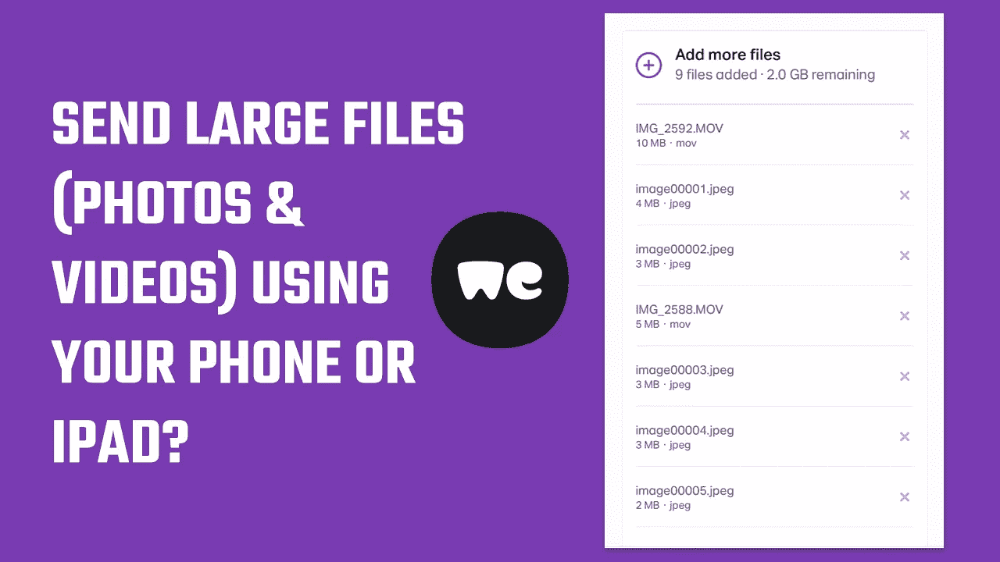

# 如何使用手机或 iPad 发送大文件、照片和视频？

> 原文：<https://medium.com/geekculture/how-to-send-large-files-photos-and-videos-using-your-phone-or-ipad-46a72a19618?source=collection_archive---------25----------------------->

附上大文件并获得访问这些文件的链接

你是否正在尝试使用手机或 iPad 发送大文件、照片和视频，但电子邮件的大小有限制？好吧，如果是的话，那么这里是如何你可以免费发送高达 2GB 的文件，你不需要安装任何应用程序。你所要做的就是上传…