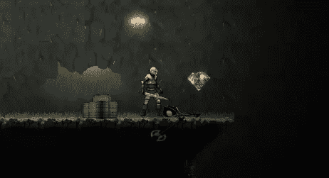

# 如何在 Unity 中建立一个简单的掉落系统

> 原文：<https://medium.com/geekculture/how-to-set-up-a-simple-drop-loot-system-in-unity-aee63a4127f8?source=collection_archive---------6----------------------->

## 来自我的 2D 项目的几行代码，但是逻辑可以被抽象

目标:建立一个掉落和掠夺系统，以及一个简单的基本物品清单

为了开始建立这种游戏机制，我们应该做一些设计。我们需要:

1.  至少有一个可删除的项目，与脚本…