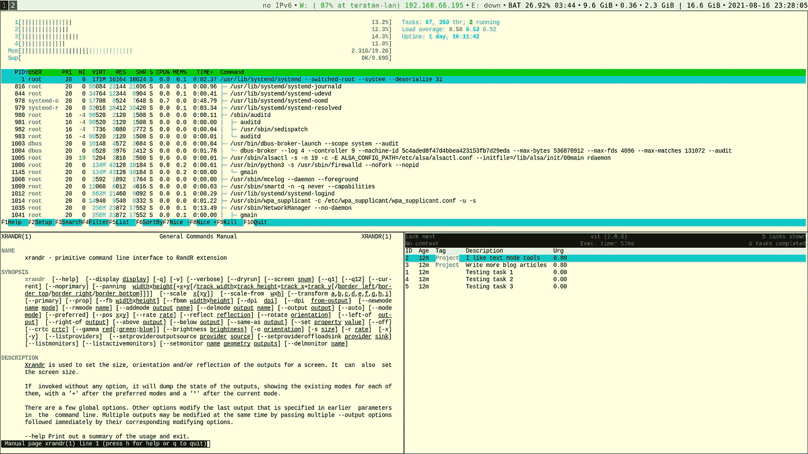
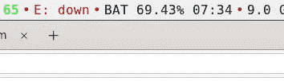
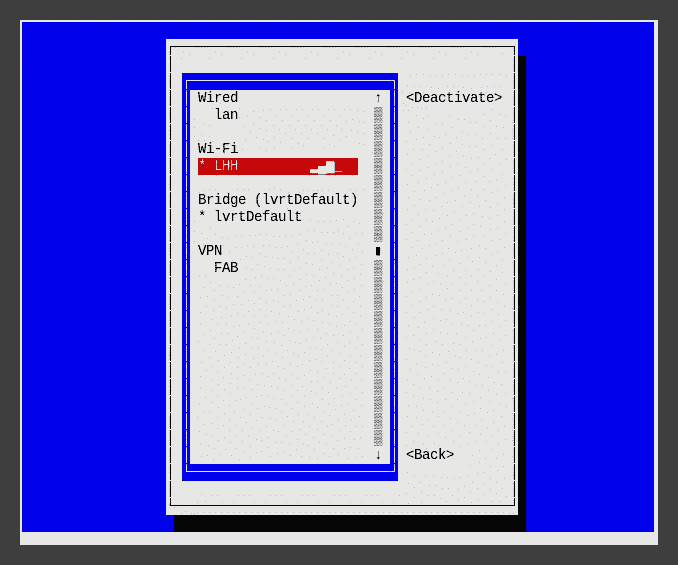
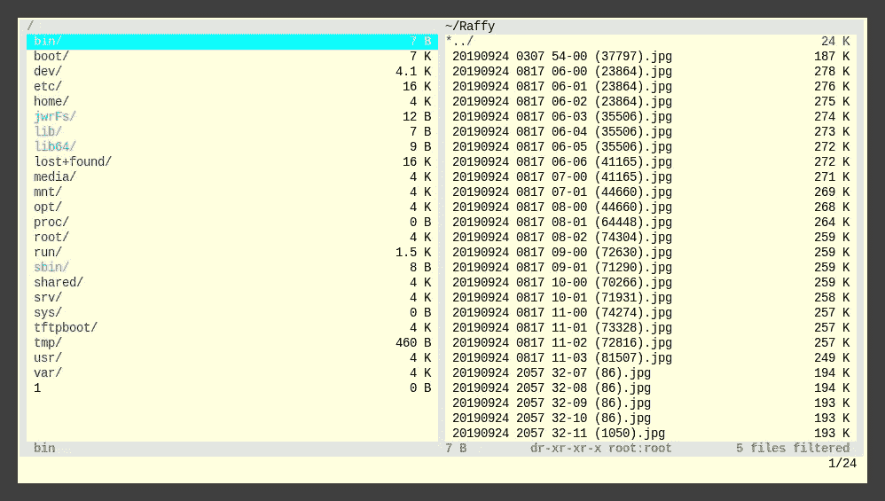
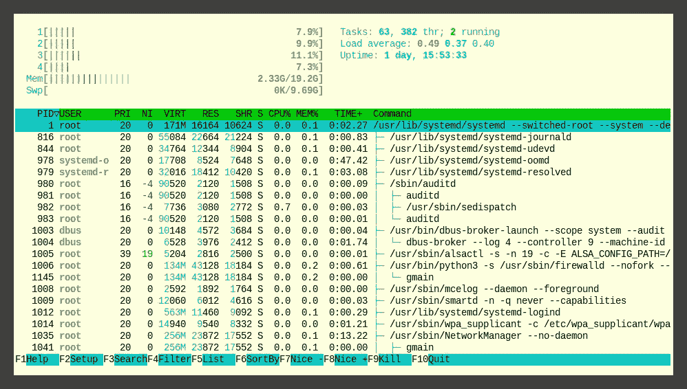
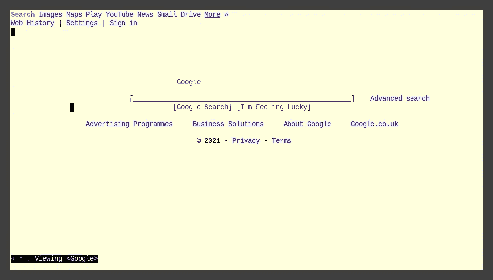
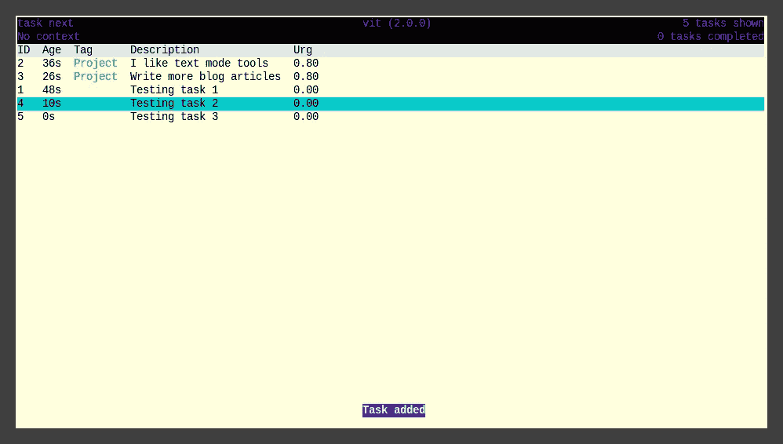
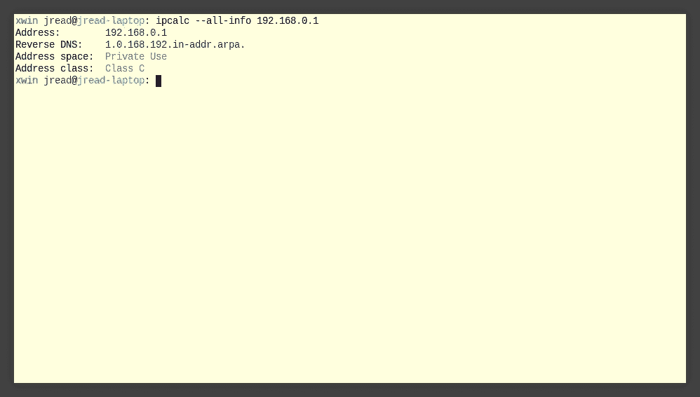

# 如何设置纯文本模式的 Linux 桌面

> 原文：<https://medium.com/geekculture/how-to-set-up-a-text-mode-only-linux-desktop-8d2c84f4205e?source=collection_archive---------9----------------------->

你可以成为命令行英雄。



众所周知，Linux 拥有一套强大的命令行工具。鲜为人知的是，大多数图形工具实际上只是运行命令行工具，或者在幕后编辑纯文本文件。那么，有没有可能在完全没有任何真正的图形工具的情况下运行一个完整的 Linux 桌面呢？仅文本模式/命令行(CLI)？

# 但是，为什么呢？你不就是用命令行(CLI)来“炫酷”的吗？

我并不是建议你用 tty 运行你的 Linux 桌面——我不是一个疯子。我确实运行一个 X 图形环境。

同样，我也想澄清一点——CLI 并不比 GUI“更好”。

我选择每天通过命令行做大多数事情。这并没有让我变得更好。这并不意味着我是一个精英黑客。不，我这样做不是为了吹牛，也不是为了装酷。如果你想运行一个完整的 gnome 或 KDE shell，请这样做，不要难过。我在 KDE 经营了很多年。我真的甚至没有建议你**应该**只使用 CLI，只是说，这是我怎么做的，你也可以。

我发现通过命令行做桌面上的事情比使用 GUI 要快一点，但是这需要大量的时间投入，可能不会让你的生产力得到明显的提高。一个好处是 CLI 很少改变——所以一旦你学会了它们，你就万事俱备了。

# **笔记本电脑电池状态—“acpi-I”**

我的 i3bar 确实有一个简短的电池状态指示器——这是默认配置。看起来是这样的；



然而，这些信息只是来自 acpi，我经常手动运行它——我的笔记本电脑有两块电池；

```
user@host: **acpi -i**
Battery 0: Unknown, 79%
Battery 0: design capacity 1943 mAh, last full capacity 1403 mAh = 72%
Battery 1: Discharging, 73%, 05:15:24 remaining
Battery 1: design capacity 6042 mAh, last full capacity 6042 mAh = 100%
```

# Wifi —网络管理器和 nmtui

几年前，NetworkManager 刚开始让我感到沮丧，但它真的非常强大，非常方便。网络管理器的文本用户界面(`nmtui`)也是一个快速和厚脸皮的界面，当你不想或不能使用图形用户界面。



如果我知道我正在连接的网络，我只需运行 nmcli

```
user@host: **nmcli c up "teratan-lan" --ask**
```

# 管理多台显示器— `xrandr`

在我尝试之前，我确实发现用一个命令行工具管理 4 台显示器是一件令人生畏的事情。但是，仅仅过了一两分钟，其实就很直观了。

```
user@host: **xrandr --output VGA --mode 1024x768**
```

或者；

```
user@host: **xrandr --output LVDS --auto --output VGA --auto -right-of LVDS**
```

# 文件管理器— vifm

我是 vim 的超级粉丝，使用类似 vim 的工具，比如`vi`文件管理器- `vifm`感觉像是一个非常高效的时间节省器。



vifm — [https://vifm.info/](https://vifm.info/)

# 任务管理器— htop

htop 是众所周知的，也是许多管理员通过 SSH 连接使用的工具。虽然您可以选择用鼠标来使用它，但您也可以轻松地对列进行排序，切换 treeview，并快速打开许多高级选项。很容易发现，恼人的进程使用了大量的 CPU。



# 网络浏览器— `w3m`

我使用 Firefox——因为我喜欢它。然而，如果你觉得自己很有男子气概，并且想证明些什么，你可以使用 w3m 浏览网页。



然而，仅仅因为你能，并不意味着你应该…

# 任务跟踪— vit

vit 是一个命令行客户端，其工作方式类似于 vim，并实现了 TaskWarrior 任务规范。它非常快速和轻便，我用它来跟踪我所有的工作待办事项。



# IP 计算

直到前几天我才知道这个工具的存在。`ipcalc`是在线子网计算器网页的一种快速简便的替代方式。多了一个工具，我可以只使用命令行版本，谢谢。



# 电子邮件— `mutt`

Mutt 是一个类似 vim 的电子邮件客户端；然而，我还没有足够的勇气离开 gmail 网络邮件，即使它真的变得越来越令人讨厌。