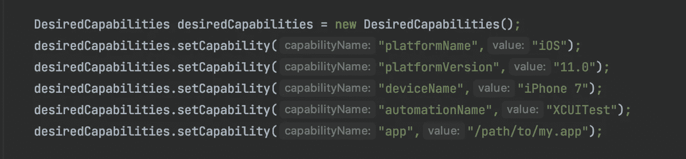
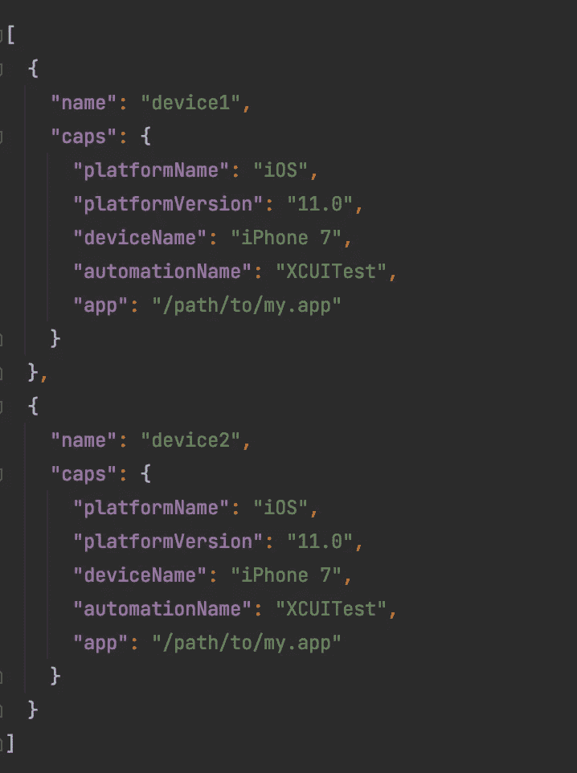
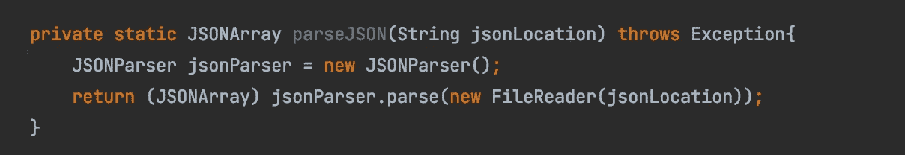
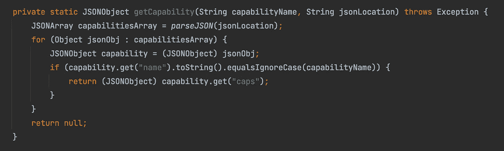
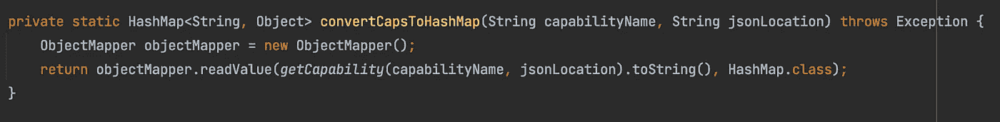
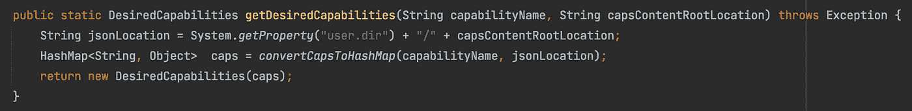
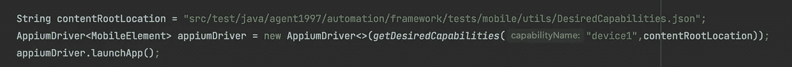
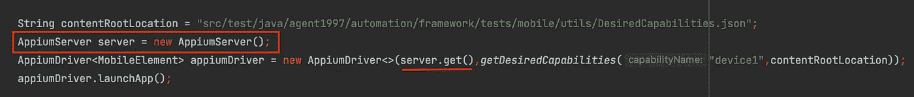

# 如何从 JSON 文件设置 Appium 所需的功能

> 原文：<https://medium.com/geekculture/how-to-set-up-appium-desired-capabilities-from-a-json-file-91b3e0bb16dc?source=collection_archive---------4----------------------->



做事情有很多方法。这同样适用于我们如何为 appium 驱动程序设置我们想要的功能。最简单的方式就像上图。我们创建一个 DesiredCapabilities 对象，并使用 ***setCapability()*** 方法为 appium 驱动程序设置我们想要的功能。或者，如果您有多组所需的功能，您可以将它们放在一个方法中，并将它们合并到一个类中。无论我们如何去做，我们最终的目标都是建立我们想要的能力。每种方法都可行，但我只想分享我和其他人是如何做到的。



Desired Capabilities

上图是我们的 JSON 文件的样子。它是 JSON 对象的数组。每个对象都有两个键， ***名称*** 和 ***大写*** 。 ***name*** 的值将用于标识要使用的所需功能，而 ***caps*** 的值将是另一个 JSON 对象，包含我们所需功能的实际键/值对。

下面是我们从 JSON 文件中读取和设置所需功能的步骤。

1.  读取并解析我们的 JSON 文件。
2.  根据 ***名称*** 得到*大写* 的值。
3.  将***caps***JSON object 转换为 string，然后将其映射到 HashMap。
4.  我们使用 HashMap 创建 DesiredCapabilities 对象。

下面是实现上述步骤的代码。我有意移除了异常处理，只是在方法签名中抛出一个异常来简化方法。如果您决定处理这些异常，您的方法可能看起来有所不同。

**读取并解析 JSON 文件**



为了解析我们的 JSON，我们将使用 com.googlecode.json-simple 提供的 JSONParser 类。关于如何将它添加到您的项目中，只需查看他们的 [maven 资源库](https://mvnrepository.com/artifact/com.googlecode.json-simple/json-simple)。 **JSONParser** 的 **parse()** 方法可以接受一个类型为 **Reader** 的对象。根据我们的面向对象概念，我们知道 **FileReader** 是一个 **Reader** ，所以我们可以将 **FileReader** 的一个实例传递给 **parse()** 方法。 **FileReader** 将负责读取我们的 JSON 文件，我们只需要确保将正确的路径传递到文件的位置。 **parse()** 方法将进行解析，并将解析后的值作为**对象**返回。因为我们知道文件的内容是一个数组，所以我们需要将那个**对象**转换成一个 **JSONArray** 以便我们能够访问它的方法，我们将使用它来处理我们的数据。出于异常处理的目的，请注意 **FileReader** 可能会抛出 **FileNotFoundException** ， **parse()** 方法可能会抛出 **IOException** 或 **ParseException** 。

**根据*名称*** 获取 *caps* 的值



这就是**的 getCapability()** 方法。我们传递想要使用的功能的名称和 JSON 文件的位置。直截了当的方法。我们使用了上面讨论的 **parseJSON()** 方法。我们知道该文件包含一个对象数组，所以我们需要做的就是迭代每个对象，并查看其名称是否与我们想要使用的功能名称相匹配。如果匹配，我们得到 **caps** 的值，并将其作为 **JSONObject** 返回。需要注意的一点是，如果 JSON 不是一个对象数组，比如说数组的数组。对 JSONObject 的强制转换将会产生 ClassCastException。所以要确保你的 JSON 格式正确，就像图片*期望的功能*一样。

**将 *caps* JSONObject 转换为 string 并映射到 HashMap**



将 JSONObject 映射到 HashMap 非常容易，这要感谢 com.fasterxml.jackson.core 的 Jackson Databind 中提供的 ObjectMapper。首先，我们创建一个 ObjectMapper 实例。然后我们使用 **readValue()** 方法将 JSONObject 映射到 HashMap。如果我们看看 ObjectMapper 类， **readValue()** 是一个严重重载的方法，但我们将使用 **readValue(字符串内容，类< T > valueType)。content** 是我们想要映射到 HashMap 的 JSON 值。 **getCapability()** 返回一个 **JSONObject** ，因此为了满足 **readValue()** 的要求，我们将其转换为一个字符串。注意 **getCapability()** 可能会返回一个空值，如果发生这种情况，当调用 **toString()** 时，您会得到一个 **NullPointerException** ，由您来处理这个异常。valueType 是你要将 JSONObject 转换成的类。您可以创建自己的类来建模您的 JSON，但是在这种情况下 HashMap 也可以。然后我们返回包含我们功能的散列表。注意 **readValue()** 可能会抛出**jsonparseeexception**或者 **JsonMappingException** 甚至在一些意外情况下可能会抛出 **IOException** 。

**使用 HashMap 创建 DesiredCapabilities 对象**



这是我们的公共接口，用于从 JSON 文件中获取我们想要使用的功能。我们传递我们想要使用的功能的名称和 JSON 文件的内容根位置。在第一行中，我们只是构造了文件的路径。幸运的是，我们可以使用 HashMap 构造 DesiredCapabilities 对象。因此，在最后一行中，我们通过将 caps 传递给其构造函数，创建并返回了一个新的 DesiredCapabilities 对象。

现在您可以使用这个**getdesiredpabilities()**方法来创建您的 appium 驱动程序。



或者如果你读过我的[如何用 Java](/geekculture/how-to-start-appium-server-programmatically-in-java-2ae2265cde10) 编程启动 Appium 服务器，你可以用这两个来实例化你的 appium 驱动。



这是我们的能力阅读器类的完整代码。

```
import com.fasterxml.jackson.databind.ObjectMapper;
import org.json.simple.JSONArray;
import org.json.simple.JSONObject;
import org.json.simple.parser.JSONParser;
import org.openqa.selenium.remote.DesiredCapabilities;
import java.io.FileReader;
import java.util.HashMap;

public class CapabilitiesReaderSimple {

    private static JSONArray parseJSON(String jsonLocation) throws Exception {
        JSONParser jsonParser = new JSONParser();
        return (JSONArray) jsonParser.parse(new FileReader(jsonLocation));
    }

    private static JSONObject getCapability(String capabilityName, String jsonLocation) throws Exception {
        JSONArray capabilitiesArray = *parseJSON*(jsonLocation);
        for (Object jsonObj : capabilitiesArray) {
            JSONObject capability = (JSONObject) jsonObj;
            if (capability.get("name").toString().equalsIgnoreCase(capabilityName)) {
                return (JSONObject) capability.get("caps");
            }
        }
        return null;
    }

    private static HashMap<String, Object> convertCapsToHashMap(String capabilityName, String jsonLocation) throws Exception {
        ObjectMapper objectMapper = new ObjectMapper();
        return objectMapper.readValue(*getCapability*(capabilityName, jsonLocation).toString(), HashMap.class);
    }

    public static DesiredCapabilities getDesiredCapabilities(String capabilityName, String capsContentRootLocation) throws Exception {
        String jsonLocation = System.*getProperty*("user.dir") + "/" + capsContentRootLocation;
        HashMap<String, Object>  caps = *convertCapsToHashMap*(capabilityName, jsonLocation);
        return new DesiredCapabilities(caps);
    }
}
```

我喜欢这样做的原因是，对我来说，选择我的测试将在哪个设备上运行更容易，尤其是当我在进行并行测试执行时。

所以你有它。对于如何设置您想要的功能，您已经有了另一个想法。还是那句话，做事有很多种方式，你的方式可能更好。

如果你是移动测试自动化的新手，想要探索 appium，但是还没有设置好你的机器，查看这个[如何为测试自动化设置 app ium](/swlh/how-to-set-up-appium-for-test-automation-1d2a4fab1f6a)。

🍻 🍻 🍻