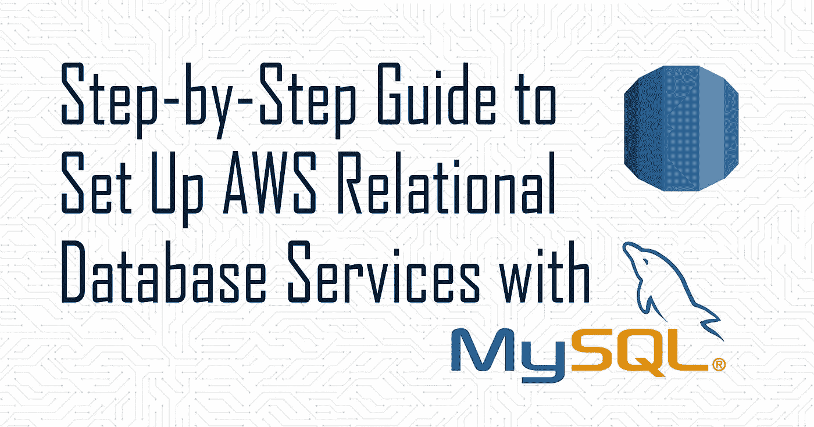

# 如何用 MySQL 设置 AWS 关系数据库服务

> 原文：<https://medium.com/geekculture/how-to-set-up-aws-relational-database-services-with-mysql-9ef526f7ea7e?source=collection_archive---------55----------------------->

大家好！让我们来了解一下亚马逊关系数据库服务(RDS)。这是一款令人惊叹的产品，让您可以在云中设置、扩展和操作关系数据库。在这个循序渐进的教程中，我们将了解如何在 RDS 数据库中建立 MySQL 连接。

# 先决条件

*   了解关系数据库…