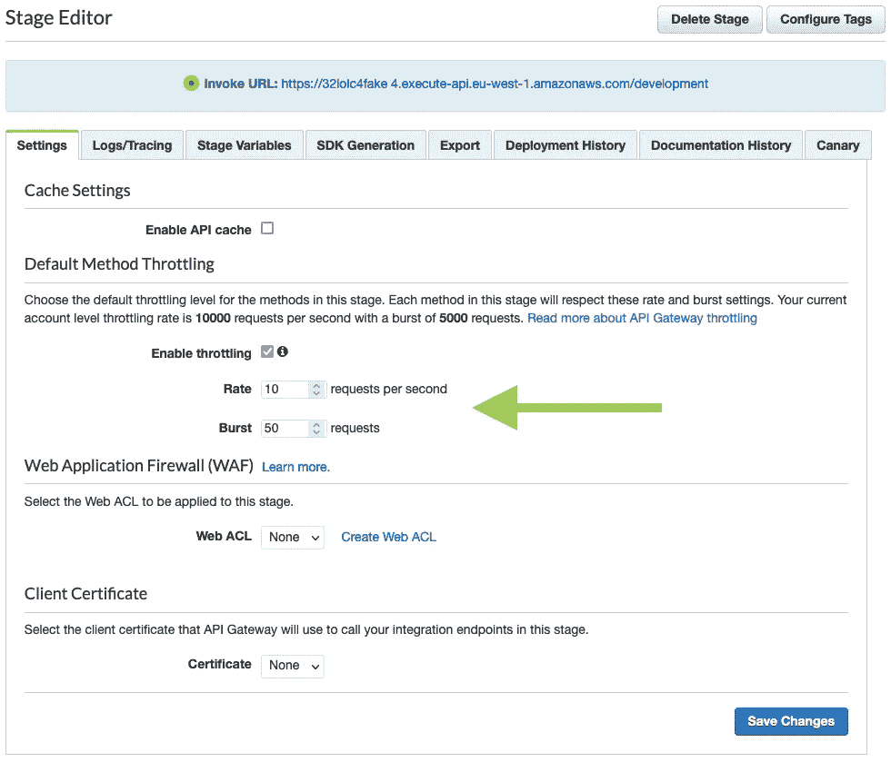

# 如何设置 REST API 的默认速率和突发限制

> 原文：<https://medium.com/geekculture/how-to-set-your-rest-apis-default-rate-burst-throttling-limits-c78508fa3b2b?source=collection_archive---------43----------------------->

## 使用无服务器在没有任何第三方插件的情况下，在 AWS API Gateway REST API 的 Stage 上设置突发和速率限制

Editing a Stage’s default method throttling limits in the AWS API Gateway Console. This is what we want to configure via Serverless.

在本文中，我们将了解如何在 AWS API Gateway REST API 的 Stage 上设置默认的方法突发和速率限制…