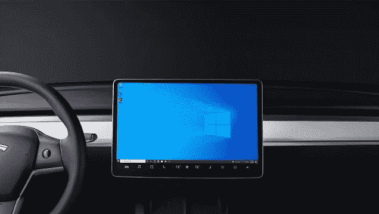
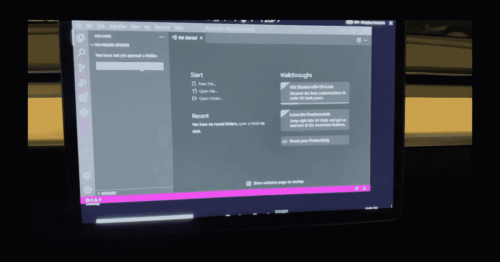
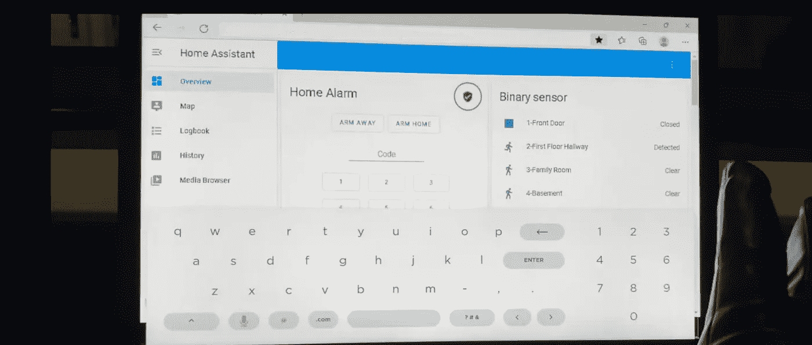

# 如何在 Tesla 上设置 Windows 和 Linux 环境

> 原文：<https://medium.com/geekculture/how-to-setup-a-windows-and-linux-environment-on-a-tesla-6cadc2a120fa?source=collection_archive---------8----------------------->

## 不需要硬件或软件黑客

Image by Author

特斯拉汽车的智能令人难以置信，并将继续革新技术和汽车行业。由于给汽车“加油”容易、环保、节省汽油和维护费用，并且不要忘记汽车的技术丰富功能，电动汽车的增长突飞猛进。虽然汽车本身有很多东西要展示，但如果我告诉你，我找到了一种让 windows 在汽车上运行的方法，而无需任何修改或软件黑客，会怎么样？它只是通过浏览器运行利用鳄梨色拉酱。不，我不是指你的芯片美味的一面，而是指软件的整洁和平，完全开源，相对容易运行。准备好学习了吗？好的，我们开始吧。

在我深入解释这个过程之前，这里有一个简短的视频，展示了它是如何工作的，我将讨论的一些缺点以及需要完成的更多测试。[视频链接此处](https://youtu.be/LRhRPWauFTk)。这里还有[的源代码](https://github.com/satssehgal/Windows_Linux_Guacamole_Tesla)，如果你想跟着做的话。此外，如果你可以点击下面的按钮，这样你就可以及时了解像这篇文章这样的酷文章。好的，我们开始吧

所以让我们来看看我们将如何组织这个项目。

Image by Author

现在有几种方法可以做到这一点，但在我看来，这是最有效和最安全的方法，通过 SSL 和双因素身份验证(2FA)来实现额外的安全性。你可以使用特斯拉的内置浏览器，并访问“abettertheatre.come”来获得全屏使用 firefox 的能力。然后你可以设置你自己的域名(免费版在视频中解释)或者使用付费域名。您将该域指向 cloudflare，这样它就可以窃取您的家庭 IP 地址，因为您不想在互联网上暴露该地址。然后，您的请求将从 cloudflare 发送到您的家中，它将访问一个服务器，在本例中是一个托管鳄梨色拉酱的 raspberry pi。我把鳄梨酱放在 kubernetes 上，但是你根本不需要这么做。你可以在任何设备上安装它。一旦你这样做了，你就可以让你的服务器通过 RDP、VNC 或 SSH 连接到你的电脑。基本上，它将你的 windows 或 linux 电脑虚拟化，然后通过安全连接将响应发送回你的特斯拉。好的，让我们进一步分解这些步骤。

1.  请确保您在特斯拉内置浏览器上标记了“abettertheatre.com ”,以便日后轻松访问。确保你点击全屏模式。
2.  第二次注册免费的 cloudflare 层。当您注册时，它将引导您完成设置说明，将您的域的 DNS 服务器指向 cloudflare。这听起来有点吓人，但是真的很简单。
3.  获得您的域名，如 mytesla.com 或 bobstesla.com 或任何你想要的。有一个网站允许你注册一年的免费域名。说明在上面的视频中，但这里是到站点的[链接。还可以通过 letsencrypt 设置 SSL](http://freenom.com/)
4.  在你的服务器上安装鳄梨色拉酱，它可以是一台旧的笔记本电脑，一个覆盆子或者其他任何东西。我使用 k3s 集群，但它有点大材小用。一个 pi 就可以了。以下是在您选择的任何设备上设置 guacmole 的说明。有太多的设备要涵盖，所以我会粘贴安装的官方链接[在这里](https://guacamole.apache.org/doc/0.8.3/gug/installing-guacamole.html)。
5.  一旦你安装了鳄梨色拉酱，你可以在软件中设置 2FA。然后，您可以添加您的计算机设备，无论是 windows 还是 linux(目前不支持 mac ),并远程访问您的设备。
6.  前往设置和连接，只需填写协议，你想使用的笔记本电脑的 IP 地址和任何认证协议。然后在你意识到之前，你就在一个 windows 设备上，希望用 VS 代码编码

Image by Owner

总而言之，我们实际上是希望通过互联网将我们的家庭计算机虚拟化，并让客户端使用浏览器。这种情况下的客户端是 tesla 浏览器。然而，虽然这听起来很酷，但并不完美。这种设置有一些缺点。

首先。我还没有找到使用键盘和鼠标的方法。如果或者当它被支持的时候，这将几乎消除我随身携带我的笔记本电脑的需要。我可以把车停在海景旁边，拿出我的笔记本电脑，用它在我的 telsa 上工作。然而，它只是还不被支持。

第二个问题是延迟。因此，你不会在你的特斯拉上玩任何 steam 游戏，但如果你想浏览文档甚至编写一点代码，你可以这样做，如果你不介意触摸界面并愿意克服下一个问题的话

第三，当你点击输入字段时，屏幕键盘不会自动填充。你必须不停地提起这件事，过一会儿就会变得有点烦人。

所以总的来说，我可能还是会带着我的 ipad pro 或笔记本电脑在旅途中工作，但能够访问你的家用电脑进行快速参考的新奇感觉非常酷。我的另一个很大的用途是，我有一个快捷方式，可以自动回到我的家，作为家里的助手，这样我就可以直接从我的屏幕上使用我的车库门开关，灯等等。

Image by Owner

你怎么想呢?你认为这有很多用处吗？同样，不要忘记在这里关注我，订阅我的频道。感谢阅读