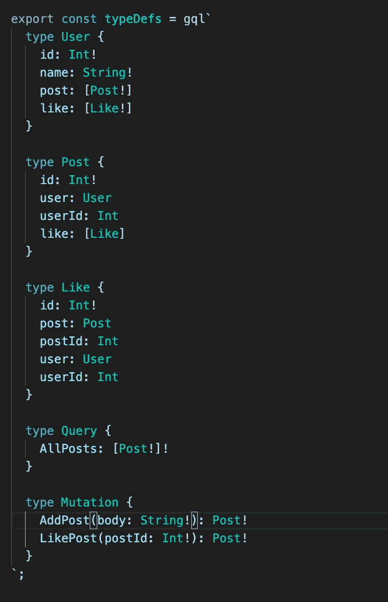
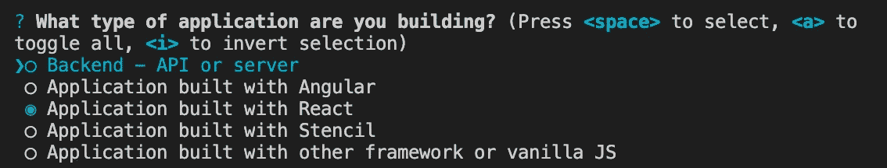
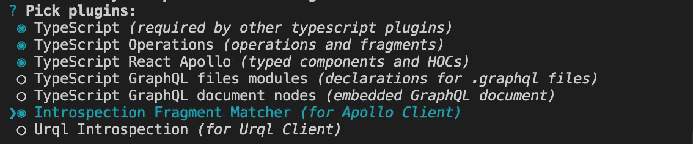

# 如何设置全栈 Apollo，GQL-CodeGen，Prisma 2.0，Typescript，React:第 2 部分—前端

> 原文：<https://medium.com/geekculture/how-to-setup-full-stack-apollo-gql-codegen-prisma-2-0-typescript-react-part-2-the-frontend-caf4e2e871de?source=collection_archive---------14----------------------->


Photo by [Pixabay](https://www.pexels.com/@pixabay?utm_content=attributionCopyText&utm_medium=referral&utm_source=pexels) from [Pexels](https://www.pexels.com/photo/space-rocket-launching-73871/?utm_content=attributionCopyText&utm_medium=referral&utm_source=pexels)

如果您想知道为什么应该遵循本教程，请阅读我以前的文章，其中详细介绍了使用这个堆栈的好处。这是一个高层次的解释，用 gif 展示了工作流的好处。您可以在这里找到它:

(文章有三个标题；" **Apollo VSCode 扩展:确保我们的 API 调用没有错误**(第二)和"**Apollo-Client+graph QL CodeGen:在从 API 发送和接收数据时提供完全的类型安全**(第三)与本教程相关)

[](/geekculture/how-im-developing-my-full-stack-web-app-with-the-guards-up-62ae1a25cf3a) [## 我如何使用 Apollo 和 GraphQL 开发我的全栈 Web 应用程序

### 在这篇文章中，我将分享 Apollo、Typescript、Prisma 2.0 和 GraphQL-codegen 是如何改变游戏的，当它…

medium.com](/geekculture/how-im-developing-my-full-stack-web-app-with-the-guards-up-62ae1a25cf3a) 

如果您不熟悉 Apollo 和 GQL-Codegen，我推荐您阅读我上面的文章，因为使用这个堆栈有一些特定的(非常有益的)特性。这是一个深入的教程，可能不会简洁明了地介绍这些特性，因为我们将在杂草中。

本系列的开始包括设置后端；在这里找到它:

[](/geekculture/how-to-setup-full-stack-apollo-gql-codegen-prisma-2-0-typescript-react-part-1-the-backend-e9eae9518dc9) [## 如何设置全栈 Apollo，GQL-CodeGen，Prisma 2.0，Typescript，React:第 1 部分—后端

### 如何设置 Apollo 服务器、Typescript、Prisma 2.0 和 GraphQL 代码生成器

medium.com](/geekculture/how-to-setup-full-stack-apollo-gql-codegen-prisma-2-0-typescript-react-part-1-the-backend-e9eae9518dc9) 

阅读第 1 部分并不是完全必要的。**如果你只是想学习如何在 Apollo 客户端使用 GraphQL 代码生成器和 Apollo VSCode 扩展，这篇文章也是为你准备的**。你需要知道的是 GraphQL、Typescript 和 React(钩子)。此外，如果你从未见过 Apollo 客户端，我会解释代码是做什么的，但你肯定需要继续学习这里的文档:

[](https://www.apollographql.com/docs/react/) [## 阿波罗客户端简介

### 将 Apollo GraphQL 客户端与 React 一起使用的指南

www.apollographql.com](https://www.apollographql.com/docs/react/) 

对于本教程，您还需要一个正在运行的 GraphQL 端点。我将使用我在第 1 部分中设置的内容，但是如果没有，请确保将任何相关的 web 地址(例如，将 http://localhost:4000 更改为 api.website.com/graphql)更改为您的端点所在的位置。

请注意，当我提到“查询”时，我指的是查询和突变。我不认为频繁阅读“查询和突变”是令人愉快的。

在此处查找项目代码:

[https://github . com/kieronjmckenna/Apollo-prisma-typescript-tutorial . git](https://github.com/kieronjmckenna/apollo-prisma-typescript-tutorial.git)

# 项目设置

我将把 React 应用程序放在我开始的同一个项目中，这样它看起来就像这样

```
- apollo-prisma-typescript-tutorial
  - backend (already created)
  - frontend
```

但是，不克隆后端回购，直接开始也同样容易。尽管如此，我们还是开始吧。运行这个(如果您是从这篇文章开始，请跳过):

```
git clone [https://github.com/kieronjmckenna/apollo-prisma-typescript-tutorial.git](https://github.com/kieronjmckenna/apollo-prisma-typescript-tutorial.git)
```

在根目录中，运行

```
yarn create react-app frontend --template typescript && cd frontend
```

然后安装您的依赖项

```
yarn add react-router-dom @apollo/client graphql && yarn add -D @graphql-codegen/cli @types/react-router-dom
```

从这里我们需要添加一些文件。(来自/前端)

```
touch apollo.config.js && cd src && mkdir client && cd client && touch testing.ts
```

我还希望能够在 React 代码中使用绝对导入，因此将 baseUrl 设置添加到我们的 tsconfig:

一旦我们完成了这些，我们就可以开始写代码了。

# 阿波罗 VSCode 扩展

为了在我们编写查询时获得智能感知，我们需要给 Apollo VSCode 扩展一个配置文件来读取。如果您需要配置它，超出了本文的范围，请查看这里的文档:

 [## 配置阿波罗项目

### Apollo 项目是使用项目根目录下的 apollo.config.js 文件配置的。许多阿波罗工具利用…

www.apollographql.com](https://www.apollographql.com/docs/devtools/apollo-config/) 

我们需要一个名为 apollo.config.js 的文件，它是我们在上面的命令中创建的。将此添加到 apollo.config.js 中

浏览代码:

*   我们首先说，我们正在与阿波罗客户端，而不是像阿波罗服务器后端的东西。
*   “includes”是针对我将如何设置它的(与 GraphQL-Codegen 相关)。但简而言之，它告诉 Apollo VSCode 只在 src/client 文件夹中查找我们的查询，我将在后面解释原因。
*   “服务”展示了我们将要查询的 GraphQL 端点在哪里。这就是智能感知的神奇之处。

对于 Apollo VSCode extension 来说，这足以为我们提供我们正在寻找的自动完成和错误预防功能。

# 编写查询

这是我们在上一篇文章中设置的 GraphQL API:



我们将在我们的 TypeScript 代码中写出“AllPosts”查询和“AddPost”变异。

我们需要做的第一件事是确保我们将使用的 GraphQL 端点已经启动并正在运行。如果您正在跟随运行(from /frontend):

```
cd ../backend && yarn start
```

下一部分将会是陌生的。我们需要告诉 Apollo VSCode 扩展从我们的 GraphQL 端点重新加载信息。下面是如何做到这一点

*   按 command + shift + p，这将调出 VSCode 的命令调色板。Apollo VScode 扩展带来了一些新命令
*   搜索“Apollo: Reload Schema”并运行它。这将在我们编写查询时为您提供自动补全/智能感知。

既然我们已经知道了扩展将带来的好处，让我们来编写查询。转到 src/client/testing.ts，我建议您自己输入:

在你打字的整个过程中，你都应该得到推荐(除了你自己编的顶级名字)。如果不是，请再次运行“Apollo: Reload Schema ”,看看是否有一条错误消息可以破译。

# GraphQL 代码生成器

因此，我们已经确保我们编写的查询是正确的。现在，我们要确保在 React 中发送接收数据时利用了 TypeScript。为此，我们将设置 GQL-Codegen。运行:

```
yarn graphql-codegen init
```

然后选择这些选项(绿点被选中):

*   **项目类型:**



*   **模式位置:**默认(回车)
*   **操作和片段:** src/client/**/**
*   **插件:**



*   **自省文件:**对于这个项目来说不是必需的，如果您喜欢，可以创建它
*   **配置文件:**默认(回车)
*   **脚本:**生成

因为我们已经添加了依赖项，所以运行:

```
yarn install
```

然后

```
yarn generate
```

这应该让 GQL-Codegen 为我们生成类型安全代码(查看 src/generated/graphql.tsx。

快速解释我们为什么创建 src/client 目录。

如果你还记得 apollo.config.js:

请注意“includes”部分，它指定只包括 src/client 目录。也回想一下 GQL-Codegen 初始化，我们说过我们的操作在 src/client/**/**。

Apollo VSCode 扩展搜索您在“includes”中指定的任何地方，以提供智能感知和调试。不允许的一件事是重复命名一个查询/变异(不是来自服务器的查询名称，而是您在前端编写的顶级名称)，这是有意义的。

当我们让 GQL-Codegen 生成我们的类型安全查询(使用“yarn generate”)时，生成的查询与我们在客户端目录中编写的查询具有相同的名称。这是意料之中的，因为我们只是为 TypeScript 添加了一些信息，而没有对查询做任何更改。但是不可避免地，它会抛出一个循环的 Apollo VSCode 扩展，因为有重复的名字(是的，我花了一整天调试这个，我相信我在这一点上)。

所以我们要做的是告诉 Apollo VSCode 只在客户端目录中查找我们的查询。我们还告诉 GQL-Codegen，我们的查询只位于那里(也许没有必要，但对我来说有意义)。这意味着，接下来，您需要在“src/client”中编写所有的 GraphQL 代码，GQL-Codegen 会将它们提取到“src/generated/graphql.tsx”中，您将从那里导入它们。

# React 和 Apollo 客户端

我们需要在 React 中设置 Apollo 客户端。转到 index.tsx 并添加以下代码:

我们设置缓存，然后初始化 Apollo 客户端。从那以后，我们所做的所有改变就是将我们的 React 应用程序包装在 Apollo Provider 中，这使我们能够在所有组件中访问客户端。

为了保持代码的可读性，我将为查询和变异创建两个单独的文件。

在前端/目录中

```
cd src && mkdir pages && cd pages && touch AllPosts.tsx CreatePost.tsx
```

下面是 AllPosts.tsx 的样子

注意这一行

```
const { data } = useAllPostsQuery()
```

这将在组件呈现后立即触发 AllPosts 查询。它还具有使其完全类型安全的所有必要的 TypeScript 信息，因为我们已经从生成的 GraphQL-Codegen 文件中导入。开始处理变量“数据”，它会给你完整的自动完成。

如果您从未使用过 Apollo Client，这很可能不足以让您立即开始工作，所以正如我在介绍中所说的，去阅读他们的文档以获得更好的理解。(使用不带 GQL-Codegen 的 Apollo 客户端时，useAllPostsQuery 等效于 useQuery)。

AddPost 可能是这样的:

和以前一样。该功能:

```
const [createPost] = useAddPostMutation({    
  variables: 
    {
      body,    
    },  
});
```

将触发 AddPost 突变，它接受一些反应状态(我们从表单中控制)作为 body 的变量。TypeScript 还将检查 body 是否是一个字符串，以便它匹配 GraphQL 查询中所需的内容。其他的都是标准的 React 代码。

使用以下代码在 App.tsx 中快速设置路由:

如果你跑步:

```
yarn start
```

React 开发服务器应该可以正常运行，不会出现任何错误。

现在我应该说这个项目并不完全是功能性的。这只是为了展示如何设置这个堆栈。如果你试图创建一个帖子，它会告诉你没有用户连接到你试图创建的帖子，因为我们没有设置。我觉得设置 auth 超出了本系列的范围。但是，如果你想看看如何用这个堆栈设置 auth，请告诉我。

# 命令概述

## 从 GraphQL API 刷新数据

*   command + shift + p:上拉 VSCode 命令调色板
*   "阿波罗:重新加载模式"

当您的 GraphQL API 发生任何变化时，请使用此选项。然后，Apollo VSCode 扩展将告诉您与更改相关的任何错误，并为任何新操作提供自动补全功能。

## 更新 GraphQL 代码生成器生成的代码

```
yarn generate
```

当我们改变我们写在前端的查询时，我们需要给 TypeScript 更新的信息。为了在我们的代码中更新这一点，我们使用“纱线生成”。这将重写“src/generated/graphq.tsx”以获得最新的信息

## 启动 React 开发服务器

```
yarn start
```

不需要解释。

# 本文的结论

在本文中，我们设置了 VSCode 扩展，以便在前端编写查询和变异时，为我们提供自动完成、智能感知和错误预防功能。

我们使用 GraphQL 代码生成器来确保将与执行操作相关的所有信息加载到 TypeScript 中。

在那里，我们使用 GQL-Codegen 生成的定制钩子在 React 代码中执行我们的查询和变异，具有完全的类型安全性。

# 系列的结论

在我写的关于这个主题的第一篇文章中，我称使用这个堆栈就像打保龄球一样。我这么说是因为犯错误太难了。

我们从服务器开始，在那里我们明确希望每个 API 调用返回什么，我们使用 GQL-Codegen 和 TypeScript 来实现这一点。Prisma 2.0 的内置类型意味着当我们编写查询时没有额外的 TypeScript 兼容性工作。

在前端，Apollo VSCode 扩展检查您没有错误地编写查询(拼写、参数类型等等)。然后，我们在 React 代码中使用 GQL-Codegen 和 Typescript 来确保在实际编码时没有语法或类型错误。

我无法想象在发现这一点后回到 python 和 Django REST 框架。

我希望你从中有所收获，也许你已经开始使用堆栈了。

同样，在这里找到代码:

[](https://github.com/kieronjmckenna/apollo-prisma-typescript-tutorial.git) [## kieronjmckenna/Apollo-prisma-typescript-教程

### 我的文章的教程在这里…

github.com](https://github.com/kieronjmckenna/apollo-prisma-typescript-tutorial.git)