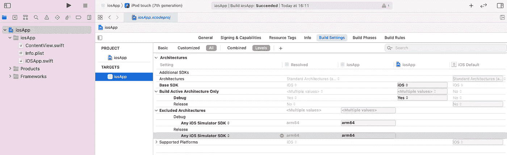

# 如何在 M1 上设置 Kotlin 多平台并获得最佳效果。

> 原文：<https://medium.com/geekculture/how-to-setup-kotlin-multiplatform-on-m1-and-get-the-best-possible-results-b4fb759ec8b7?source=collection_archive---------8----------------------->

Photo by [Clayton](https://unsplash.com/@cmalquist?utm_source=medium&utm_medium=referral) on [Unsplash](https://unsplash.com?utm_source=medium&utm_medium=referral)

比方说，你刚买了一台新的 M1 Mac，你很兴奋地跳上了 kotlin 多平台列车，你已经做了 Android，你已经设置你的 Mac 运行与支持 JDK 的 **arm64** 如[阿苏尔 JDK](https://www.azul.com/downloads/?package=jdk) 。

你已经得到了这个你想要检验的多平台项目，或者你刚刚用 KMM 插件自己创建了一个新项目。

一切都很好，你运行 android 应用程序(在 Android Studio 上),它将 kotlin 多平台模块视为一个库，一切都很好。

然后运行 iOS 应用程序(在 XCode 上),它使用 kotlin native 将模块捆绑成一个框架，然后…..失败了？😲

你疯狂地在谷歌上搜索一个解决方案，但你很快就会发现几个解决方案，比如这里的[和这个旧的](https://github.com/JetBrains/kotlin-native/issues/4034#issuecomment-837950575) [youtrack 问题](https://youtrack.jetbrains.com/issue/KT-43596)，建议你应该使用**英特尔 x64 jdk** 。

您还会发现这篇关于问题的[详细文章，它会让您明白，您可能不得不放弃一些您目前享受的 M1 性能优势。](https://yaxarat.medium.com/setting-up-the-correct-environment-for-kotlin-multiplatform-mobile-development-in-m1-apple-silicon-fa9ee62d0c1d)

 [## NoClassDefFoundError:无法初始化类 llvm.llvm 问题#4034 JetBrains/kotlin-native

### 此存储库已由所有者存档。它现在是只读的。此时您不能执行该操作。你…

github.com](https://github.com/JetBrains/kotlin-native/issues/4034#issuecomment-837950575) 

如果你像我一样抱怨(我有😂)，有一种方法可以在实现多平台的同时获得原生优势。首先，您必须了解问题的存在是因为 kotlin 本机编译器版本 konan 不支持 arm64 jdk，从而导致了低级虚拟机(llvm)的问题。

在做了一点研究后，我发现有一种方法可以在 [jetbrains 博客](https://blog.jetbrains.com/kotlin/2021/07/kotlin-1-5-30-m1-released/)上获得对 M1 的早期访问支持。

 [## Kotlin 1.5.30 预览版，支持原生 Apple 芯片，针对 CocoaPods 改进了 Kotlin DSL

### 成为第一个尝试 Kotlin 1.5.30 中的新功能和改进的人:原生 Apple 芯片支持，以及…

blog.jetbrains.com](https://blog.jetbrains.com/kotlin/2021/07/kotlin-1-5-30-m1-released/) 

所以改变多平台 koltin gradle 插件指向 1.5.30-M1 [依赖](https://search.maven.org/artifact/org.jetbrains.kotlin/kotlin-gradle-plugin/1.5.30-M1/jar)应该能解决问题吧？

 [## Maven 中央存储库搜索

### Maven 中央存储库维护者的官方搜索

search.maven.org](https://search.maven.org/artifact/org.jetbrains.kotlin/kotlin-gradle-plugin/1.5.30-M1/jar) 

嗯…不完全是。如果你在 iPhone 上运行应用程序，你应该没有问题，但如果你的目标设备是一个模拟器，你会遇到这个问题。

> ld:警告:为 iOS Simulator-arm64 构建，但试图链接为 iOS Simulator-x86_64 构建的文件

震惊是因为文章明确写明支持 **iosSimulatorArm64。**你疯狂地在谷歌上搜索其他解决方案，但很快找到一个建议，你应该[在 rosetta](https://stackoverflow.com/a/68301640/7093155) 下运行 XCode 来让它工作。

如果你再次抱怨，有一个解决方案是从模拟器构建中排除 arm64。这应该可以让你的应用程序在 XCode 中启动并运行。

总之，你不需要改变你的 jdk，你只需要改变插件版本，此外，如果你想在模拟器上运行，同时保留 M1 本地的性能，你只需要对 XCode 做一个小的调整。

感谢阅读，保持咖啡因！